## Folder Structure 
1. Policies and Procedures
    
    - Information Security Policy
    - Acceptable Use Policy
    - Incident Response Plan
    - Business Continuity Plan
    - Risk Management Policy
    - Access Control Policy
    - Data Classification Policy
2. Risk Management
    
    - Risk Assessment Reports
    - Risk Treatment Plans
    - Risk Register
    - Risk Mitigation Actions
    - Risk Monitoring and Review
3. Asset Management
    
    - Asset Inventory
    - Asset Classification
    - Asset Ownership
    - Asset Handling and Disposal
4. Human Resources
    
    - Security Awareness Training
    - Employee Security Policies Acknowledgment
    - Joiner, Mover, Leaver (JML) Process
    - Employee Security Incident Reports
5. Access Control
    
    - User Access Management
    - Access Control Logs
    - Privileged Access Management
    - Role-Based Access Control (RBAC)
6. Physical Security
    
    - Access Control Systems
    - CCTV Logs
    - Visitor Management
    - Physical Security Incident Reports
7. Incident Management
    
    - Incident Reports
    - Incident Response Logs
    - Incident Root Cause Analysis
    - Lessons Learned and Remediation
8. Business Continuity Management
    
    - Business Impact Analysis
    - Business Continuity Plans
    - Recovery Point Objectives (RPO)
    - Recovery Time Objectives (RTO)
    - Disaster Recovery Test Reports
9. Compliance
    
    - ISO27001 Compliance Checklist
    - Compliance Audit Reports
    - Regulatory Compliance Documentation
10. Change Management
    
    - Change Request Forms
    - Change Implementation Plans
    - Change Approval and Review
11. Vendor Management
    
    - Vendor Security Assessments
    - Vendor Contracts and Agreements
    - Vendor Due Diligence
12. Security Incident and Event Management (SIEM)
    
    - SIEM Logs
    - Security Event Analysis Reports
    - SIEM Configuration and Rules
13. Security Monitoring and Testing
    
    - Penetration Test Reports
    - Vulnerability Assessment Reports
    - Security Monitoring Logs
    - Security Testing Methodology
14. Documentation and Records
    
    - Policies and Procedures
    - Security Plans and Reports
    - Security Incident Records
    - Audit Reports and Findings
    - Training and Awareness Materials
15. Legal and Regulatory Compliance
    
    - Data Protection Regulations
    - Privacy Policies
    - Legal Compliance Documentation
16. Network and Infrastructure Security
    
    - Firewall Configuration and Logs
    - Intrusion Detection and Prevention System (IDPS) Logs
    - Network Diagrams and Architecture
17. Application Security
    
    - Application Security Assessments
    - Secure Coding Guidelines
    - Application Security Logs
18. Data Security and Privacy
    
    - Data Classification and Handling
    - Data Encryption Policies
    - Data Breach Incident Reports
19. Security Governance
    
    - Security Committee Meeting Minutes
    - Security Metrics and Reporting
    - Security Strategy and Roadmap
20. Training and Awareness
    
    - Security Awareness Materials
    - Training Records
    - Phishing Awareness Campaigns

## SQL Database Structure 
Table: Folders

- FolderID (Primary Key)
- FolderName
- ParentFolderID (Foreign Key)

Table: Files

- FileID (Primary Key)
- FileName
- FolderID (Foreign Key)

Table: Policies

- PolicyID (Primary Key)
- PolicyName
- FolderID (Foreign Key)

Table: RiskAssessment

- RiskAssessmentID (Primary Key)
- ReportName
- FolderID (Foreign Key)

Table: Assets

- AssetID (Primary Key)
- AssetName
- FolderID (Foreign Key)

Table: HumanResources

- HRID (Primary Key)
- HRName
- FolderID (Foreign Key)

Table: AccessControl

- AccessControlID (Primary Key)
- AccessControlName
- FolderID (Foreign Key)

Table: PhysicalSecurity

- PhysicalSecurityID (Primary Key)
- PhysicalSecurityName
- FolderID (Foreign Key)

Table: Incidents

- IncidentID (Primary Key)
- IncidentName
- FolderID (Foreign Key)

Table: BusinessContinuity

- BusinessContinuityID (Primary Key)
- BusinessContinuityName
- FolderID (Foreign Key)

Table: Compliance

- ComplianceID (Primary Key)
- ComplianceName
- FolderID (Foreign Key)

Table: ChangeManagement

- ChangeID (Primary Key)
- ChangeName
- FolderID (Foreign Key)

Table: Vendors

- VendorID (Primary Key)
- VendorName
- FolderID (Foreign Key)

Table: SIEM

- SIEMID (Primary Key)
- SIEMName
- FolderID (Foreign Key)

Table: SecurityMonitoring

- SecurityMonitoringID (Primary Key)
- SecurityMonitoringName
- FolderID (Foreign Key)

Table: Documentation

- DocumentationID (Primary Key)
- DocumentationName
- FolderID (Foreign Key)

Table: LegalCompliance

- LegalComplianceID (Primary Key)
- LegalComplianceName
- FolderID (Foreign Key)

Table: NetworkSecurity

- NetworkSecurityID (Primary Key)
- NetworkSecurityName
- FolderID (Foreign Key)

Table: ApplicationSecurity

- ApplicationSecurityID (Primary Key)
- ApplicationSecurityName
- FolderID (Foreign Key)

Table: DataSecurity

- DataSecurityID (Primary Key)
- DataSecurityName
- FolderID (Foreign Key)

Table: SecurityGovernance

- SecurityGovernanceID (Primary Key)
- SecurityGovernanceName
- FolderID (Foreign Key)

Table: TrainingAwareness

- TrainingAwarenessID (Primary Key)
- TrainingAwarenessName
- FolderID (Foreign Key)


Note: The above table structures assume a one-to-many relationship between folders and files/polici
es/assessments/etc. The "FolderID" column in each table acts as a foreign key referencing the "FolderID" column in the "Folders" table.

## Entity Relationship 
```mermaid 
erDiagram
    Folders ||--o{ Files : contains
    Folders ||--o{ Policies : contains
    Folders ||--o{ RiskAssessment : contains
    Folders ||--o{ Assets : contains
    Folders ||--o{ HumanResources : contains
    Folders ||--o{ AccessControl : contains
    Folders ||--o{ PhysicalSecurity : contains
    Folders ||--o{ Incidents : contains
    Folders ||--o{ BusinessContinuity : contains
    Folders ||--o{ Compliance : contains
    Folders ||--o{ ChangeManagement : contains
    Folders ||--o{ Vendors : contains
    Folders ||--o{ SIEM : contains
    Folders ||--o{ SecurityMonitoring : contains
    Folders ||--o{ Documentation : contains
    Folders ||--o{ LegalCompliance : contains
    Folders ||--o{ NetworkSecurity : contains
    Folders ||--o{ ApplicationSecurity : contains
    Folders ||--o{ DataSecurity : contains
    Folders ||--o{ SecurityGovernance : contains
    Folders ||--o{ TrainingAwareness : contains

```


## Change Control 
1. Document Control Information:
    
    - Document title
    - Document number
    - Revision history
    - Date of last revision
    - Document owner
    - Distribution list
2. Change Control Record:
    
    - Change request number
    - Change request date
    - Requested by (name and position)
    - Description of the change
    - Justification for the change
    - Impact assessment (including potential risks and mitigation measures)
    - Change priority (e.g., low, medium, high)
    - Change category (e.g., hardware, software, procedural)
    - Change implementation date/time
    - Change approver(s) and approval date(s)
3. Change Implementation Plan:
    
    - Scope of the change
    - Steps involved in implementing the change
    - Resources required for the change (e.g., personnel, equipment)
    - Timeline for each step
    - Testing and validation procedures
    - Rollback plan (in case the change needs to be reverted)
4. Communication and Notification:
    
    - Stakeholders affected by the change
    - Communication plan (including the method and frequency of communication)
    - Notification process for impacted parties
    - Training requirements for personnel involved in the change
5. Risk Assessment and Control:
    
    - Risk assessment of the change
    - Identification of potential risks and vulnerabilities
    - Risk mitigation measures
    - Contingency plans for unforeseen issues or failures
    - Monitoring and reporting mechanisms during the change implementation
6. Documentation and Records:
    
    - Document references (e.g., related policies, procedures)
    - Documented evidence and artifacts related to the change (e.g., design documents, test results)
    - Record keeping requirements for change-related activities
    - Retention period for change control records
7. Approval and Signatures:
    
    - Change request approval(s) with date(s)
    - Change implementer(s) with signature(s) and date(s)
    - Document owner's approval and signature

## Change Control Graphs
## Document Control Information

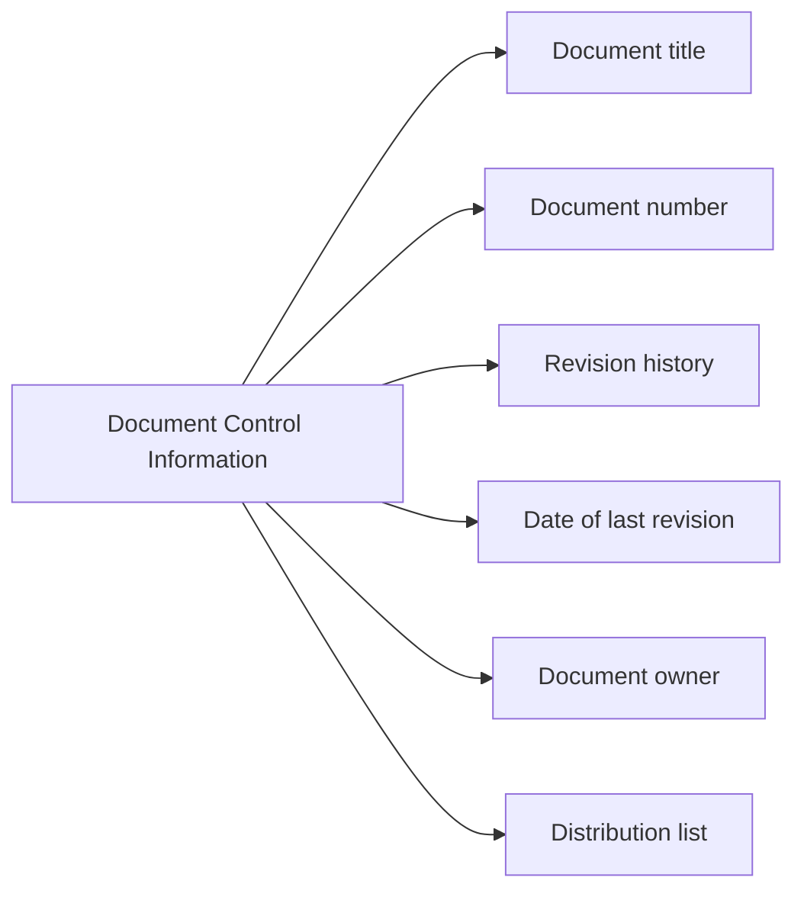
## Change Control Record
Notes about NODE names: syntax does not allow parentheses in the node names
the attributes of the "Change Control Record" section are represented without parentheses in the node names. The relationships between the main node and the attributes are depicted using arrows. Pay special attention to this note. 
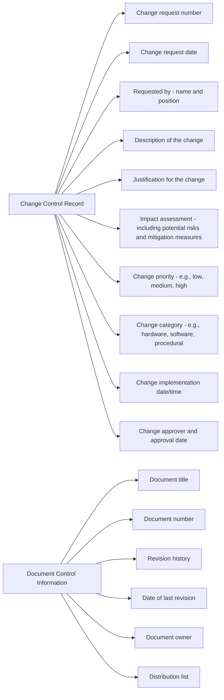


Additional note: When you are sanitizing your inputs - remove any quotations around (s) in your documentation. It will save you time in the future. 

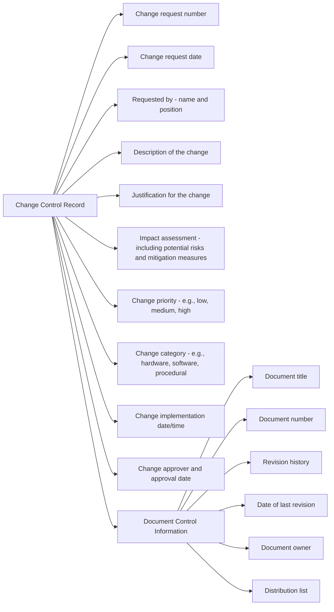

#### Change Implementation Plan
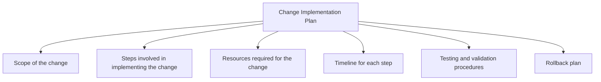

##### Integrating
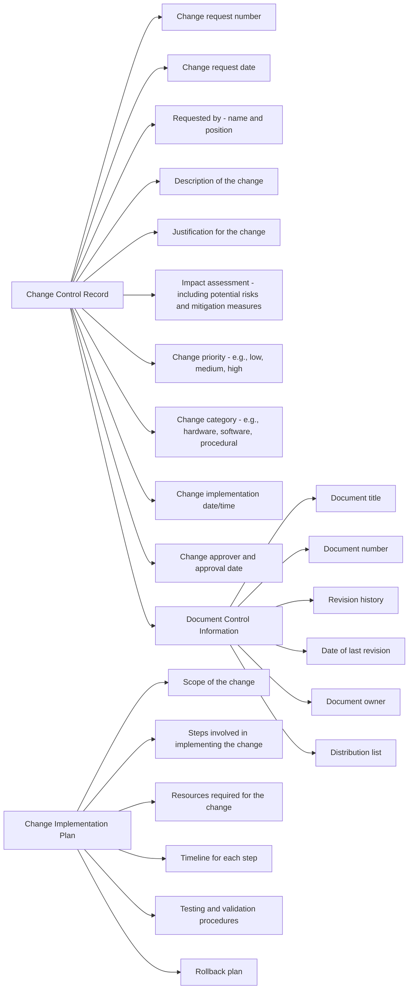

## Communication of the plan
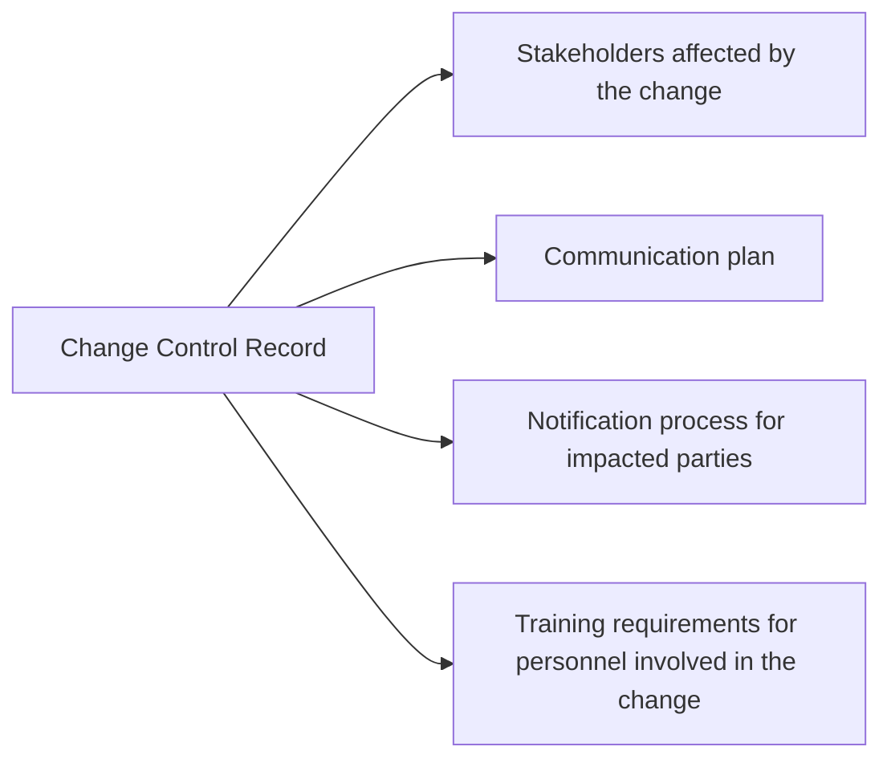
### Integrated 

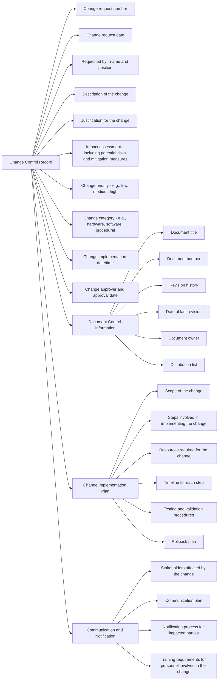


## Risk Assessments
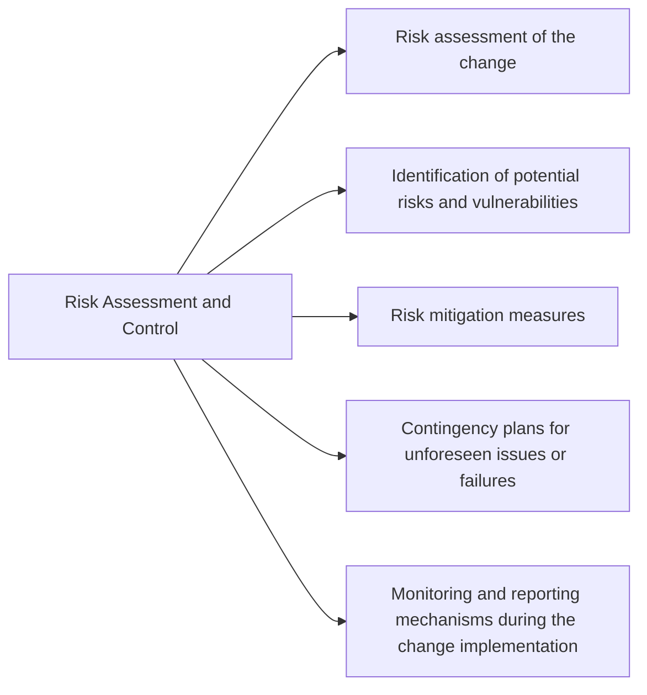
#### Integrated
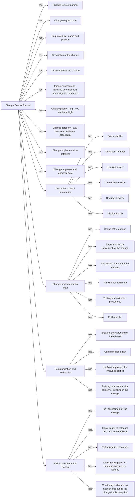

Note: This optimized and integrated graph represents the relationships among the entities in the Change Control process, Document Control Information, Change Implementation Plan, Communication and Notification, and Risk Assessment and Control. Each entity is connected to its corresponding attributes and components.

## Documentation and Records
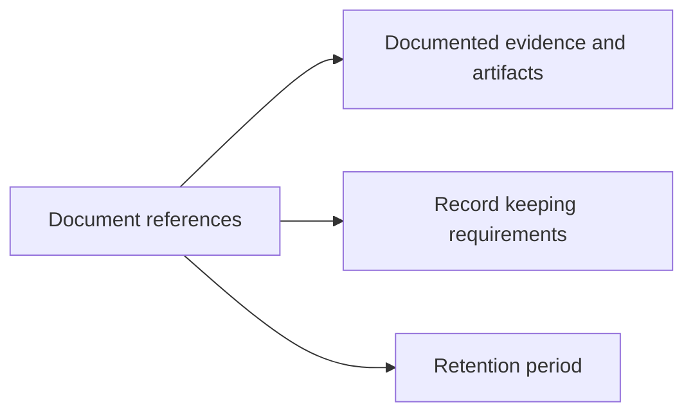

#### Integrated
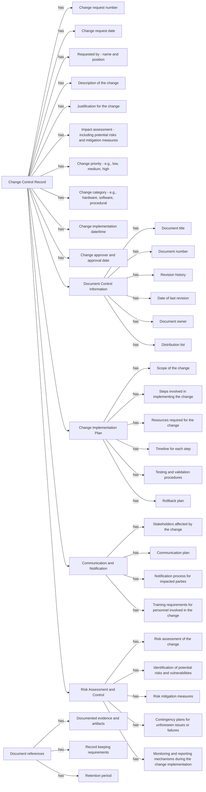

## Approvals 
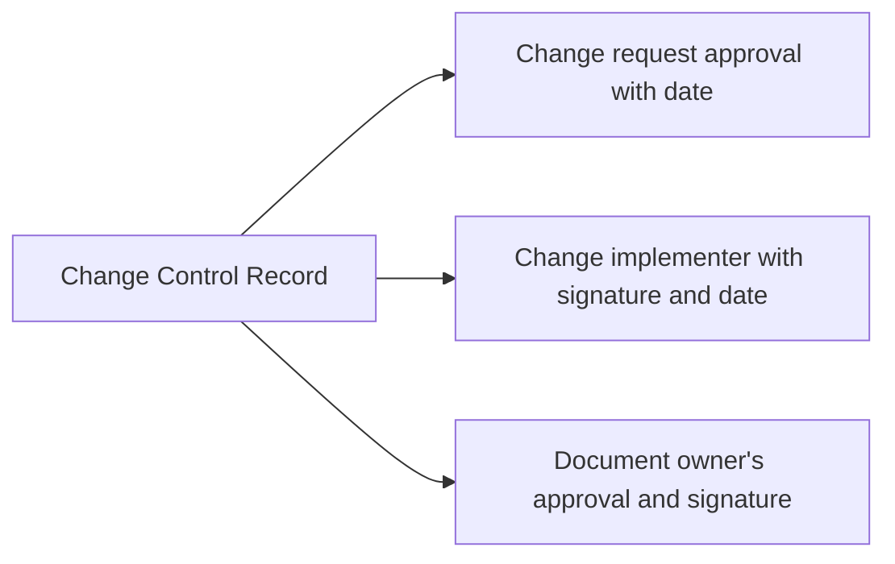
#### Integrate
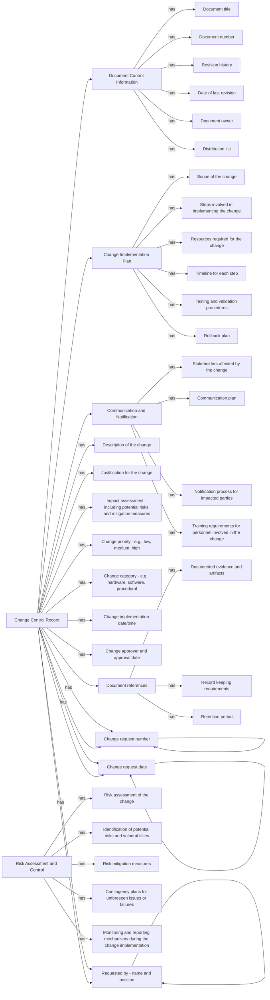


## Building Change Control Relationship
Notes : identify common elements and consolidate them into a unified structure.
Notes about arrows "arrow definition on line 44, where there is an extra space between `--|` and `has|`."


## Better Mappings


## Dependency Chains
- Change Control Record (A) has dependencies on:
    
    - Change request number (B)
    - Change request date (C)
    - Requested by - name and position (D)
    - Description of the change (E)
    - Justification for the change (F)
    - Impact assessment - including potential risks and mitigation measures (G)
    - Change priority - e.g., low, medium, high (H)
    - Change category - e.g., hardware, software, procedural (I)
    - Change implementation date/time (J)
    - Change approver and approval date (K)
- Document Control Information (L) has dependencies on:
    
    - Document title (M)
    - Document number (N)
    - Revision history (O)
    - Date of last revision (P)
    - Document owner (Q)
    - Distribution list (R)
- Change Control Record (A) is also connected to Document Control Information (L).
    
- Change Implementation Plan (X) has dependencies on:
    
    - Scope of the change (Y)
    - Steps involved in implementing the change (Z)
    - Resources required for the change (A1)
    - Timeline for each step (B1)
    - Testing and validation procedures (C1)
    - Rollback plan (D1)
- Change Control Record (A) is also connected to Change Implementation Plan (X).
    
- Communication and Notification (E1) has dependencies on:
    
    - Stakeholders affected by the change (F1)
    - Communication plan (G1)
    - Notification process for impacted parties (H1)
    - Training requirements for personnel involved in the change (I1)
- Change Control Record (A) is also connected to Communication and Notification (E1).
    
- Risk Assessment and Control (A2) has dependencies on:
    
    - Risk assessment of the change (B2)
    - Identification of potential risks and vulnerabilities (C2)
    - Risk mitigation measures (D2)
    - Contingency plans for unforeseen issues or failures (E2)
    - Monitoring and reporting mechanisms during the change implementation (F2)
- Document references (A3) has dependencies on:
    
    - Documented evidence and artifacts (B3)
    - Record keeping requirements (C3)
    - Retention period (D3)
- Change Control Record (A) has a dependency on Document references (A3).
    
- Change Control Record (A) has self-referential dependencies for Change request number (B), Change request date (C), Requested by - name and position (D).

## Mapping Relationships
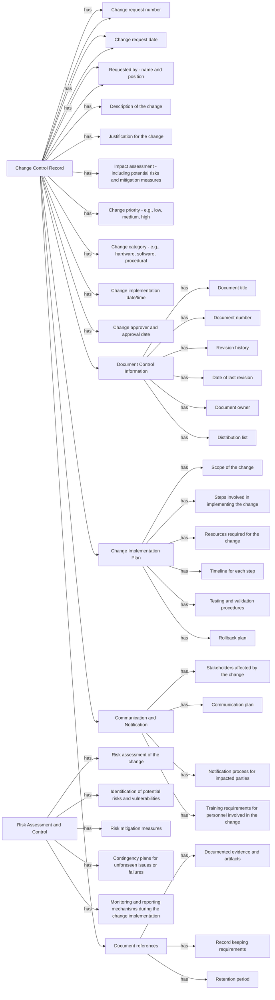

## CRIP
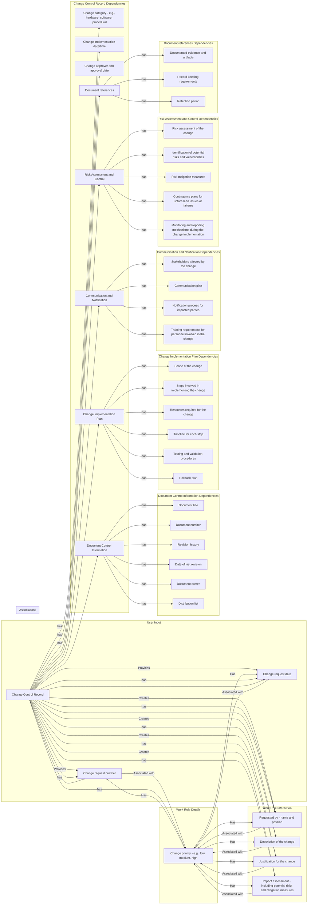

#### Reduction 
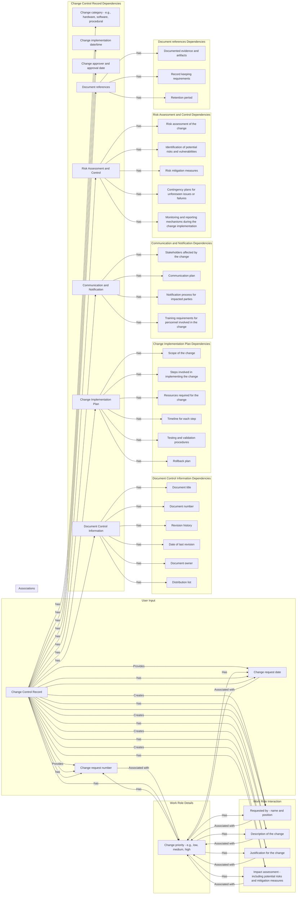


## Input Document
# Trouble Ticket Inputs

## User Input

- Description: [Provide a detailed description of the issue]
- Email: [Provide your email address for communication]

## Work Role Interaction

- Problem: [Create a problem statement]
- Change: [Describe the desired change]
- Request: [Specify the request details]
- Incident: [Report any incident related to the issue]

## Work Role Details

- Primary Work Role ID:
  - Description: [Provide a description of the primary work role]
  - Email: [Provide the email address associated with the primary work role]
  - Problem: [Link the problem statement to the primary work role]
  - Change: [Link the desired change to the primary work role]
  - Request: [Link the request details to the primary work role]
  - Incident: [Link the incident details to the primary work role]

## Change Control Record Dependencies

- Change Control Record:
  - Change Request Number: [Assign a unique change request number]
  - Change Request Date: [Specify the date of the change request]
  - Requested by - Name and Position: [Provide the name and position of the requester]
  - Description of the Change: [Provide a detailed description of the change]
  - Justification for the Change: [Explain the reasons for the change]
  - Impact Assessment - Including Potential Risks and Mitigation Measures: [Assess the impact of the change and identify potential risks with mitigation measures]
  - Change Priority: [Specify the priority of the change (e.g., low, medium, high)]
  - Change Category: [Specify the category of the change (e.g., hardware, software, procedural)]
  - Change Implementation Date/Time: [Specify the planned implementation date and time for the change]
  - Change Approver and Approval Date: [Provide the name of the change approver and the approval date]
  - Document Control Information: [Provide document control information]
  - Change Implementation Plan: [Link to the change implementation plan]
  - Communication and Notification: [Link to the communication and notification details]
  - Risk Assessment and Control: [Link to the risk assessment and control details]
  - Document References: [Link to the document references]

## Document Control Information Dependencies

- Document Control Information:
  - Document Title: [Specify the title of the document]
  - Document Number: [Assign a unique document number]
  - Revision History: [Provide the revision history of the document]
  - Date of Last Revision: [Specify the date of the last revision]
  - Document Owner: [Specify the owner of the document]
  - Distribution List: [Specify the list of recipients for the document]

## Change Implementation Plan Dependencies

- Change Implementation Plan:
  - Scope of the Change: [Define the scope of the change]
  - Steps Involved in Implementing the Change: [Specify the steps involved in implementing the change]
  - Resources Required for the Change: [Identify the resources required for the change]
  - Timeline for Each Step: [Provide a timeline for each step of the change implementation]
  - Testing and Validation Procedures: [Describe the testing and validation procedures]
  - Rollback Plan: [Outline the plan for rolling back the change if needed]

## Communication and Notification Dependencies

- Communication and Notification:
  - Stakeholders Affected by the Change: [Identify the stakeholders affected by the change]
  - Communication Plan: [Specify the communication plan for the change]
  - Notification Process for Impacted Parties: [Outline the process for notifying impacted parties]
  - Training Requirements for Personnel Involved in the Change: [Specify any training requirements for personnel involved in the change]

## Risk Assessment and Control Dependencies

- Risk Assessment and Control:
  - Risk Assessment of the Change: [Assess the risks associated with the change]
  - Identification of Potential Risks and Vulnerabilities: [Identify potential risks and vulnerabilities]
  - Risk Mitigation Measures: [Outline the measures for mitigating the identified risks]
  - Contingency Plans for Unforeseen Issues or Failures: [Develop contingency plans for handling unforeseen issues or failures]
  - Monitoring and Reporting Mechanisms During the Change Implementation: [Specify the mechanisms for monitoring and reporting during the change implementation]

## Document References Dependencies

- Document References:
  - Documented Evidence and Artifacts: [Provide references to relevant documented evidence and artifacts]
  - Record Keeping Requirements: [Specify the record keeping requirements]
  - Retention Period: [Specify the retention period for the documents]


### Entity Relationships
```mermaid
erDiagram
    user ||--o{ trouble_ticket_input : "Provides"
    trouble_ticket_input ||--o{ description : "Has"
    trouble_ticket_input ||--o{ email : "Has"
    user ||--o{ work_role_interaction : "Creates"
    work_role_interaction ||--o{ problem : "Has"
    work_role_interaction ||--o{ change : "Has"
    work_role_interaction ||--o{ request : "Has"
    work_role_interaction ||--o{ incident : "Has"
    primary_work_role ||--o{ work_role_details : "Has"
    work_role_details ||--o{ description : "Has"
    work_role_details ||--o{ email : "Has"
    work_role_details ||--o{ problem : "Has"
    work_role_details ||--o{ change : "Has"
    work_role_details ||--o{ request : "Has"
    work_role_details ||--o{ incident : "Has"
    trouble_ticket_input ||--o{ primary_work_role : "Associated with"
    trouble_ticket_input ||--o{ change_control_record : "Has"
    change_control_record ||--o{ change_request_number : "Has"
    change_control_record ||--o{ change_request_date : "Has"
    change_control_record ||--o{ requested_by_name_position : "Has"
    change_control_record ||--o{ description_of_change : "Has"
    change_control_record ||--o{ justification_for_change : "Has"
    change_control_record ||--o{ impact_assessment : "Has"
    change_control_record ||--o{ change_priority : "Has"
    change_control_record ||--o{ change_category : "Has"
    change_control_record ||--o{ change_implementation_date_time : "Has"
    change_control_record ||--o{ change_approver_approval_date : "Has"
    change_control_record ||--o{ document_control_information : "Has"
    change_control_record ||--o{ change_implementation_plan : "Has"
    change_control_record ||--o{ communication_notification : "Has"
    change_control_record ||--o{ risk_assessment_control : "Has"
    change_control_record ||--o{ document_references : "Has"
    document_control_information ||--o{ change_control_record : "Associated with"
    document_control_information ||--o{ document_title : "Has"
    document_control_information ||--o{ document_number : "Has"
    document_control_information ||--o{ revision_history : "Has"
    document_control_information ||--o{ date_of_last_revision : "Has"
    document_control_information ||--o{ document_owner : "Has"
    document_control_information ||--o{ distribution_list : "Has"
    change_implementation_plan ||--o{ change_control_record : "Associated with"
    change_implementation_plan ||--o{ scope_of_change : "Has"
    change_implementation_plan ||--o{ steps_involved_in_implementing_change : "Has"
    change_implementation_plan ||--o{ resources_required_for_change : "Has"
    change_implementation_plan ||--o{ timeline_for_each_step : "Has"
    change_implementation_plan ||--o{ testing_validation_procedures : "Has"
    change_implementation_plan ||--o{ rollback_plan : "Has"
    communication_notification ||--o{ change_control_record : "Associated with"
    communication_notification ||--o{ stakeholders_affected_by_change : "Has"
    communication_notification ||--o{ communication_plan : "Has"
    communication_notification ||--o{ notification_process_for_impacted_parties : "Has"
    communication_notification ||--o{ training_requirements_for_personnel_involved_in_change : "Has"
    risk_assessment_control ||--o{ change_control_record : "Associated with"
    risk_assessment_control ||--o{ risk_assessment_of_change : "Has"
    risk_assessment_control ||--o{ identification_of_potential_risks_vulnerabilities : "Has"
    risk_assessment_control ||--o{ risk_mitigation_measures : "Has"
    risk_assessment_control ||--o{ contingency_plans_for_unforeseen_issues_failures : "Has"
    risk_assessment_control ||--o{ monitoring_reporting_mechanisms_during_change_implementation : "Has"
    document_references ||--o{ change_control_record : "Associated with"
    document_references ||--o{ documented_evidence_artifacts : "Has"
    document_references ||--o{ record_keeping_requirements : "Has"
    document_references ||--o{ retention_period : "Has"

```


## User Journey
graph TB
    subgraph User
        A[User]
        A -->|Provides| B[Trouble Ticket Input]
        A -->|Creates| C[Work Role Interaction]
    end
    subgraph Trouble Ticket Input
        B -->|Has| D[Description]
        B -->|Has| E[Email]
        B -->|Associated with| F[Primary Work Role]
        B -->|Has| G[Change Control Record]
    end
    subgraph Work Role Interaction
        C -->|Has| H[Problem]
        C -->|Has| I[Change]
        C -->|Has| J[Request]
        C -->|Has| K[Incident]
    end
    subgraph Primary Work Role
        F -->|Has| L[Work Role Details]
    end
    subgraph Work Role Details
        L -->|Has| M[Description]
        L -->|Has| N[Email]
        L -->|Has| O[Problem]
        L -->|Has| P[Change]
        L -->|Has| Q[Request]
        L -->|Has| R[Incident]
    end
    subgraph Change Control Record
        G -->|Has| S[Change Request Number]
        G -->|Has| T[Change Request Date]
        G -->|Has| U[Requested by Name/Position]
        G -->|Has| V[Description of Change]
        G -->|Has| W[Justification for Change]
        G -->|Has| X[Impact Assessment]
        G -->|Has| Y[Change Priority]
        G -->|Has| Z[Change Category]
        G -->|Has| AA[Change Implementation Date/Time]
        G -->|Has| AB[Change Approver/Approval Date]
        G -->|Has| AC[Document Control Information]
        G -->|Has| AD[Change Implementation Plan]
        G -->|Has| AE[Communication/Notification]
        G -->|Has| AF[Risk Assessment/Control]
        G -->|Has| AG[Document References]
    end
    subgraph Document Control Information
        AC -->|Has| AH[Document Title]
        AC -->|Has| AI[Document Number]
        AC -->|Has| AJ[Revision History]
        AC -->|Has| AK[Date of Last Revision]
        AC -->|Has| AL[Document Owner]
        AC -->|Has| AM[Distribution List]
    end
    subgraph Change Implementation Plan
        AD -->|Has| AN[Scope of Change]
        AD -->|Has| AO[Steps Involved in Implementing Change]
        AD -->|Has| AP[Resources Required for Change]
        AD -->|Has| AQ[Timeline for Each Step]
        AD -->|Has| AR[Testing/Validation Procedures]
        AD -->|Has| AS[Rollback Plan]
    end
    subgraph Communication/Notification
        AE -->|Has| AT[Stakeholders Affected by Change]
        AE -->|Has| AU[Communication Plan]
        AE -->|Has| AV[Notification Process for Impacted Parties]
        AE -->|Has| AW[Training Requirements for Personnel Involved in Change]
    end
    subgraph Risk Assessment/Control
        AF -->|Has| AX[Risk Assessment of Change]
        AF -->|Has| AY[Identification of Potential Risks/Vulnerabilities]
        AF -->|Has| AZ[Risk Mitigation Measures]
        AF -->|Has| BA[Contingency Plans for Unforeseen Issues/Failures]
        AF -->|Has| BB[Monitoring/Reporting Mechanisms during Change Implementation]
    end
    subgraph Document References
        AG -->|Has| BC[Documented Evidence/Artifacts]
        AG -->|Has| BD[Record-Keeping Requirements]
        AG -->|Has| BE[Retention Period]
    end

#### User Journey
```mermaid
graph TB
    subgraph User
        A[User]
        A -->|Provides| B[Trouble Ticket Input]
        A -->|Creates| C[Work Role Interaction]
    end
    subgraph Trouble Ticket Input
        B -->|Has| D[Description]
        B -->|Has| E[Email]
        B -->|Associated with| F[Primary Work Role]
        B -->|Has| G[Change Control Record]
    end
    subgraph Work Role Interaction
        C -->|Has| H[Problem]
        C -->|Has| I[Change]
        C -->|Has| J[Request]
        C -->|Has| K[Incident]
    end
    subgraph Primary Work Role
        F -->|Has| L[Work Role Details]
    end
    subgraph Work Role Details
        L -->|Has| M[Description]
        L -->|Has| N[Email]
        L -->|Has| O[Problem]
        L -->|Has| P[Change]
        L -->|Has| Q[Request]
        L -->|Has| R[Incident]
    end
    subgraph Change Control Record
        G -->|Has| S[Change Request Number]
        G -->|Has| T[Change Request Date]
        G -->|Has| U[Requested by Name/Position]
        G -->|Has| V[Description of Change]
        G -->|Has| W[Justification for Change]
        G -->|Has| X[Impact Assessment]
        G -->|Has| Y[Change Priority]
        G -->|Has| Z[Change Category]
        G -->|Has| AA[Change Implementation Date/Time]
        G -->|Has| AB[Change Approver/Approval Date]
        G -->|Has| AC[Document Control Information]
        G -->|Has| AD[Change Implementation Plan]
        G -->|Has| AE[Communication/Notification]
        G -->|Has| AF[Risk Assessment/Control]
        G -->|Has| AG[Document References]
    end
    subgraph Document Control Information
        AC -->|Has| AH[Document Title]
        AC -->|Has| AI[Document Number]
        AC -->|Has| AJ[Revision History]
        AC -->|Has| AK[Date of Last Revision]
        AC -->|Has| AL[Document Owner]
        AC -->|Has| AM[Distribution List]
    end
    subgraph Change Implementation Plan
        AD -->|Has| AN[Scope of Change]
        AD -->|Has| AO[Steps Involved in Implementing Change]
        AD -->|Has| AP[Resources Required for Change]
        AD -->|Has| AQ[Timeline for Each Step]
        AD -->|Has| AR[Testing/Validation Procedures]
        AD -->|Has| AS[Rollback Plan]
    end
    subgraph Communication/Notification
        AE -->|Has| AT[Stakeholders Affected by Change]
        AE -->|Has| AU[Communication Plan]
        AE -->|Has| AV[Notification Process for Impacted Parties]
        AE -->|Has| AW[Training Requirements for Personnel Involved in Change]
    end
    subgraph Risk Assessment/Control
        AF -->|Has| AX[Risk Assessment of Change]
        AF -->|Has| AY[Identification of Potential Risks/Vulnerabilities]
        AF -->|Has| AZ[Risk Mitigation Measures]
        AF -->|Has| BA[Contingency Plans for Unforeseen Issues/Failures]
        AF -->|Has| BB[Monitoring/Reporting Mechanisms during Change Implementation]
    end
    subgraph Document References
        AG -->|Has| BC[Documented Evidence/Artifacts]
        AG -->|Has| BD[Record-Keeping Requirements]
        AG -->|Has| BE[Retention Period]
    end

```

### Contextual Relationships
```mermaid
graph TB
    subgraph User
        A[User]
    end
    subgraph Trouble Ticket Input
        B[Trouble Ticket Input]
    end
    subgraph Work Role Interaction
        C[Work Role Interaction]
    end
    subgraph Primary Work Role
        F[Primary Work Role]
    end
    subgraph Work Role Details
        L[Work Role Details]
    end
    subgraph Change Control Record
        G[Change Control Record]
    end
    subgraph Document Control Information
        AC[Document Control Information]
    end
    subgraph Change Implementation Plan
        AD[Change Implementation Plan]
    end
    subgraph Communication/Notification
        AE[Communication/Notification]
    end
    subgraph Risk Assessment/Control
        AF[Risk Assessment/Control]
    end
    subgraph Document References
        AG[Document References]
    end
    
    A --> B
    A --> C
    B --> D[Description]
    B --> E[Email]
    B --> F
    B --> G
    C --> H[Problem]
    C --> I[Change]
    C --> J[Request]
    C --> K[Incident]
    F --> L
    L --> M[Description]
    L --> N[Email]
    L --> O[Problem]
    L --> P[Change]
    L --> Q[Request]
    L --> R[Incident]
    G --> S[Change Request Number]
    G --> T[Change Request Date]
    G --> U[Requested by Name/Position]
    G --> V[Description of Change]
    G --> W[Justification for Change]
    G --> X[Impact Assessment]
    G --> Y[Change Priority]
    G --> Z[Change Category]
    G --> AA[Change Implementation Date/Time]
    G --> AB[Change Approver/Approval Date]
    G --> AC
    G --> AD
    G --> AE
    G --> AF
    G --> AG
    AC --> AH[Document Title]
    AC --> AI[Document Number]
    AC --> AJ[Revision History]
    AC --> AK[Date of Last Revision]
    AC --> AL[Document Owner]
    AC --> AM[Distribution List]
    AD --> AN[Scope of Change]
    AD --> AO[Steps Involved in Implementing Change]
    AD --> AP[Resources Required for Change]
    AD --> AQ[Timeline for Each Step]
    AD --> AR[Testing/Validation Procedures]
    AD --> AS[Rollback Plan]
    AE --> AT[Stakeholders Affected by Change]
    AE --> AU[Communication Plan]
    AE --> AV[Notification Process for Impacted Parties]
    AE --> AW[Training Requirements for Personnel Involved in Change]
    AF --> AX[Risk Assessment of Change]
    AF --> AY[Identification of Potential Risks/Vulnerabilities]
    AF --> AZ[Risk Mitigation Measures]
    AF --> BA[Contingency Plans for Unforeseen Issues/Failures]
    AF --> BB[Monitoring/Reporting Mechanisms during Change Implementation]
    AG --> BC[Documented Evidence/Artifacts]
    AG --> BD[Record-Keeping Requirements]
    AG --> BE[Retention Period]

```


```mermaid
graph TB
    subgraph User
        A[User]
    end
    subgraph Trouble Ticket Input
        B[Trouble Ticket Input]
        D[Description]
        E[Email]
        F[Primary Work Role]
        G[Change Control Record]
    end
    subgraph Work Role Interaction
        C[Work Role Interaction]
        H[Problem]
        I[Change]
        J[Request]
        K[Incident]
    end
    subgraph Primary Work Role
        F[Primary Work Role]
        L[Work Role Details]
    end
    subgraph Work Role Details
        L[Work Role Details]
        M[Description]
        N[Email]
        O[Problem]
        P[Change]
        Q[Request]
        R[Incident]
    end
    subgraph Change Control Record
        G[Change Control Record]
        S[Change Request Number]
        T[Change Request Date]
        U[Requested by Name/Position]
        V[Description of Change]
        W[Justification for Change]
        X[Impact Assessment]
        Y[Change Priority]
        Z[Change Category]
        AA[Change Implementation Date/Time]
        AB[Change Approver/Approval Date]
        AC[Document Control Information]
        AD[Change Implementation Plan]
        AE[Communication/Notification]
        AF[Risk Assessment/Control]
        AG[Document References]
    end
    subgraph Document Control Information
        AC[Document Control Information]
        AH[Document Title]
        AI[Document Number]
        AJ[Revision History]
        AK[Date of Last Revision]
        AL[Document Owner]
        AM[Distribution List]
    end
    subgraph Change Implementation Plan
        AD[Change Implementation Plan]
        AN[Scope of Change]
        AO[Steps Involved in Implementing Change]
        AP[Resources Required for Change]
        AQ[Timeline for Each Step]
        AR[Testing/Validation Procedures]
        AS[Rollback Plan]
    end
    subgraph Communication/Notification
        AE[Communication/Notification]
        AT[Stakeholders Affected by Change]
        AU[Communication Plan]
        AV[Notification Process for Impacted Parties]
        AW[Training Requirements for Personnel Involved in Change]
    end
    subgraph Risk Assessment/Control
        AF[Risk Assessment/Control]
        AX[Risk Assessment of Change]
        AY[Identification of Potential Risks/Vulnerabilities]
        AZ[Risk Mitigation Measures]
        BA[Contingency Plans for Unforeseen Issues/Failures]
        BB[Monitoring/Reporting Mechanisms during Change Implementation]
    end
    subgraph Document References
        AG[Document References]
        BC[Documented Evidence/Artifacts]
        BD[Record-Keeping Requirements]
        BE[Retention Period]
    end

```

## Class Diagram
```mermaid
classDiagram
    class User
    class TroubleTicketInput {
        + Description
        + Email
        + PrimaryWorkRole
        + ChangeControlRecord
    }
    class WorkRoleInteraction {
        + Problem
        + Change
        + Request
        + Incident
    }
    class PrimaryWorkRole {
        + WorkRoleDetails
    }
    class WorkRoleDetails {
        + Description
        + Email
        + Problem
        + Change
        + Request
        + Incident
    }
    class ChangeControlRecord {
        + ChangeRequestNumber
        + ChangeRequestDate
        + RequestedBy
        + DescriptionOfChange
        + JustificationForChange
        + ImpactAssessment
        + ChangePriority
        + ChangeCategory
        + ChangeImplementationDateTime
        + ChangeApprover
        + DocumentControlInformation
        + ChangeImplementationPlan
        + CommunicationNotification
        + RiskAssessmentControl
        + DocumentReferences
    }
    class DocumentControlInformation {
        + DocumentTitle
        + DocumentNumber
        + RevisionHistory
        + DateOfLastRevision
        + DocumentOwner
        + DistributionList
    }
    class ChangeImplementationPlan {
        + ScopeOfChange
        + StepsInvolvedInImplementingChange
        + ResourcesRequiredForChange
        + TimelineForEachStep
        + TestingValidationProcedures
        + RollbackPlan
    }
    class CommunicationNotification {
        + StakeholdersAffectedByChange
        + CommunicationPlan
        + NotificationProcessForImpactedParties
        + TrainingRequirements
    }
    class RiskAssessmentControl {
        + RiskAssessmentOfChange
        + IdentificationOfRisks
        + RiskMitigationMeasures
        + ContingencyPlans
        + MonitoringReportingMechanisms
    }
    class DocumentReferences {
        + DocumentedEvidenceArtifacts
        + RecordKeepingRequirements
        + RetentionPeriod
    }
    
    User -- TroubleTicketInput
    TroubleTicketInput --> WorkRoleDetails
    TroubleTicketInput --> ChangeControlRecord
    WorkRoleInteraction --> WorkRoleDetails
    PrimaryWorkRole --> WorkRoleDetails
    ChangeControlRecord --> DocumentControlInformation
    ChangeControlRecord --> ChangeImplementationPlan
    ChangeControlRecord --> CommunicationNotification
    ChangeControlRecord --> RiskAssessmentControl
    ChangeControlRecord --> DocumentReferences

```

## Sequence Diagram
```mermaid
sequenceDiagram
    participant User
    participant TroubleTicketInput
    participant WorkRoleDetails
    participant ChangeControlRecord
    participant AssignedTo
    participant Resolved

    User->>TroubleTicketInput: Creates Trouble Ticket
    TroubleTicketInput->>AssignedTo: Assigned To
    AssignedTo-->>TroubleTicketInput: Updates Trouble Ticket
    TroubleTicketInput->>Resolved: Resolves Trouble Ticket

```
### Sequence Diagram Considering Work Role ID
```mermaid
sequenceDiagram
    participant PrimaryWorkRoleID
    participant Description
    participant Email
    participant Problem
    participant Change
    participant Request
    participant Incident

    PrimaryWorkRoleID->>Description: has Description
    PrimaryWorkRoleID->>Email: has Email
    PrimaryWorkRoleID->>Problem: has Problem
    PrimaryWorkRoleID->>Change: has Change
    PrimaryWorkRoleID->>Request: has Request
    PrimaryWorkRoleID->>Incident: has Incident
    Description-->>PrimaryWorkRoleID: associated with Primary Work Role ID
    Email-->>PrimaryWorkRoleID: associated with Primary Work Role ID
    Problem-->>PrimaryWorkRoleID: associated with Primary Work Role ID
    Change-->>PrimaryWorkRoleID: associated with Primary Work Role ID
    Request-->>PrimaryWorkRoleID: associated with Primary Work Role ID
    Incident-->>PrimaryWorkRoleID: associated with Primary Work Role ID

```
### Flowchart 
```mermaid
graph LR
    subgraph Primary Work Role ID Mapping
        A[Primary Work Role ID] -->|has| B[Description]
        A[Primary Work Role ID] -->|has| C[Email]
        A[Primary Work Role ID] -->|has| D[Problem]
        A[Primary Work Role ID] -->|has| E[Change]
        A[Primary Work Role ID] -->|has| F[Request]
        A[Primary Work Role ID] -->|has| G[Incident]
        B[Description] -- associated with --> A[Primary Work Role ID]
        C[Email] -- associated with --> A[Primary Work Role ID]
        D[Problem] -- associated with --> A[Primary Work Role ID]
        E[Change] -- associated with --> A[Primary Work Role ID]
        F[Request] -- associated with --> A[Primary Work Role ID]
        G[Incident] -- associated with --> A[Primary Work Role ID]
    end

```

## Entity Relationship Considerations SQL 


```SQL
+--------------+
|    Folders   |
+--------------+
|              |
|  contains    |
|              |
|--------------|
|              |
|   - Files    |
|   - Policies |
|   - RiskAssessment |
|   - Assets |
|   - HumanResources |
|   - AccessControl |
|   - PhysicalSecurity |
|   - Incidents |
|   - BusinessContinuity |
|   - Compliance |
|   - ChangeManagement |
|   - Vendors |
|   - SIEM |
|   - SecurityMonitoring |
|   - Documentation |
|   - LegalCompliance |
|   - NetworkSecurity |
|   - ApplicationSecurity |
|   - DataSecurity |
|   - SecurityGovernance |
|   - TrainingAwareness |
|              |
+--------------+

+-------------+           +----------------------+
|    User     |           | TroubleTicketInput   |
+-------------+           +----------------------+
|             |           |                      |
|             |           |  + Description       |
|             |           |  + Email             |
|             |           |  + PrimaryWorkRole   |
|             |           |  + ChangeControlRecord |
|             |           |                      |
+-------------+           +----------------------+
       |                              |
       |                              |
       |                              |
       |                              |
       |                              |
       |                              |
       |                              |
       |                              |
+------------------+           +------------------------+
|  WorkRoleInteraction |           | PrimaryWorkRole        |
+------------------+           +------------------------+
|                  |           |   + WorkRoleDetails    |
|   + Problem      |           |                        |
|   + Change       |           +------------------------+
|   + Request      |
|   + Incident     |
|                  |
+------------------+

+------------------+
|  WorkRoleDetails  |
+------------------+
|   + Description  |
|   + Email        |
|   + Problem      |
|   + Change       |
|   + Request      |
|   + Incident     |
+------------------+

+----------------------+
| ChangeControlRecord  |
+----------------------+
| + ChangeRequestNumber  |
| + ChangeRequestDate    |
| + RequestedBy          |
| + DescriptionOfChange  |
| + JustificationForChange |
| + ImpactAssessment     |
| + ChangePriority       |
| + ChangeCategory       |
| + ChangeImplementationDateTime |
| + ChangeApprover       |
| + DocumentControlInformation |
| + ChangeImplementationPlan  |
| + CommunicationNotification |
| + RiskAssessmentControl |
| + DocumentReferences   |
+-----------------------+

+------------------------+
| DocumentControlInformation |
+------------------------+
| + DocumentTitle         |
| + DocumentNumber        |
| + RevisionHistory       |
| + DateOfLastRevision    |
| + DocumentOwner         |
| + DistributionList      |
+------------------------+

+------------------------+
| ChangeImplementationPlan |
+------------------------+
| + ScopeOfChange         |
| + StepsInvolvedInImplementingChange |
| + ResourcesRequiredForChange |
| + TimelineForEachStep   |
| + TestingValidationProcedures |
| + RollbackPlan          |
+------------------------+

+-----------------------+
| CommunicationNotification |
+-----------------------+
| + StakeholdersAffectedByChange |
| + CommunicationPlan    |
| + NotificationProcessForImpactedParties |
| + TrainingRequirements |
+-----------------------+

+-------------------+
| RiskAssessmentControl |
+-------------------+
| + RiskAssessmentOfChange |
| + IdentificationOfRisks |
| + RiskMitigationMeasures |
| + ContingencyPlans |
| + MonitoringReportingMechanisms |
+-------------------+

+------------------+
| DocumentReferences |
+------------------+
| + DocumentedEvidenceArtifacts |
| + RecordKeepingRequirements |
| + RetentionPeriod |
+------------------+

```


## Sequence Diagram 
```mermaid
sequenceDiagram
    participant User
    participant TroubleTicketSystem
    participant SecurelyProvision
    participant Analyze
    participant Operate
    participant CollectOperate
    participant Investigate
    participant OversightDevelopment
    participant ProtectDefend
    participant OperateMaintain
    participant PrimaryWorkRoleMapping
    participant TroubleTicket
    participant AssignedTo
    participant Resolved
    participant Description
    participant Email
    participant Problem
    participant Change
    participant Request
    participant Incident
    
    User->>TroubleTicketSystem: Create Trouble Ticket
    TroubleTicketSystem->>TroubleTicket: Create Trouble Ticket
    TroubleTicket-->>AssignedTo: Assigned To
    
    loop Update Ticket
        AssignedTo->>TroubleTicket: Update Ticket
        TroubleTicket-->>AssignedTo: Assigned To
    end
    
    AssignedTo->>TroubleTicket: Resolve Ticket
    TroubleTicket-->>Resolved: Resolved
    
    User->>PrimaryWorkRoleMapping: Access Primary Work Role ID
    PrimaryWorkRoleMapping-->>Description: Description
    PrimaryWorkRoleMapping-->>Email: Email
    PrimaryWorkRoleMapping-->>Problem: Problem
    PrimaryWorkRoleMapping-->>Change: Change
    PrimaryWorkRoleMapping-->>Request: Request
    PrimaryWorkRoleMapping-->>Incident: Incident
    
    User->>SecurelyProvision: Access Securely Provision
    SecurelyProvision-->>Analyze: Analyze
    SecurelyProvision-->>CollectOperate: Collect and Operate
    SecurelyProvision-->>Investigate: Investigate
    SecurelyProvision-->>OversightDevelopment: Oversight and Development
    
    Analyze->>Operate: Involve Operate and Maintain
    Analyze->>Investigate: Involve Investigate
    Analyze->>ProtectDefend: Involve Protect and Defend
    
    CollectOperate->>Operate: Involve Operate and Maintain
    CollectOperate->>SecurelyProvision: Involve Securely Provision
    
    Investigate->>Investigate: Involve Investigate
    Investigate->>ProtectDefend: Involve Protect and Defend
    
    OversightDevelopment->>SecurelyProvision: Involve Securely Provision
    OversightDevelopment->>Analyze: Involve Analyze
    OversightDevelopment->>ProtectDefend: Involve Protect and Defend
    
    Operate->>Analyze: Involve Analyze
    Operate->>ProtectDefend: Involve Protect and Defend
    
    Investigate->>Analyze: Involve Analyze
    Investigate->>CollectOperate: Involve Collect and Operate
    
    ProtectDefend->>ProtectDefend: Involve Protect and Defend
    
    SecurelyProvision->>OperateMaintain: Provide Operate and Maintain
    
    Analyze->>OperateMaintain: Involve Operate and Maintain
    
    ProtectDefend->>OperateMaintain: Involve Operate and Maintain
    
    Analyze->>CollectOperate: Involve Collect and Operate
    
    CollectOperate->>OperateMaintain: Involve Operate and Maintain
    
    CollectOperate->>SecurelyProvision: Involve Securely Provision
    
    Analyze->>Investigate: Involve Investigate
    
    Investigate->>Investigate: Involve Investigate
    
    Investigate->>ProtectDefend: Involve Protect and Defend
    
    OversightDevelopment->>OperateMaintain: Involve Operate and Maintain
    
    OversightDevelopment->>Analyze: Involve Analyze
    
    OversightDevelopment->>ProtectDefend: Involve Protect and Defend
    
    Analyze->>CollectOperate: Involve Collect and Operate
    
    CollectOperate->>OperateMaintain: Involve Operate and Maintain

```
