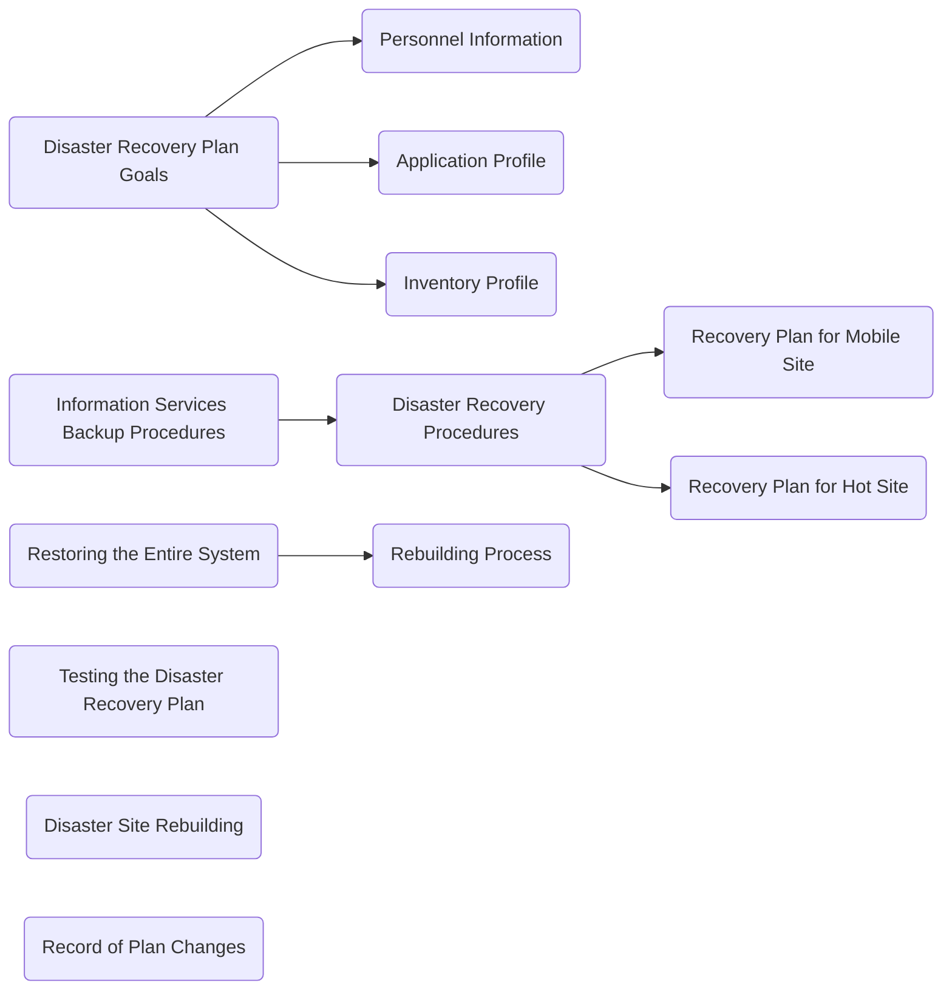

# Disaster Recovery Relationships

```mermaid
graph LR
  A(Disaster Recovery Plan Goals)
  B(Personnel Information)
  C(Application Profile)
  D(Inventory Profile)
  E(Information Services Backup Procedures)
  F(Disaster Recovery Procedures)
  G(Recovery Plan for Mobile Site)
  H(Recovery Plan for Hot Site)
  I(Restoring the Entire System)
  J(Rebuilding Process)
  K(Testing the Disaster Recovery Plan)
  L(Disaster Site Rebuilding)
  M(Record of Plan Changes)

  A --> B
  A --> C
  A --> D
  E --> F
  F --> G
  F --> H
  I --> J
  K
  L
  M
```
[Build mermaid Diagrams](https://docs.github.com/en/get-started/writing-on-github/working-with-advanced-formatting/creating-diagrams#creating-mermaid-diagrams)
