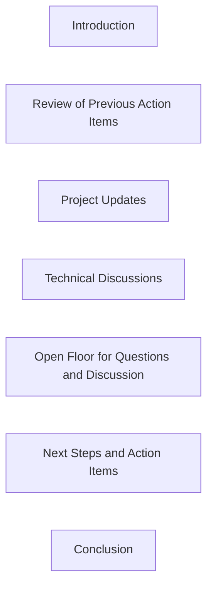
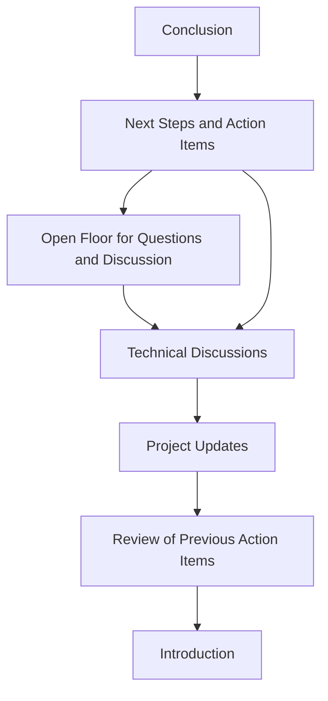
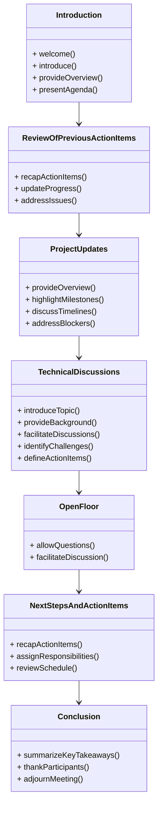
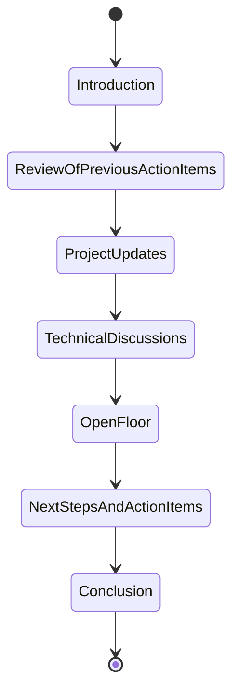

# visualizing meeting agenda

```mermaid 
graph LR

I[Introduction]
II[Review of Previous Action Items]
III[Project Updates]
IV[Technical Discussions]
V[Open Floor for Questions and Discussion]
VI[Next Steps and Action Items]
VII[Conclusion]


```

# Dependencies

```mermaid
graph TD

I[Introduction]
II[Review of Previous Action Items]
III[Project Updates]
IV[Technical Discussions]
V[Open Floor for Questions and Discussion]
VI[Next Steps and Action Items]
VII[Conclusion]

II --> I
III --> II
IV --> III
V --> IV
VI --> IV
VI --> V
VII --> VI
```

# State Diagram

```mermaid
stateDiagram-v2
    [*] --> I
    I --> II
    II --> III
    III --> IV
    IV --> V
    V --> VI
    VI --> VII
    VII --> [*]
```

# Host Journey Class Diagram

```mermaid
classDiagram
    class Introduction {
        + welcome()
        + introduce()
        + provideOverview()
        + presentAgenda()
    }

    class ReviewOfPreviousActionItems {
        + recapActionItems()
        + updateProgress()
        + addressIssues()
    }

    class ProjectUpdates {
        + provideOverview()
        + highlightMilestones()
        + discussTimelines()
        + addressBlockers()
    }

    class TechnicalDiscussions {
        + introduceTopic()
        + provideBackground()
        + facilitateDiscussions()
        + identifyChallenges()
        + defineActionItems()
    }

    class OpenFloor {
        + allowQuestions()
        + facilitateDiscussion()
    }

    class NextStepsAndActionItems {
        + recapActionItems()
        + assignResponsibilities()
        + reviewSchedule()
    }

    class Conclusion {
        + summarizeKeyTakeaways()
        + thankParticipants()
        + adjournMeeting()
    }

    Introduction --> ReviewOfPreviousActionItems
    ReviewOfPreviousActionItems --> ProjectUpdates
    ProjectUpdates --> TechnicalDiscussions
    TechnicalDiscussions --> OpenFloor
    OpenFloor --> NextStepsAndActionItems
    NextStepsAndActionItems --> Conclusion
```

# State Diagram

```mermaid
stateDiagram-v2
    [*] --> Introduction
    Introduction --> ReviewOfPreviousActionItems
    ReviewOfPreviousActionItems --> ProjectUpdates
    ProjectUpdates --> TechnicalDiscussions
    TechnicalDiscussions --> OpenFloor
    OpenFloor --> NextStepsAndActionItems
    NextStepsAndActionItems --> Conclusion
    Conclusion --> [*]
```

# Entitites 

