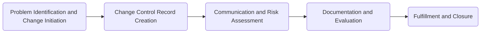

# Blocks

Block: Problem Identification and Change Initiation

Task 1: User (A) identifies and documents the problem (C) or the need for change (D).
Task 2: Work Role (B) reviews the problem (C) or change (D) request initiated by the User (A) and validates its significance and impact.
Block: Change Control Record Creation

Task 3: Work Role (B) creates a Change Control Record (F) and fills in the necessary details, including the problem (C) or change (D) description and the affected systems or processes.
Task 4: Work Role (B) captures the document control information (G), such as version control and access permissions, in the Change Control Record (F).
Task 5: Work Role (B) develops a comprehensive change implementation plan (H) that outlines the steps, resources, and timeline required for the change (D).
Block: Communication and Risk Assessment

Task 6: Work Role (B) identifies the stakeholders and determines the appropriate communication and notification (I) strategy for informing them about the change (D).
Task 7: Work Role (B) conducts a risk assessment and control (J) to identify potential risks associated with the change (D) and develops mitigation strategies.
Block: Documentation and Evaluation

Task 8: Work Role (B) references relevant documents and resources (K) in the Change Control Record (F) to provide additional context and references for the change (D).
Task 9: Work Role (B) conducts an evaluation (L) to assess the impact and effectiveness of the change (D) after its implementation.
Block: Fulfillment and Closure

Task 10: Work Role (B) initiates the fulfillment (M) process if required, ensuring that all necessary actions and resources are coordinated to implement the change (D) successfully.
Task 11: User (A) selects the appropriate role (S) for executing the assigned tasks (U) within the Change Control Record (F).
Task 12: Role Selected (W) manages trouble tickets (X) to track and resolve any issues or incidents related to the change (D).
Task 13: Users can view (Y) the status and details of the change (D) through the provided interface.
Note: The actual tasks and their order may vary based on the specific needs and processes of your organization.

# Visualzied 

