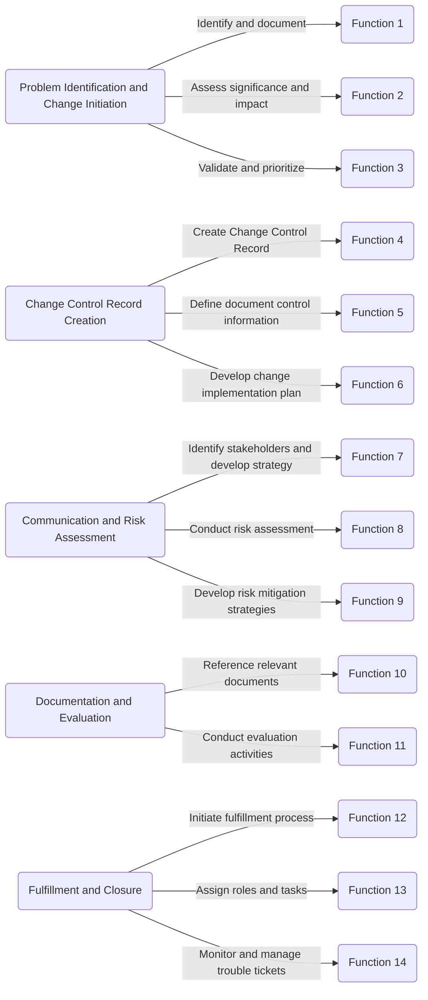

# Sample Functions for your playbook

Block: Problem Identification and Change Initiation

Function 1: Identify and document problems or change requests.
Function 2: Assess the significance and impact of identified problems or change requests.
Function 3: Validate and prioritize problems or change requests for further action.
Block: Change Control Record Creation

Function 4: Create a Change Control Record and capture the necessary details.
Function 5: Define and document the document control information for the Change Control Record.
Function 6: Develop a comprehensive change implementation plan.
Block: Communication and Risk Assessment

Function 7: Identify stakeholders and develop a communication and notification strategy.
Function 8: Conduct a risk assessment to identify potential risks associated with the change.
Function 9: Develop risk mitigation strategies and control measures.
Block: Documentation and Evaluation

Function 10: Reference relevant documents and resources to provide additional context for the change.
Function 11: Conduct evaluation activities to assess the impact and effectiveness of the change.
Block: Fulfillment and Closure

Function 12: Initiate the fulfillment process to implement the change.
Function 13: Assign roles and tasks for executing the change.
Function 14: Monitor and manage trouble tickets to track and resolve issues or incidents related to the change. 

# Example

