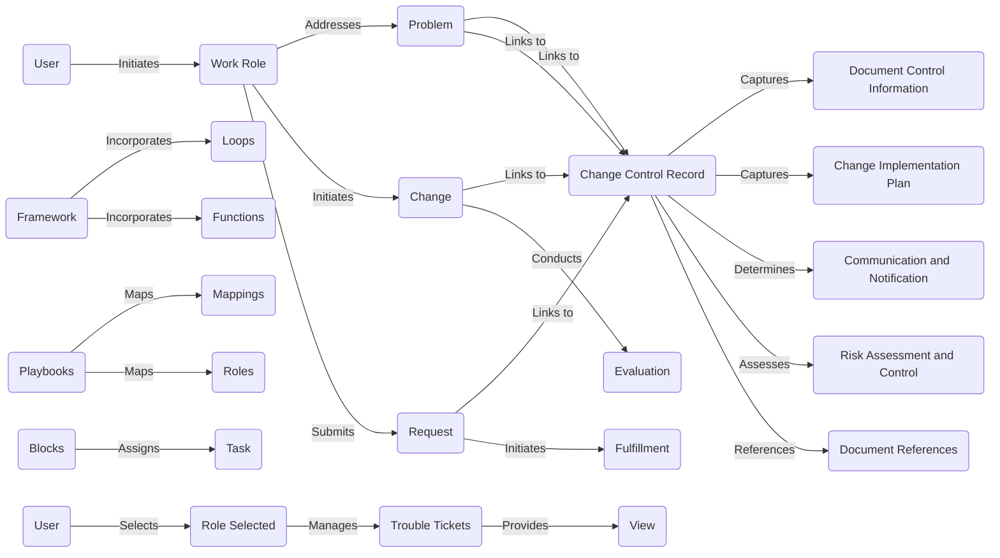

# Playbook Sample

User (A) identifies a problem (C) or a need for change (D).
User (A) engages with the appropriate Work Role (B) to address the problem (C) or initiate the change (D) process.
Work Role (B) collaborates with User (A) to gather relevant information and document the problem (C) or change (D) details.
Work Role (B) creates a Change Control Record (F) to capture the problem (C) or change (D) information.
Work Role (B) fills in the Document Control Information (G) and Change Implementation Plan (H) sections of the Change Control Record (F).
Work Role (B) identifies the stakeholders and determines the appropriate Communication and Notification (I) strategy.
Work Role (B) assesses the potential risks associated with the change (D) and develops Risk Assessment and Control (J) measures.
Work Role (B) references relevant documents and resources in the Document References (K) section of the Change Control Record (F).
Work Role (B) submits the completed Change Control Record (F) for review and approval.
Problem (C) and Change (D) information is linked to the Change Control Record (F) for tracking and reference.
If necessary, Work Role (B) conducts an Evaluation (L) to assess the impact and effectiveness of the change (D).
If the change (D) requires fulfillment, Work Role (B) initiates the Fulfillment (M) process.
The overall framework (N) guides the execution of the change (D) and incorporates Loops (O) and Functions (P) as needed.
Playbooks (Q) are used to map the steps and interactions between Mappings (R) and Roles (S).
Playbook (Q) execution is divided into Blocks (T) of tasks, each representing a specific phase or objective.
Each Task (U) within a Block (T) is assigned to the appropriate Role (S) for execution.
User (V) selects the Role (S) required to complete the assigned Task (U).
Role Selected (W) determines the context and permissions for accessing and performing actions within the Change Control Record (F).
Trouble Tickets (X) are generated to track and manage any issues or incidents related to the change (D).
Users can view (Y) the status and details of the change (D) through the Trouble Tickets (X) interface.

# Playbook Roles

Roles

User (A)
Work Role (B)
Problem (C)
Change (D)
Request (E)
Change Control Record (F)
Document Control Information (G)
Change Implementation Plan (H)
Communication and Notification (I)
Risk Assessment and Control (J)
Document References (K)
Evaluation (L)
Fulfillment (M)
Framework (N)
Loops (O)
Functions (P)
Playbooks (Q)
Mappings (R)
Roles (S)
Blocks (T)
Task (U)
User (V)
Role Selected (W)
Trouble Tickets (X)
View (Y)

