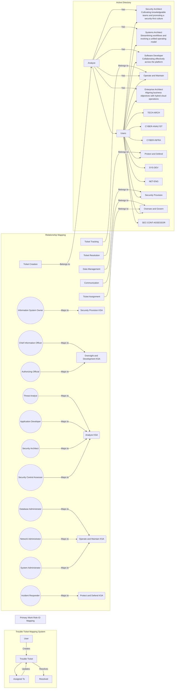

```mermaid
graph LR

subgraph Active Directory
    A[Root]
    A --> B[Users]
    B --> C[SEC-ARCH]
    B --> D[SYS-ARCH]
    B --> E[SOFT-DEV]
    B --> F[DATA-ARCH]
    B --> G[ENT-ARCH]
    B --> H[TECH-ARCH]
    B --> I[CYBER-ANALYST]
    B --> J[CYBER-INFRA]
    B --> K[DATA-ANALYST]
    B --> L[SYS-DEV]
    B --> M[NET-ENG]
    B --> N[SYS-ADMIN]
    B --> O[SEC-ASSESSOR]
    B --> P[SEC-CONT-ASSESSOR]
end

subgraph Trouble Ticket Mapping System
    Q[User] -- Creates --> R[Trouble Ticket]
    R --> S[Assigned To]
    S -- Updates --> R
    R -- Resolves --> T[Resolved]
end

subgraph Primary Work Role ID Mapping
    A -->|has| C[Security Architect<br>Cultivating knowledgeable teams and promoting a security-first culture]
    A -->|has| D[Systems Architect<br>Streamlining workflows and evolving a unified operating model]
    A -->|has| E[Software Developer<br>Collaborating effectively across the platform]
    A -->|has| F[Data Architect<br>Ensuring efficient and effective data management]
    A -->|has| G[Enterprise Architect<br>Aligning business objectives with hybrid cloud operations]
end

subgraph Relationship Mapping
    TC[Ticket Creation] -- Belongs to --> A[Analyze]
    TA[Ticket Assignment] -- Belongs to --> O[Oversee and Govern]
    TT[Ticket Tracking] -- Belongs to --> F[Operate and Maintain]
    TR[Ticket Resolution] -- Belongs to --> K[Protect and Defend]
    DM[Data Management] -- Belongs to --> N[Securely Provision]
    CM[Communication] -- Belongs to --> O[Oversee and Govern]
    ISO((Information System Owner)) -- Maps to --> KSA1("Securely Provision KSA")
    AO((Authorizing Official)) -- Maps to --> KSA2("Oversight and Development KSA")
    CIO((Chief Information Officer)) -- Maps to --> KSA2("Oversight and Development KSA")
    SCA((Security Control Assessor)) -- Maps to --> KSA3("Analyze KSA")
    SYS_ADMIN((System Administrator)) -- Maps to --> KSA4("Operate and Maintain KSA")
    NET_ADMIN((Network Administrator)) -- Maps to --> KSA4("Operate and Maintain KSA")
    DB_ADMIN((Database Administrator)) -- Maps to --> KSA4("Operate and Maintain KSA")
    SEC_ARCH((Security Architect)) -- Maps to --> KSA3("Analyze KSA")
    APP_DEV((Application Developer)) -- Maps to --> KSA3("Analyze KSA")
    INC_RESP((Incident Responder)) -- Maps to --> KSA5("Protect and Defend KSA")
    THREAT_ANALYST((Threat Analyst)) -- Maps to --> KSA3("Analyze KSA")
end

```