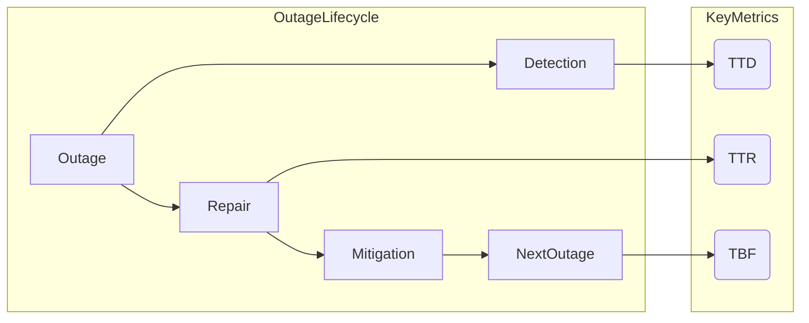

### Planning for failure

```mermaid
graph LR
    subgraph OutageLifecycle
        Outage --> Detection
        Outage --> Repair
        Repair --> Mitigation
        Mitigation --> NextOutage
    end

    subgraph KeyMetrics
        Detection --> TimeToDetect(TTD)
        Repair --> TimeToRepair(TTR)
        NextOutage --> TimeBetweenFailures(TBF)
    end

```
