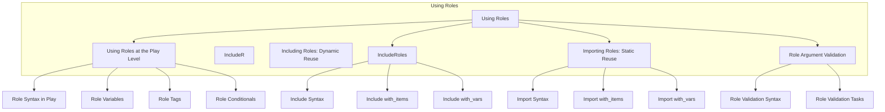

```mermaid
graph TD

subgraph Using Roles
  Roles[Using Roles]
  PlayLevelRoles[Using Roles at the Play Level]
  IncludeR
  oles[Including Roles: Dynamic Reuse]
  ImportRoles[Importing Roles: Static Reuse]
  RoleValidation[Role Argument Validation]

  Roles --> PlayLevelRoles
  Roles --> IncludeRoles
  Roles --> ImportRoles
  Roles --> RoleValidation
end

PlayLevelRoles --> RoleSyntax[Role Syntax in Play]
PlayLevelRoles --> RoleVars[Role Variables]
PlayLevelRoles --> RoleTags[Role Tags]
PlayLevelRoles --> RoleConditionals[Role Conditionals]

IncludeRoles --> IncludeSyntax[Include Syntax]
IncludeRoles --> IncludeWithItems[Include with_items]
IncludeRoles --> IncludeWithVars[Include with_vars]

ImportRoles --> ImportSyntax[Import Syntax]
ImportRoles --> ImportWithItems[Import with_items]
ImportRoles --> ImportWithVars[Import with_vars]

RoleValidation --> RoleValidationSyntax[Role Validation Syntax]
RoleValidation --> RoleValidationTasks[Role Validation Tasks]

```
