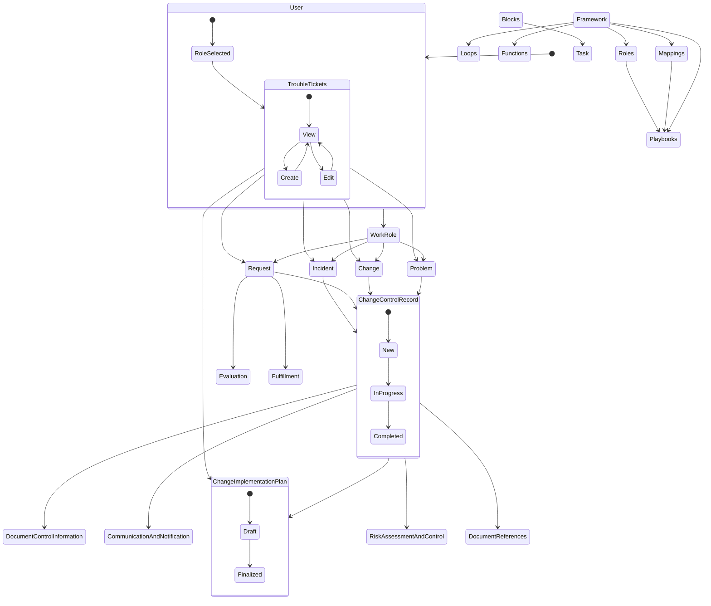
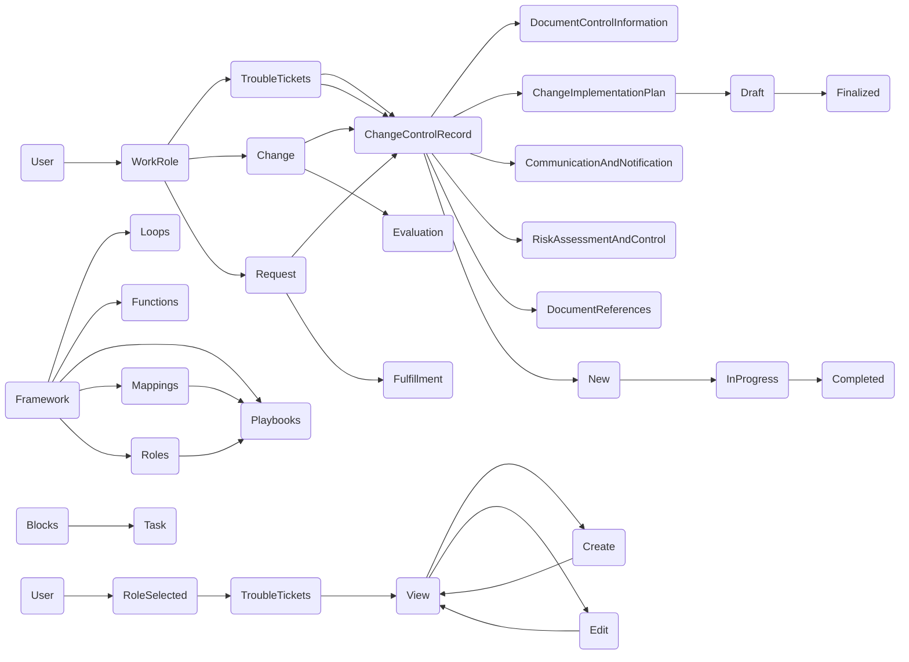
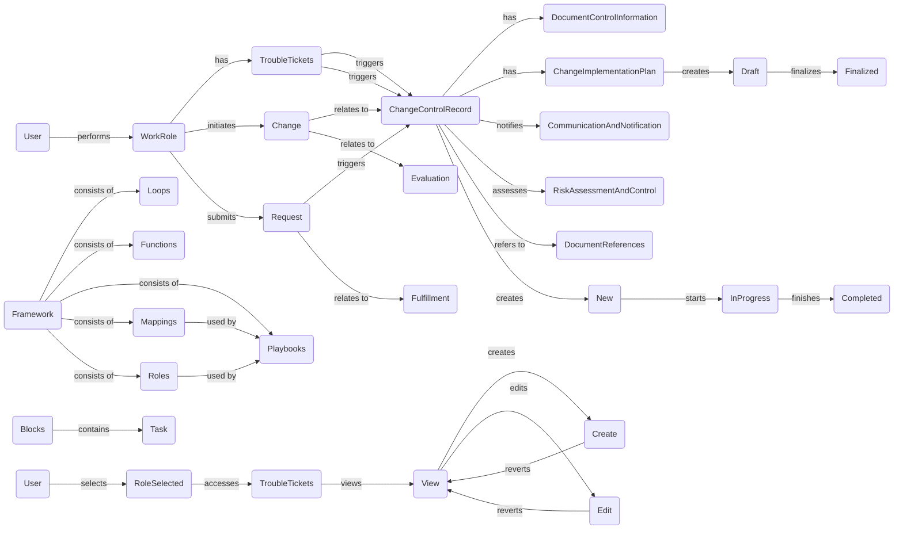
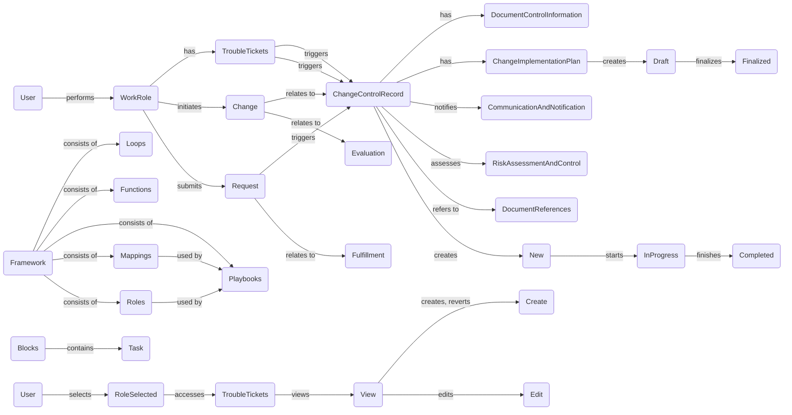

# State Diagram 

## Components and Relationships:
### User: Represents the user interacting with the system.
### WorkRole: Represents a specific role assigned to the user.
Problem, Change, Request, Incident: These states represent different types of work items that the user may encounter.
ChangeControlRecord: Represents a record that tracks the details and progress of a change, request, incident, or problem.
DocumentControlInformation, ChangeImplementationPlan, CommunicationAndNotification, RiskAssessmentAndControl, DocumentReferences: These are substates of ChangeControlRecord and represent various aspects related to managing and documenting changes.
TroubleTickets: Represents a collection of work items, including problems, changes, incidents, and requests.
Evaluation, 
### Fulfillment: These states represent different stages in processing a request.
### Framework: Represents a framework within which the system operates.
Loops, Functions, Playbooks, Mappings, Roles: Substates of the Framework state, representing different components or aspects of the system.
Blocks, Task: Represent additional components within the system.
State Transitions and Relationships:
The initial state [*] represents the starting point of the system.
The User state represents the user's interaction with the system, and the RoleSelected state represents the selection of a specific role by the user.
TroubleTickets state is accessible from the RoleSelected state, indicating that the user with a selected role can view and work on trouble tickets.
TroubleTickets state has transitions to View, Create, and Edit states, representing different actions that can be performed on trouble tickets.
Problem, Change, Request, and Incident states represent different work items that can be associated with a WorkRole.
All work item states (Problem, Change, Request, Incident) are associated with the ChangeControlRecord state, indicating that a change control record is created for each work item.
ChangeControlRecord has substates such as DocumentControlInformation, ChangeImplementationPlan, CommunicationAndNotification, RiskAssessmentAndControl, and DocumentReferences, which represent different aspects of managing a change.
TroubleTickets state has transitions to ChangeImplementationPlan state, indicating that a change implementation plan can be associated with trouble tickets.
Request state has transitions to Evaluation and Fulfillment, representing different stages in processing a request.
Framework state has relationships with various substates, including Loops, Functions, Playbooks, Mappings, and Roles.
## Overall Workflow:
The diagram depicts a workflow where a user with a selected role can interact with trouble tickets.
Users can view, create, and edit trouble tickets, which can be categorized as problems, changes, requests, or incidents.
For each work item, a change control record is created to track its progress and associated documentation.
Trouble tickets can also be associated with change implementation plans.
Requests go through an evaluation process before moving to fulfillment.
The system operates within a framework and utilizes components like loops, functions, playbooks, mappings, and roles.

# Considerations in development 
Active Directory: The Active Directory component represents a hierarchical structure of users and various roles associated with them. To optimize this structure, you can review the roles and their relationships to ensure they are organized efficiently and aligned with the system's requirements. Consider evaluating the need for each role and whether any redundant roles can be eliminated or consolidated.
Trouble Ticket Mapping System: This component handles the management of trouble tickets, including creation, assignment, updates, and resolution. To optimize this system, you can focus on improving the ticket handling process. Review the workflow to identify any bottlenecks or areas for improvement. Streamline the ticket creation, assignment, and resolution processes to enhance efficiency and reduce response time.
Primary Work Role ID Mapping: This component establishes relationships between work roles and the root node. To optimize this mapping, ensure that each work role is accurately associated with the relevant root node. Review the associations to eliminate any duplicates or incorrect mappings.
Relationship Mapping: This component defines the relationships between different aspects of the system, such as ticket creation, assignment, tracking, resolution, data management, and communication. To optimize this mapping, validate the relationships to ensure they accurately reflect the system's functionality and requirements. Remove any unnecessary or incorrect relationships that may lead to confusion or inefficiency.
State Diagram: The state diagram depicts the various states and transitions within the system, including user roles, trouble ticket handling, change control records, and other related processes. To optimize this diagram, review the states and transitions to ensure they accurately represent the system's behavior. Verify that all necessary states and transitions are included and remove any redundant or unnecessary elements.

# What occuring in the flow 
## User:
The workflow starts with the "User" state, representing a user interacting with the system.
From the initial state, the user proceeds to the "RoleSelected" state, indicating that they have selected a specific role.
## WorkRole:
The user's selected role is then associated with the "WorkRole" state, indicating the user's current work role.
The "WorkRole" state is connected to several other states, including "Problem," "Change," "Request," and "Incident," representing different aspects of the user's work responsibilities.
## TroubleTickets:
The "WorkRole" state is connected to the "TroubleTickets" state, which represents the user's interaction with trouble tickets.
Within the "TroubleTickets" state, there are sub-states: "View," "Create," and "Edit."
Users can view existing trouble tickets, create new ones, and edit existing ones.
Problem, Change, Request, Incident:
These states are directly connected to the "WorkRole" state, indicating that the user can work on various tasks related to problems, changes, requests, and incidents within their assigned role.
These states are also connected to the "ChangeControlRecord" state.
## ChangeControlRecord:
The "ChangeControlRecord" state represents the management and control of changes and is connected to different aspects of change control, including:
"DocumentControlInformation": Managing documents related to the change.
"ChangeImplementationPlan": Developing and finalizing the change implementation plan.
"CommunicationAndNotification": Managing communication and notifications related to the change.
"RiskAssessmentAndControl": Assessing and controlling risks associated with the change.
"DocumentReferences": Managing references and documentation related to the change.
## ChangeImplementationPlan:
The "ChangeImplementationPlan" state represents the process of creating and finalizing the change implementation plan.
It consists of two sub-states: "Draft" and "Finalized."
Changes progress from the draft stage to being finalized.
## Framework, Mappings, Roles:
These states represent various components of the overall system framework.
"Framework" is connected to "Loops," "Functions," "Playbooks," "Mappings," and "Roles," indicating their inclusion in the system's framework.
"Mappings" and "Roles" are connected to "Playbooks," indicating that they play a role in defining and guiding the execution of playbooks.
## Blocks:
The "Blocks" state represents tasks or actions within the workflow.

# Flow and Sequence 

# Applying Labels and relationships

# Simplification

