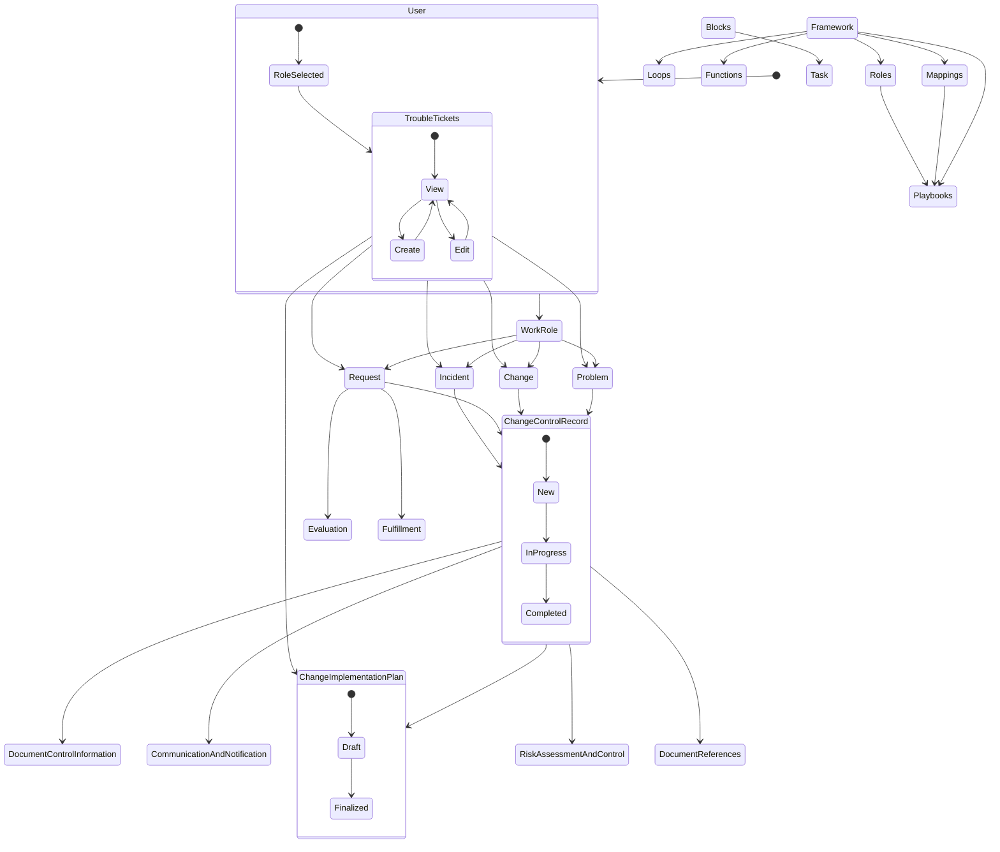

```mermaid
stateDiagram
    [*] --> User
    User --> WorkRole
    WorkRole --> Problem
    WorkRole --> Change
    WorkRole --> Request
    WorkRole --> Incident
    Problem --> ChangeControlRecord
    Change --> ChangeControlRecord
    Request --> ChangeControlRecord
    Incident --> ChangeControlRecord
    ChangeControlRecord --> DocumentControlInformation
    ChangeControlRecord --> ChangeImplementationPlan
    ChangeControlRecord --> CommunicationAndNotification
    ChangeControlRecord --> RiskAssessmentAndControl
    ChangeControlRecord --> DocumentReferences
    TroubleTickets --> Problem
    TroubleTickets --> Change
    TroubleTickets --> Incident
    TroubleTickets --> Request
    TroubleTickets --> ChangeImplementationPlan
    Request --> Evaluation
    Request --> Fulfillment
    Framework --> Loops
    Framework --> Functions
    Framework --> Playbooks
    Framework --> Mappings
    Framework --> Roles
    Mappings --> Playbooks
    Roles --> Playbooks
    Blocks --> Task

    state User {
        [*] --> RoleSelected
        RoleSelected --> TroubleTickets
    }

    state TroubleTickets {
        [*] --> View
        View --> Create
        Create --> View
        View --> Edit
        Edit --> View
    }

    state ChangeControlRecord {
        [*] --> New
        New --> InProgress
        InProgress --> Completed
    }

    state ChangeImplementationPlan {
        [*] --> Draft
        Draft --> Finalized
    }
```