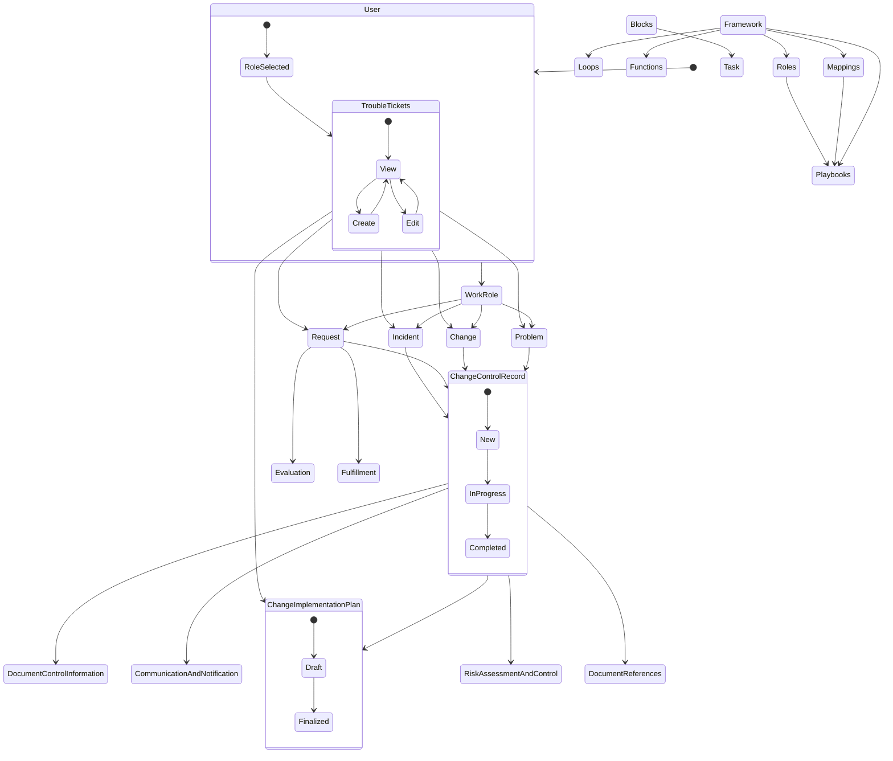

# State Diagram 

## Components and Relationships:
### User: Represents the user interacting with the system.
### WorkRole: Represents a specific role assigned to the user.
Problem, Change, Request, Incident: These states represent different types of work items that the user may encounter.
ChangeControlRecord: Represents a record that tracks the details and progress of a change, request, incident, or problem.
DocumentControlInformation, ChangeImplementationPlan, CommunicationAndNotification, RiskAssessmentAndControl, DocumentReferences: These are substates of ChangeControlRecord and represent various aspects related to managing and documenting changes.
TroubleTickets: Represents a collection of work items, including problems, changes, incidents, and requests.
Evaluation, 
### Fulfillment: These states represent different stages in processing a request.
### Framework: Represents a framework within which the system operates.
Loops, Functions, Playbooks, Mappings, Roles: Substates of the Framework state, representing different components or aspects of the system.
Blocks, Task: Represent additional components within the system.
State Transitions and Relationships:
The initial state [*] represents the starting point of the system.
The User state represents the user's interaction with the system, and the RoleSelected state represents the selection of a specific role by the user.
TroubleTickets state is accessible from the RoleSelected state, indicating that the user with a selected role can view and work on trouble tickets.
TroubleTickets state has transitions to View, Create, and Edit states, representing different actions that can be performed on trouble tickets.
Problem, Change, Request, and Incident states represent different work items that can be associated with a WorkRole.
All work item states (Problem, Change, Request, Incident) are associated with the ChangeControlRecord state, indicating that a change control record is created for each work item.
ChangeControlRecord has substates such as DocumentControlInformation, ChangeImplementationPlan, CommunicationAndNotification, RiskAssessmentAndControl, and DocumentReferences, which represent different aspects of managing a change.
TroubleTickets state has transitions to ChangeImplementationPlan state, indicating that a change implementation plan can be associated with trouble tickets.
Request state has transitions to Evaluation and Fulfillment, representing different stages in processing a request.
Framework state has relationships with various substates, including Loops, Functions, Playbooks, Mappings, and Roles.
## Overall Workflow:
The diagram depicts a workflow where a user with a selected role can interact with trouble tickets.
Users can view, create, and edit trouble tickets, which can be categorized as problems, changes, requests, or incidents.
For each work item, a change control record is created to track its progress and associated documentation.
Trouble tickets can also be associated with change implementation plans.
Requests go through an evaluation process before moving to fulfillment.
The system operates within a framework and utilizes components like loops, functions, playbooks, mappings, and roles.

