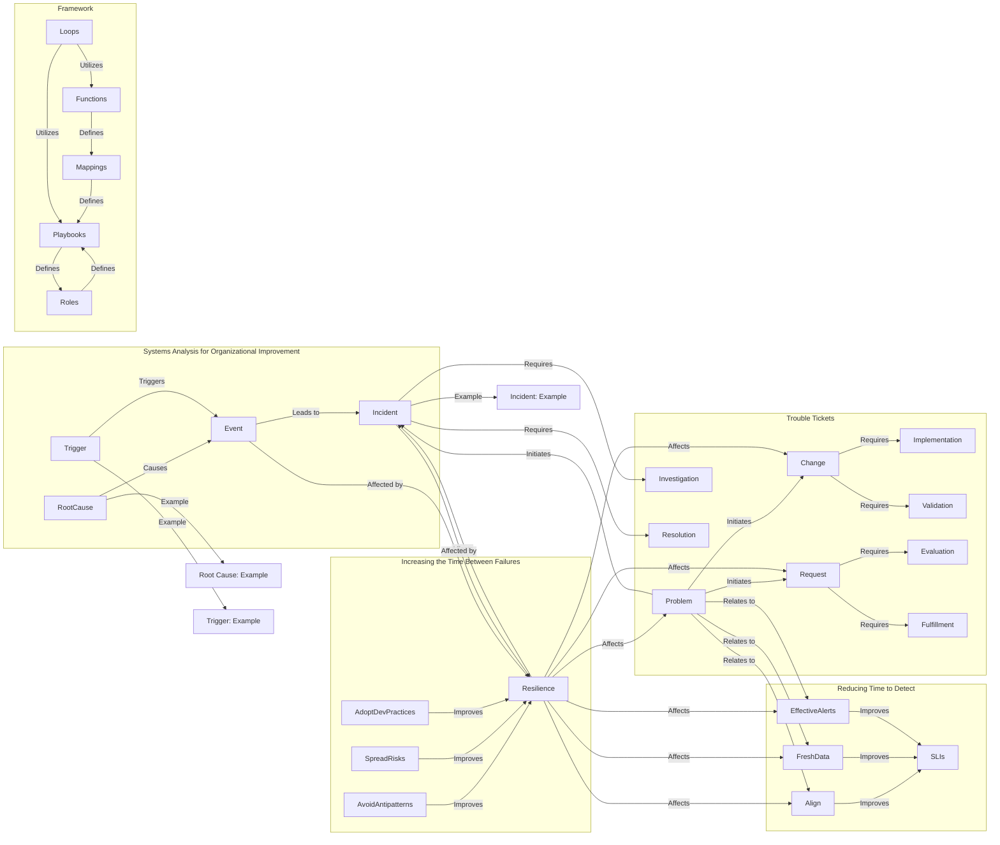

### Naming boundaries

```mermaid
graph LR
    subgraph "Systems Analysis for Organizational Improvement"
        RootCause -->|Causes| Event
        Trigger -->|Triggers| Event
        Event -->|Leads to| Incident
    end

    RootCause -->|Example| RootCauseExample[Root Cause: Example]
    Trigger -->|Example| TriggerExample[Trigger: Example]
    Incident -->|Example| IncidentExample[Incident: Example]

    subgraph "Increasing the Time Between Failures"
        AvoidAntipatterns -->|Improves| Resilience
        SpreadRisks -->|Improves| Resilience
        AdoptDevPractices -->|Improves| Resilience
    end
    
    subgraph Trouble Tickets
        Problem -->|Initiates| Change
        Problem -->|Initiates| Incident
        Problem -->|Initiates| Request
        Change -->|Requires| Implementation
        Change -->|Requires| Validation
        Incident -->|Requires| Investigation
        Incident -->|Requires| Resolution
        Request -->|Requires| Evaluation
        Request -->|Requires| Fulfillment
    end

    subgraph Framework
        Loops -->|Utilizes| Functions
        Loops -->|Utilizes| Playbooks
        Functions -->|Defines| Mappings
        Mappings -->|Defines| Playbooks
        Playbooks -->|Defines| Roles
        Roles -->|Defines| Playbooks
    end
    
    subgraph "Reducing Time to Detect"
        Align -->|Improves| SLIs
        FreshData -->|Improves| SLIs
        EffectiveAlerts -->|Improves| SLIs
    end
    
    Problem -->|Relates to| Align
    Problem -->|Relates to| FreshData
    Problem -->|Relates to| EffectiveAlerts
    
    Resilience -->|Affects| Change
    Resilience -->|Affects| Incident
    Resilience -->|Affects| Request
    Resilience -->|Affects| Problem
    Resilience -->|Affects| Align
    Resilience -->|Affects| FreshData
    Resilience -->|Affects| EffectiveAlerts
    
    Event -->|Affected by| Resilience
    Incident -->|Affected by| Resilience

```
