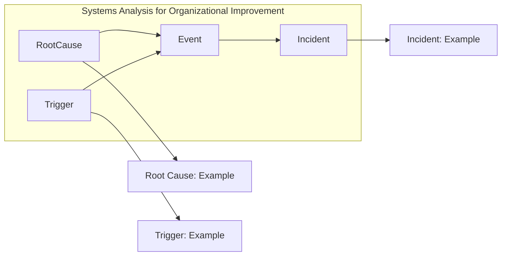

### System Analysis for Organizational Improvement

```mermaid
graph LR
    subgraph "Systems Analysis for Organizational Improvement"
        RootCause --> Event
        Trigger --> Event
        Event --> Incident
    end

    RootCause --> RootCauseExample[Root Cause: Example]
    Trigger --> TriggerExample[Trigger: Example]
    Incident --> IncidentExample[Incident: Example]

```
