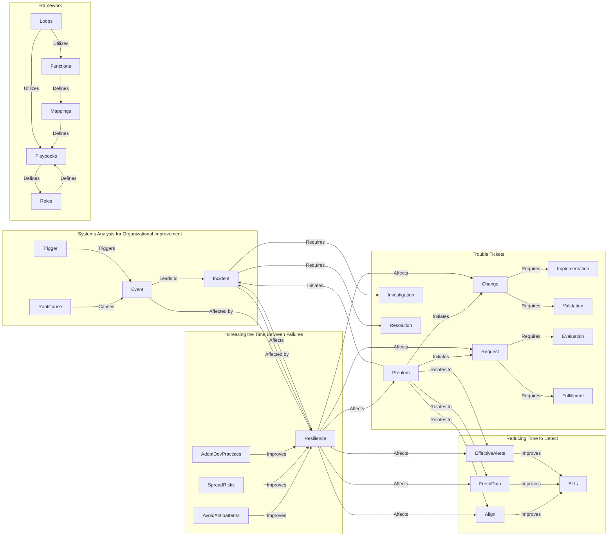
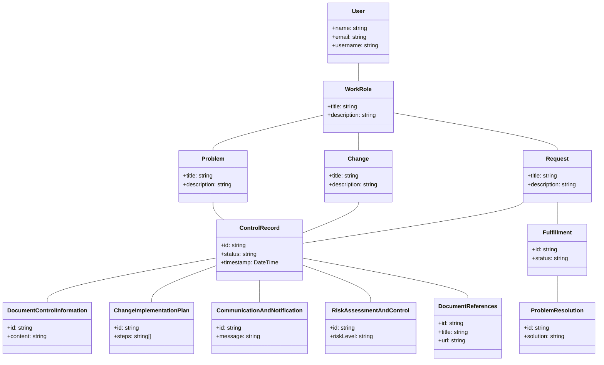

# System Example

```mermaid

graph LR
    subgraph "Systems Analysis for Organizational Improvement"
        RootCause -->|Causes| Event
        Trigger -->|Triggers| Event
        Event -->|Leads to| Incident
    end

    subgraph "Increasing the Time Between Failures"
        AvoidAntipatterns -->|Improves| Resilience
        SpreadRisks -->|Improves| Resilience
        AdoptDevPractices -->|Improves| Resilience
    end
    
    subgraph Trouble Tickets
        Problem -->|Initiates| Change
        Problem -->|Initiates| Incident
        Problem -->|Initiates| Request
        Change -->|Requires| Implementation
        Change -->|Requires| Validation
        Incident -->|Requires| Investigation
        Incident -->|Requires| Resolution
        Request -->|Requires| Evaluation
        Request -->|Requires| Fulfillment
    end

    subgraph Framework
        Loops -->|Utilizes| Functions
        Loops -->|Utilizes| Playbooks
        Functions -->|Defines| Mappings
        Mappings -->|Defines| Playbooks
        Playbooks -->|Defines| Roles
        Roles -->|Defines| Playbooks
    end
    
    subgraph "Reducing Time to Detect"
        Align -->|Improves| SLIs
        FreshData -->|Improves| SLIs
        EffectiveAlerts -->|Improves| SLIs
    end
    
    Problem -->|Relates to| Align
    Problem -->|Relates to| FreshData
    Problem -->|Relates to| EffectiveAlerts
    
    Resilience -->|Affects| Change
    Resilience -->|Affects| Incident
    Resilience -->|Affects| Request
    Resilience -->|Affects| Problem
    Resilience -->|Affects| Align
    Resilience -->|Affects| FreshData
    Resilience -->|Affects| EffectiveAlerts
    
    Event -->|Affected by| Resilience
    Incident -->|Affected by| Resilience
    
    
```

# System Class

```mermaid
classDiagram
  class User {
    +name: string
    +email: string
    +username: string
  }

  class WorkRole {
    +title: string
    +description: string
  }

  class Problem {
    +title: string
    +description: string
  }

  class Change {
    +title: string
    +description: string
  }

  class Request {
    +title: string
    +description: string
  }

  class ControlRecord {
    +id: string
    +status: string
    +timestamp: DateTime
  }

  class DocumentControlInformation {
    +id: string
    +content: string
  }

  class ChangeImplementationPlan {
    +id: string
    +steps: string[]
  }

  class CommunicationAndNotification {
    +id: string
    +message: string
  }

  class RiskAssessmentAndControl {
    +id: string
    +riskLevel: string
  }

  class DocumentReferences {
    +id: string
    +title: string
    +url: string
  }

  class Fulfillment {
    +id: string
    +status: string
  }

  class ProblemResolution {
    +id: string
    +solution: string
  }

  User -- WorkRole
  WorkRole -- Problem
  WorkRole -- Change
  WorkRole -- Request
  Problem -- ControlRecord
  Change -- ControlRecord
  Request -- ControlRecord
  ControlRecord -- DocumentControlInformation
  ControlRecord -- ChangeImplementationPlan
  ControlRecord -- CommunicationAndNotification
  ControlRecord -- RiskAssessmentAndControl
  ControlRecord -- DocumentReferences
  Request -- Fulfillment
  Fulfillment -- ProblemResolution
```