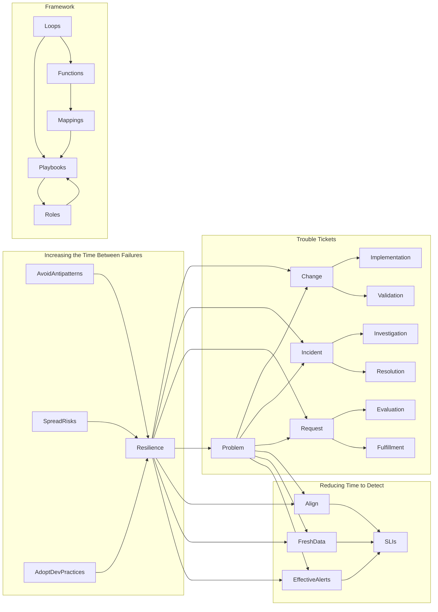

### Learning From Failures

```mermaid
graph LR
    subgraph "Increasing the Time Between Failures"
        AvoidAntipatterns --> Resilience
        SpreadRisks --> Resilience
        AdoptDevPractices --> Resilience
    end
    
    subgraph Trouble Tickets
        Problem --> Change
        Problem --> Incident
        Problem --> Request
        Change --> Implementation
        Change --> Validation
        Incident --> Investigation
        Incident --> Resolution
        Request --> Evaluation
        Request --> Fulfillment
    end

    subgraph Framework
        Loops --> Functions
        Loops --> Playbooks
        Functions --> Mappings
        Mappings --> Playbooks
        Playbooks --> Roles
        Roles --> Playbooks
    end
    
    subgraph "Reducing Time to Detect"
        Align --> SLIs
        FreshData --> SLIs
        EffectiveAlerts --> SLIs
    end
    
    Problem --> Align
    Problem --> FreshData
    Problem --> EffectiveAlerts
    
    Resilience --> Change
    Resilience --> Incident
    Resilience --> Request
    Resilience --> Problem
    Resilience --> Align
    Resilience --> FreshData
    Resilience --> EffectiveAlerts

```

