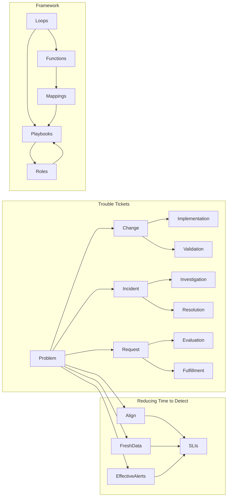

### Time to detect and Tickets

```mermaid
graph LR
    subgraph Trouble Tickets
        Problem --> Change
        Problem --> Incident
        Problem --> Request
        Change --> Implementation
        Change --> Validation
        Incident --> Investigation
        Incident --> Resolution
        Request --> Evaluation
        Request --> Fulfillment
    end

    subgraph Framework
        Loops --> Functions
        Loops --> Playbooks
        Functions --> Mappings
        Mappings --> Playbooks
        Playbooks --> Roles
        Roles --> Playbooks
    end
    
    subgraph "Reducing Time to Detect"
        Align --> SLIs
        FreshData --> SLIs
        EffectiveAlerts --> SLIs
    end
    
    Problem --> Align
    Problem --> FreshData
    Problem --> EffectiveAlerts

```
