# Considering Class and trouble tickets
Each component from the flowchart is represented as a class.
Associations between classes represent the relationships and dependencies.
Class attributes and methods are not included for simplicity, but you can add them as needed.
Multiplicity is indicated using * (zero or more) and |> (one or more).
Inheritance is not used in this diagram.

```mermaid
classDiagram

class User {
    - name: string
    - role: WorkRole
}

class WorkRole {
    - name: string
    - problems: Problem[]
    - changes: Change[]
    - requests: Request[]
    - incidents: Incident[]
}

class Problem {
    - description: string
}

class Change {
    - description: string
}

class Request {
    - description: string
    - relatedChange: Change
    - evaluation: Evaluation
    - fulfillment: Fulfillment
}

class Incident {
    - description: string
}

class ChangeControlRecord {
    - documentControl: DocumentControlInformation
    - implementationPlan: ChangeImplementationPlan
    - communication: CommunicationAndNotification
    - riskAssessment: RiskAssessmentAndControl
    - documentReferences: DocumentReferences[]
}

class DocumentControlInformation {
    - content: string
}

class ChangeImplementationPlan {
    - content: string
}

class CommunicationAndNotification {
    - content: string
}

class RiskAssessmentAndControl {
    - content: string
}

class DocumentReferences {
    - title: string
    - url: string
}

class TroubleTickets {
    - problems: Problem[]
    - changes: Change[]
    - incidents: Incident[]
    - requests: Request[]
    - implementationPlan: ChangeImplementationPlan
}

class Framework {
    - loops: Loops
    - functions: Functions
    - playbooks: Playbooks
    - mappings: Mappings
    - roles: Roles
}

class Loops {
    - description: string
}

class Functions {
    - description: string
}

class Playbooks {
    - description: string
}

class Mappings {
    - description: string
}

class Roles {
    - description: string
}

class Evaluation {
    - description: string
}

class Fulfillment {
    - description: string
}

class Block1 {
    - tasks: Task[]
}

class Block2 {
    - tasks: Task[]
}

class Task {
    - description: string
}

User --|> WorkRole
WorkRole --* Problem
WorkRole --* Change
WorkRole --* Request
WorkRole --* Incident
Request --|> Change
Request --|> Evaluation
Request --|> Fulfillment
ChangeControlRecord --|> DocumentControlInformation
ChangeControlRecord --|> ChangeImplementationPlan
ChangeControlRecord --|> CommunicationAndNotification
ChangeControlRecord --|> RiskAssessmentAndControl
ChangeControlRecord --* DocumentReferences
TroubleTickets --* Problem
TroubleTickets --* Change
TroubleTickets --* Incident
TroubleTickets --* Request
TroubleTickets --|> ChangeImplementationPlan
Framework --|> Loops
Framework --|> Functions
Framework --|> Playbooks
Framework --|> Mappings
Framework --|> Roles
Mappings --|> Playbooks
Roles --|> Playbooks
Block1 --* Task
Block2 --* Task
```

