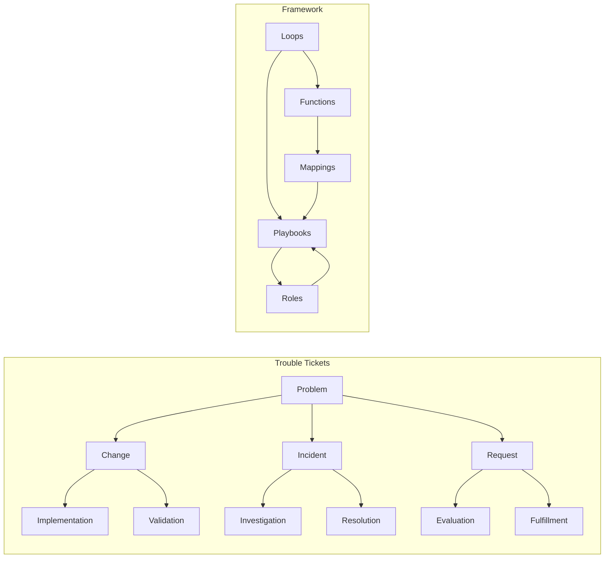
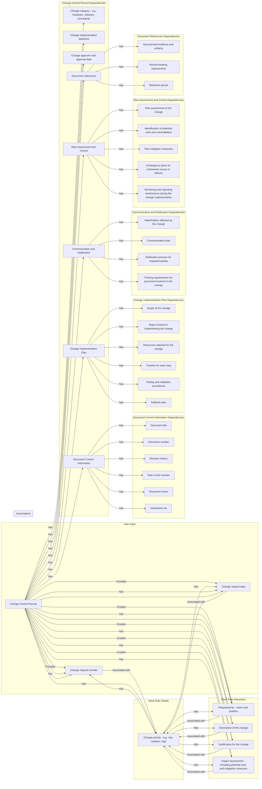
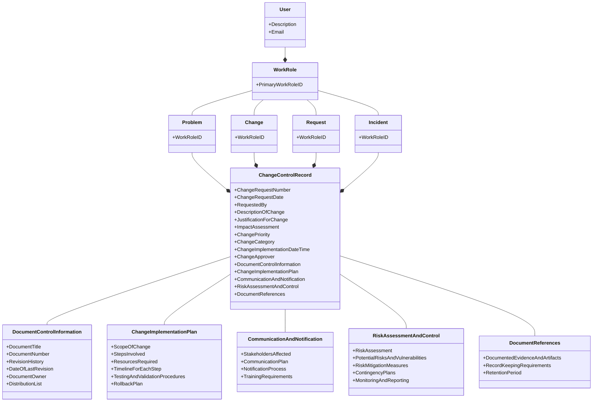

### Growing Dependencies

```mermaid
graph LR
    subgraph Trouble Tickets
        Problem --> Change
        Problem --> Incident
        Problem --> Request
        Change --> Implementation
        Change --> Validation
        Incident --> Investigation
        Incident --> Resolution
        Request --> Evaluation
        Request --> Fulfillment
    end

    subgraph Framework
        Loops --> Functions
        Loops --> Playbooks
        Functions --> Mappings
        Mappings --> Playbooks
        Playbooks --> Roles
        Roles --> Playbooks
    end

```

# Change Control process

```mermaid

graph LR

subgraph User Input
A(User) -->|Provides| B(Description)
A(User) -->|Provides| C(Email)
end

subgraph Work Role Interaction
A(User) -->|Creates| D(Problem)
A(User) -->|Creates| E(Change)
A(User) -->|Creates| F(Request)
A(User) -->|Creates| G(Incident)
end

subgraph Work Role Details
H(Primary Work Role ID) -->|Has| B(Description)
H(Primary Work Role ID) -->|Has| C(Email)
H(Primary Work Role ID) -->|Has| D(Problem)
H(Primary Work Role ID) -->|Has| E(Change)
H(Primary Work Role ID) -->|Has| F(Request)
H(Primary Work Role ID) -->|Has| G(Incident)
end

subgraph Associations
B(Description) -- Associated with --> H(Primary Work Role ID)
C(Email) -- Associated with --> H(Primary Work Role ID)
D(Problem) -- Associated with --> H(Primary Work Role ID)
E(Change) -- Associated with --> H(Primary Work Role ID)
F(Request) -- Associated with --> H(Primary Work Role ID)
G(Incident) -- Associated with --> H(Primary Work Role ID)
end

subgraph Change Control Record Dependencies
A[Change Control Record] -->|has| B[Change request number]
A -->|has| C[Change request date]
A -->|has| D[Requested by - name and position]
A -->|has| E[Description of the change]
A -->|has| F[Justification for the change]
A -->|has| G[Impact assessment - including potential risks and mitigation measures]
A -->|has| H[Change priority - e.g., low, medium, high]
A -->|has| I[Change category - e.g., hardware, software, procedural]
A -->|has| J[Change implementation date/time]
A -->|has| K[Change approver and approval date]
A -->|has| L[Document Control Information]
A -->|has| X[Change Implementation Plan]
A -->|has| E1[Communication and Notification]
A -->|has| A2[Risk Assessment and Control]
A -->|has| A3[Document references]
end

subgraph Document Control Information Dependencies
L -->|has| M[Document title]
L -->|has| N[Document number]
L -->|has| O[Revision history]
L -->|has| P[Date of last revision]
L -->|has| Q[Document owner]
L -->|has| R[Distribution list]
end

subgraph Change Implementation Plan Dependencies
X -->|has| Y[Scope of the change]
X -->|has| Z[Steps involved in implementing the change]
X -->|has| A1[Resources required for the change]
X -->|has| B1[Timeline for each step]
X -->|has| C1[Testing and validation procedures]
X -->|has| D1[Rollback plan]
end

subgraph Communication and Notification Dependencies
E1 -->|has| F1[Stakeholders affected by the change]
E1 -->|has| G1[Communication plan]
E1 -->|has| H1[Notification process for impacted parties]
E1 -->|has| I1[Training requirements for personnel involved in the change]
end

subgraph Risk Assessment and Control Dependencies
A2 -->|has| B2[Risk assessment of the change]
A2 -->|has| C2[Identification of potential risks and vulnerabilities]
A2 -->|has| D2[Risk mitigation measures]
A2 -->|has| E2[Contingency plans for unforeseen issues or failures]
A2 -->|has| F2[Monitoring and reporting mechanisms during the change implementation]
end

subgraph Document References Dependencies
A3 -->|has| B3[Documented evidence and artifacts]
A3 -->|has| C3[Record keeping requirements]
A3 -->|has| D3[Retention period]
end

%% Self-referential dependencies of Change Control Record
A --> B
A --> C
A --> D
```

# Class Considerations

```mermaid
classDiagram
    class User {
        +Description
        +Email
    }

    class WorkRole {
        +PrimaryWorkRoleID
    }

    class Problem {
        +WorkRoleID
    }

    class Change {
        +WorkRoleID
    }

    class Request {
        +WorkRoleID
    }

    class Incident {
        +WorkRoleID
    }

    class ChangeControlRecord {
        +ChangeRequestNumber
        +ChangeRequestDate
        +RequestedBy
        +DescriptionOfChange
        +JustificationForChange
        +ImpactAssessment
        +ChangePriority
        +ChangeCategory
        +ChangeImplementationDateTime
        +ChangeApprover
        +DocumentControlInformation
        +ChangeImplementationPlan
        +CommunicationAndNotification
        +RiskAssessmentAndControl
        +DocumentReferences
    }

    class DocumentControlInformation {
        +DocumentTitle
        +DocumentNumber
        +RevisionHistory
        +DateOfLastRevision
        +DocumentOwner
        +DistributionList
    }

    class ChangeImplementationPlan {
        +ScopeOfChange
        +StepsInvolved
        +ResourcesRequired
        +TimelineForEachStep
        +TestingAndValidationProcedures
        +RollbackPlan
    }

    class CommunicationAndNotification {
        +StakeholdersAffected
        +CommunicationPlan
        +NotificationProcess
        +TrainingRequirements
    }

    class RiskAssessmentAndControl {
        +RiskAssessment
        +PotentialRisksAndVulnerabilities
        +RiskMitigationMeasures
        +ContingencyPlans
        +MonitoringAndReporting
    }

    class DocumentReferences {
        +DocumentedEvidenceAndArtifacts
        +RecordKeepingRequirements
        +RetentionPeriod
    }

    User --* WorkRole
    WorkRole -- Problem
    WorkRole -- Change
    WorkRole -- Request
    WorkRole -- Incident
    Problem --* ChangeControlRecord
    Change --* ChangeControlRecord
    Request --* ChangeControlRecord
    Incident --* ChangeControlRecord
    ChangeControlRecord -- DocumentControlInformation
    ChangeControlRecord -- ChangeImplementationPlan
    ChangeControlRecord -- CommunicationAndNotification
    ChangeControlRecord -- RiskAssessmentAndControl
    ChangeControlRecord -- DocumentReferences
```
