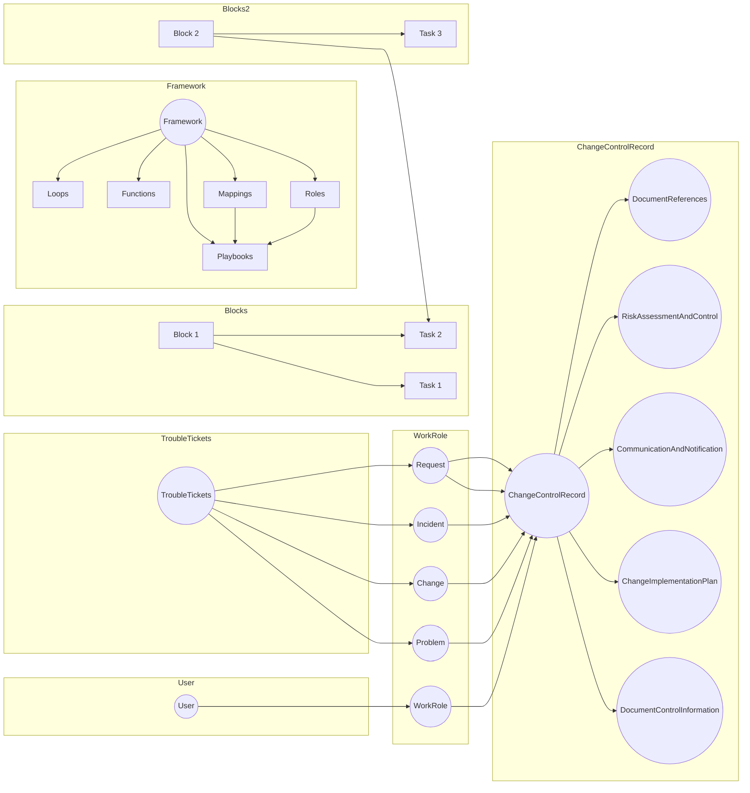

# Getting Started with Trouble tickets

## Components:
User: Represents a user in the system.
WorkRole: Represents a role related to work.
Problem: Represents a problem or an issue.
Change: Represents a change in the system.
Request: Represents a user request.
Incident: Represents an incident or an unexpected event.
ChangeControlRecord: Represents a record for controlling changes.
DocumentControlInformation: Represents information related to document control.
ChangeImplementationPlan: Represents a plan for implementing a change.
CommunicationAndNotification: Represents communication and notification activities.
RiskAssessmentAndControl: Represents activities related to assessing and controlling risks.
DocumentReferences: Represents references to documents.
TroubleTickets: Represents tickets or records related to problems or issues.
Framework: Represents a framework for the system.
Blocks: Represents blocks within the system.
Tasks: Represents tasks within the system.
## Relationships:
There are several relationships between the components represented by the arrows in the flowchart. These relationships indicate the flow of activities or information between the components.
For example, the arrows indicate that the User is connected to the WorkRole, which is connected to the Problem, Change, Request, and Incident components.
Similarly, there are connections between various components, such as TroubleTickets being connected to Problem, Change, Incident, Request, and ChangeImplementationPlan.
## Blocks and Tasks:
The flowchart also includes blocks (B1, B2, B3) and tasks (T1, T2, T3) represented as rectangles.
The blocks represent specific sections or stages within the system.
The tasks represent specific activities or tasks that need to be performed within the blocks.
The arrows indicate the flow of tasks between the blocks.

## Considerations 

The components are grouped based on their relationships and dependencies, providing a clearer representation of the system.
The blocks and tasks are organized for better readability.
Redundant edges between components have been removed to simplify the diagram.

### Growing Dependencies

# Change Control process

# Class Considerations

