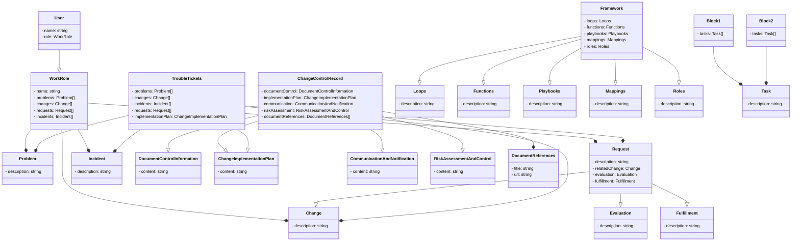
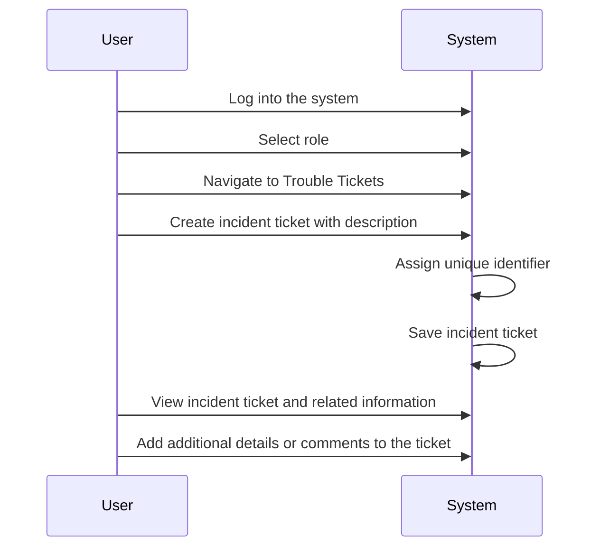

# Requirement Diagrams
Each class from the class diagram is represented as a requirement.
Dependencies and relationships between requirements are represented using arrows.
The arrows indicate the direction of the dependency or relationship.
Inheritance is not explicitly shown in this diagram.

## About Requirement Diagrams and nomenclature 
User and WorkRole: A User has a WorkRole, indicating the user's role in the system.
WorkRole and Problem/Change/Request/Incident: A WorkRole can be associated with multiple Problems, Changes, Requests, and Incidents.
Problem/Change/Request/Incident and ChangeControlRecord: Problems, Changes, Requests, and Incidents are linked to a ChangeControlRecord, which contains information related to control and management of changes.
ChangeControlRecord and DocumentControlInformation/ChangeImplementationPlan/CommunicationAndNotification/RiskAssessmentAndControl/DocumentReferences: The ChangeControlRecord includes references to various documents and plans related to change control and management.
TroubleTickets and Problem/Change/Incident/Request: TroubleTickets can have associations with multiple Problems, Changes, Incidents, and Requests.
TroubleTickets and ChangeImplementationPlan: TroubleTickets are associated with a ChangeImplementationPlan.
Framework and Loops/Functions/Playbooks/Mappings/Roles: The Framework includes Loops, Functions, Playbooks, Mappings, and Roles.
Mappings and Playbooks: Mappings are linked to Playbooks.
Roles and Playbooks: Roles are associated with Playbooks.
Blocks and Tasks: Blocks can contain multiple Tasks.





# Simple Class Relationships

```mermaid
classDiagram

class User {
    - name: string
    - role: WorkRole
}

class WorkRole {
    - name: string
}

class Problem {
    - description: string
}

class Change {
    - description: string
}

class Request {
    - description: string
}

class Incident {
    - description: string
}

class ChangeControlRecord {
    - documentControl: DocumentControlInformation
    - implementationPlan: ChangeImplementationPlan
    - communication: CommunicationAndNotification
    - riskAssessment: RiskAssessmentAndControl
    - documentReferences: DocumentReferences[]
}

class DocumentControlInformation {
    - content: string
}

class ChangeImplementationPlan {
    - content: string
}

class CommunicationAndNotification {
    - content: string
}

class RiskAssessmentAndControl {
    - content: string
}

class DocumentReferences {
    - title: string
    - url: string
}

class TroubleTickets {
    - problems: Problem[]
    - changes: Change[]
    - incidents: Incident[]
    - requests: Request[]
    - implementationPlan: ChangeImplementationPlan
}

class Framework {
    - loops: Loops
    - functions: Functions
    - playbooks: Playbooks
    - mappings: Mappings
    - roles: Roles
}

class Loops {
    - description: string
}

class Functions {
    - description: string
}

class Playbooks {
    - description: string
}

class Mappings {
    - description: string
}

class Roles {
    - description: string
}

class Evaluation {
    - description: string
}

class Fulfillment {
    - description: string
}

class Block {
    - tasks: Task[]
}

class Task {
    - description: string
}

User --|> WorkRole
WorkRole --* Problem
WorkRole --* Change
WorkRole --* Request
WorkRole --* Incident
ChangeControlRecord --|> DocumentControlInformation
ChangeControlRecord --|> ChangeImplementationPlan
ChangeControlRecord --|> CommunicationAndNotification
ChangeControlRecord --|> RiskAssessmentAndControl
ChangeControlRecord --* DocumentReferences
TroubleTickets --* Problem
TroubleTickets --* Change
TroubleTickets --* Incident
TroubleTickets --* Request
TroubleTickets --|> ChangeImplementationPlan
Framework --|> Loops
Framework --|> Functions
Framework --|> Playbooks
Framework --|> Mappings
Framework --|> Roles
Block --* Task
```



# Sequence Diagram



# State Diagram
```mermaid
stateDiagram
    [*] --> User
    User --> WorkRole
    WorkRole --> Problem
    WorkRole --> Change
    WorkRole --> Request
    WorkRole --> Incident
    Problem --> ChangeControlRecord
    Change --> ChangeControlRecord
    Request --> ChangeControlRecord
    Incident --> ChangeControlRecord
    ChangeControlRecord --> DocumentControlInformation
    ChangeControlRecord --> ChangeImplementationPlan
    ChangeControlRecord --> CommunicationAndNotification
    ChangeControlRecord --> RiskAssessmentAndControl
    ChangeControlRecord --> DocumentReferences
    TroubleTickets --> Problem
    TroubleTickets --> Change
    TroubleTickets --> Incident
    TroubleTickets --> Request
    TroubleTickets --> ChangeImplementationPlan
    Request --> Evaluation
    Request --> Fulfillment
    Framework --> Loops
    Framework --> Functions
    Framework --> Playbooks
    Framework --> Mappings
    Framework --> Roles
    Mappings --> Playbooks
    Roles --> Playbooks
    Blocks --> Task

    state User {
        [*] --> LoggedIn
        LoggedIn --> RoleSelected
        RoleSelected --> TroubleTickets
    }

    state TroubleTickets {
        [*] --> View
        View --> Create
        Create --> View
        View --> Edit
        Edit --> View
    }

    state ChangeControlRecord {
        [*] --> New
        New --> InProgress
        InProgress --> Completed
    }

    state ChangeImplementationPlan {
        [*] --> Draft
        Draft --> Finalized
    }
    ```


