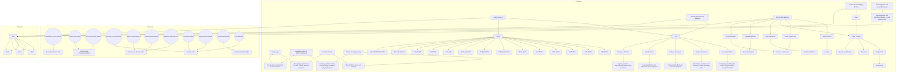

```mermaid
graph TD

subgraph Functions
  AD[Active Directory]
  TTMS[Trouble Ticket Mapping System]
  PWRI[Primary Work Role ID Mapping]
  RM[Relationship Mapping]
  EP[Executing tasks with elevated privileges]
  LP[Using loops]
  DP[Delegating tasks to different machines]
  CT[Conditional tasks]
  BL[Blocks for task grouping]

  AD --> Root
  AD --> Users
  Users --> SEC-ARCH
  Users --> SYS-ARCH
  Users --> SOFT-DEV
  Users --> DATA-ARCH
  Users --> ENT-ARCH
  Users --> TECH-ARCH
  Users --> CYBER-ANALYST
  Users --> CYBER-INFRA
  Users --> DATA-ANALYST
  Users --> SYS-DEV
  Users --> NET-ENG
  Users --> SYS-ADMIN
  Users --> SEC-ASSESSOR
  Users --> SEC-CONT-ASSESSOR

  TTMS --> User
  User --> TT[Trouble Ticket]
  TT --> AT[Assigned To]
  AT --> UB[Updated By]
  TT --> Resolved

  PWRI --> Root
  Root --> SecurityArch[Security Architect]
  SecurityArch --> Cultivate[Cultivating knowledgeable teams and promoting a security-first culture]
  Root --> SystemsArch[Systems Architect]
  SystemsArch --> Streamline[Streamlining workflows and evolving a unified operating model]
  Root --> SoftDev[Software Developer]
  SoftDev --> Collaborate[Collaborating effectively across the platform]
  Root --> DataArch[Data Architect]
  DataArch --> Ensure[Ensuring efficient and effective data management]
  Root --> EntArch[Enterprise Architect]
  EntArch --> Align[Aligning business objectives with hybrid cloud operations]

  RM --> TC[Ticket Creation]
  TC --> Analyze[Analyze]
  RM --> TA[Ticket Assignment]
  TA --> OAG[Oversee and Govern]
  RM --> TT[Ticket Tracking]
  TT --> OAM[Operate and Maintain]
  RM --> TR[Ticket Resolution]
  TR --> PAD[Protect and Defend]
  RM --> DM[Data Management]
  DM --> SP[Securely Provision]
  RM --> CM[Communication]
  CM --> OAG[Oversee and Govern]

  EP --> A
  LP --> B
  DP --> C
  CT --> D
  BL --> E
end

subgraph Mappings
  ISO((Information System Owner))
  AO((Authorizing Official))
  CIO((Chief Information Officer))
  SCA((Security Control Assessor))
  SYS_ADMIN((System Administrator))
  NET_ADMIN((Network Administrator))
  DB_ADMIN((Database Administrator))
  SEC_ARCH((Security Architect))
  APP_DEV((Application Developer))
  INC_RESP((Incident Responder))
  THREAT_ANALYST((Threat Analyst))

  ISO --> SPKSA[Securely Provision KSA]
  AO --> ODKSA[Oversight and Development KSA]
  CIO --> ODKSA
  SCA --> AKSA[Analyze KSA]
  SYS_ADMIN --> OMKSA[Operate and Maintain KSA]
  NET_ADMIN --> OMKSA
  DB_ADMIN --> OMKSA
  SEC_ARCH --> AKSA
  APP_DEV --> AKSA
  INC_RESP --> PDKSA[Protect and Defend KSA]
  THREAT_ANALYST --> AKSA

  A["Executing tasks with elevated privileges or as a different user"] --> SYS_ADMIN
  B["Using loops to repeat tasks for items in a list"] --> LP
  C["Delegating playbooks to execute tasks on different machines"] --> DP
  D["Running conditional tasks and evaluating conditions with playbook tests"] --> CT
  E["Using blocks to group sets of tasks"] --> BL
end

subgraph Playbook
  Play[Play]
  Role[Role]
  Block[Block]
  Task[Task]

  Play --> Role
  Play --> Block
  Play --> Task
end

AD --> Play
TTMS --> Play
PWRI --> Play
RM --> Play
Play --> Role
Play --> Block
Play --> Task

```

