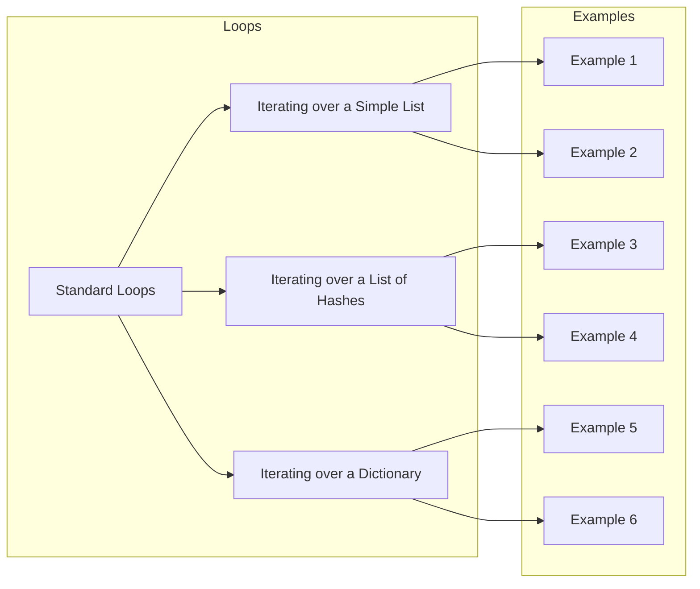

```mermaid
graph LR

subgraph Loops
  SL[Standard Loops]
  LSL[Iterating over a Simple List]
  LH[Iterating over a List of Hashes]
  LD[Iterating over a Dictionary]

  SL --> LSL
  SL --> LH
  SL --> LD
end

subgraph Examples
  LSL --> Example1[Example 1]
  LSL --> Example2[Example 2]

  LH --> Example3[Example 3]
  LH --> Example4[Example 4]

  LD --> Example5[Example 5]
  LD --> Example6[Example 6]
end

```
