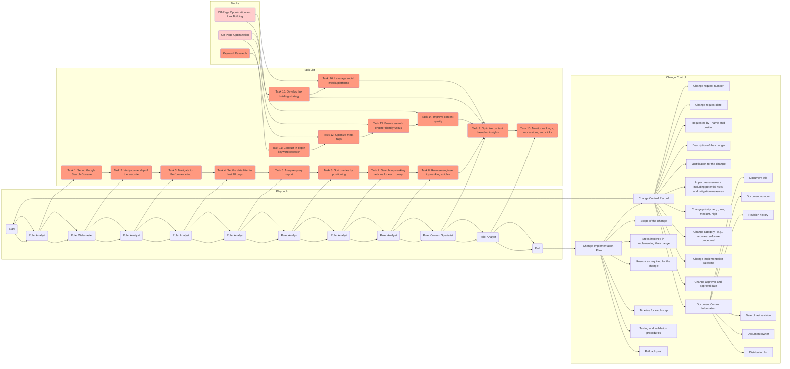
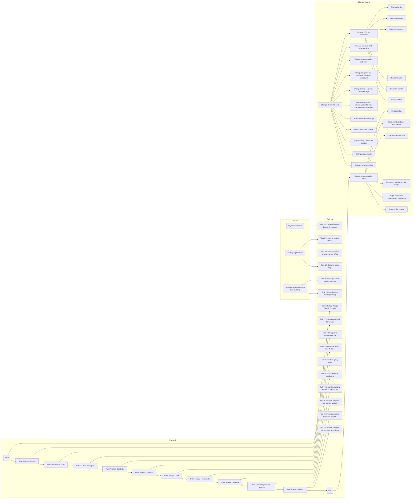

Building the Change Control Record

In order to effectively manage changes to the SEO playbook, it is important to establish a change control process. This process ensures that any modifications to the playbook are properly documented, evaluated, and approved. Here is an example of a change control record that can be used for the SEO playbook:

Change Control Record
Change Request Number: [Unique identifier for the change request]
Change Request Date: [Date when the change request was submitted]
Requested by: [Name and position of the person who requested the change]
Description of the Change: [Brief description of the proposed change]
Justification for the Change: [Reasons for the proposed change]
Impact Assessment: [Assessment of the potential impact of the change, including any risks and mitigation measures]
Change Priority: [Priority level assigned to the change (e.g., low, medium, high)]
Change Category: [Category of the change (e.g., hardware, software, procedural)]
Change Implementation Date/Time: [Scheduled date and time for implementing the change]
Change Approver and Approval Date: [Name and position of the person who approved the change, along with the approval date]
Document Control Information
Document Title: [Title of the SEO playbook]
Document Number: [Unique identifier for the document]
Revision History: [Summary of the document's revision history]
Date of Last Revision: [Date of the most recent revision]
Document Owner: [Name and position of the person responsible for maintaining the document]
Distribution List: [List of individuals or departments who should receive the updated document]
Change Implementation Plan
Scope of the Change: [Description of the scope and objectives of the proposed change]
Steps Involved in Implementing the Change: [Sequential list of steps required to implement the change]
Resources Required for the Change: [List of resources, including personnel and tools, needed to implement the change]
Timeline for Each Step: [Estimated timeline for completing each step of the change implementation]
Testing and Validation Procedures: [Description of the procedures to test and validate the changes before implementation]
Rollback Plan: [Plan outlining steps to revert the changes in case of any issues or failures]
By following a structured change control process, you can ensure that any modifications to the SEO playbook are properly evaluated, approved, and implemented. This helps maintain the integrity and effectiveness of the playbook while minimizing the potential risks associated with changes.

Remember to review and update the change control record and implementation plan whenever changes are made to the SEO playbook. Documenting these changes and following an organized process will help maintain a reliable and up-to-date playbook for increasing SEO with Google.

# Requirements

