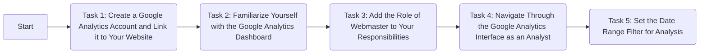
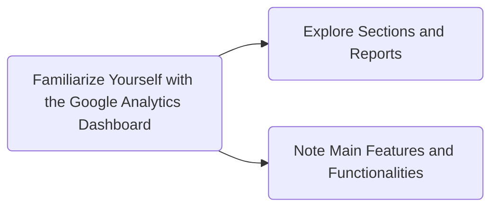
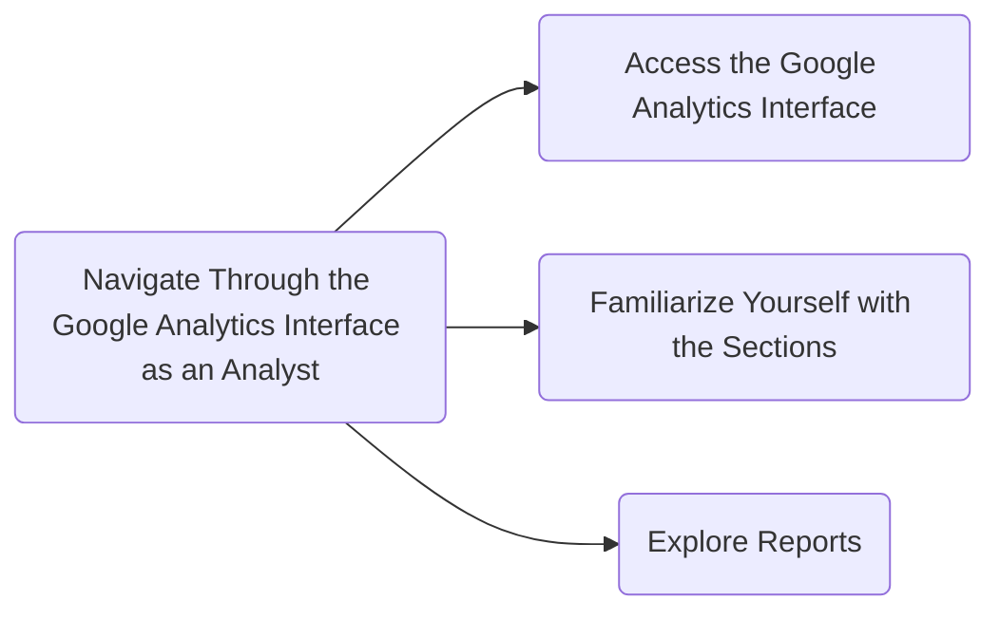
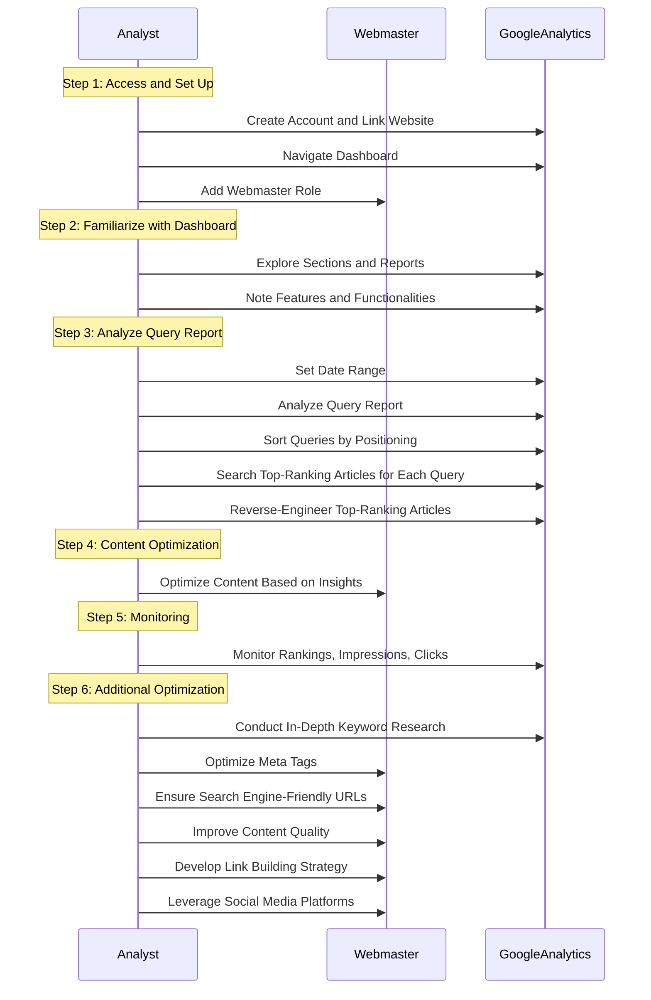
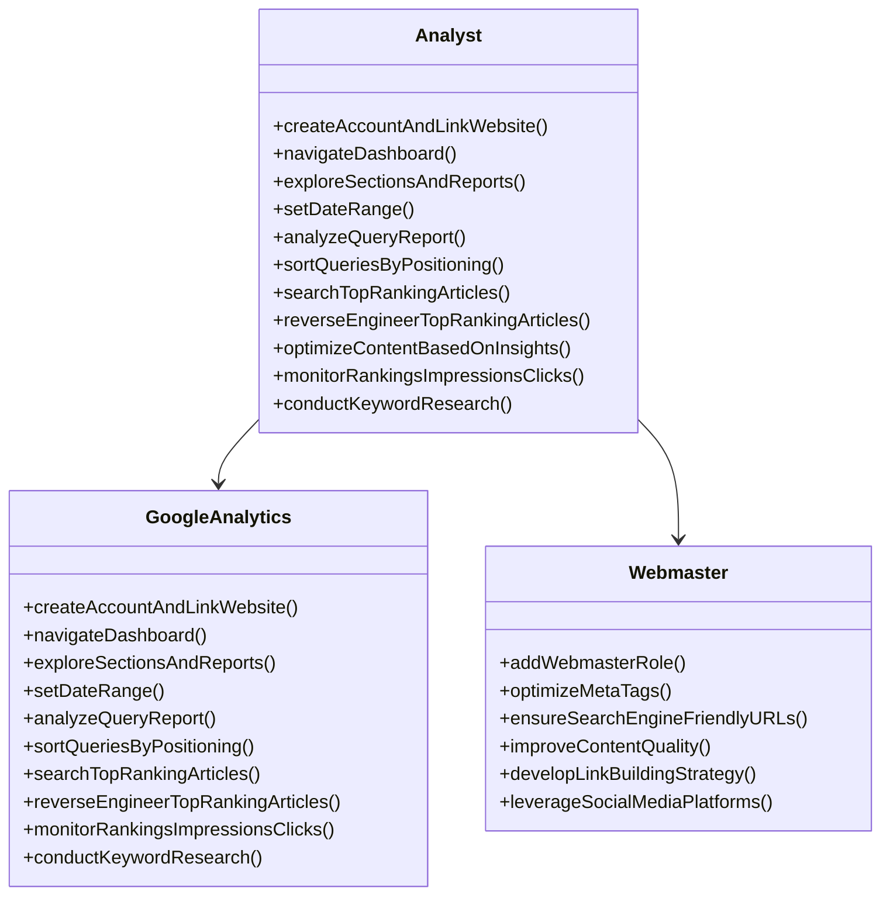
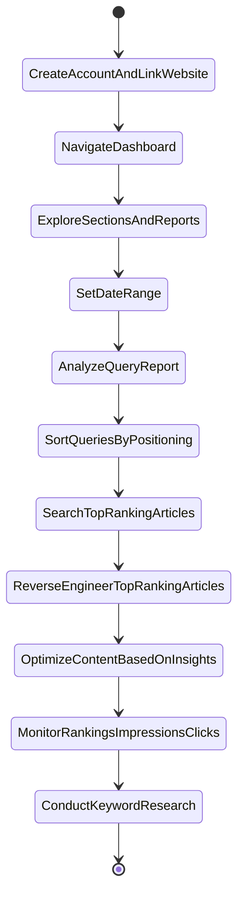
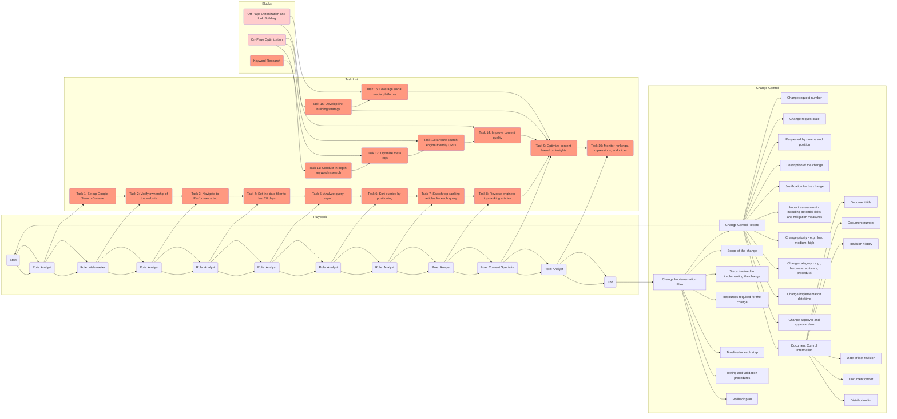
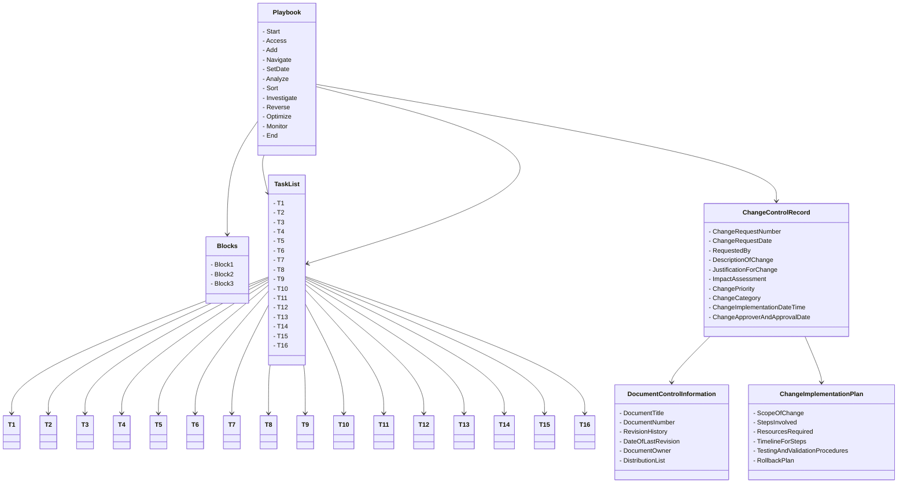
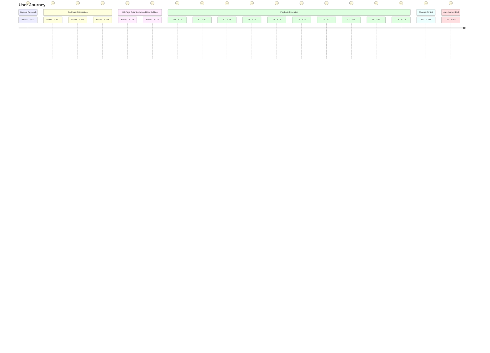
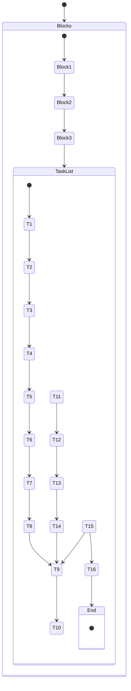

A Comprehensive Guide to Using Google Analytics for Website Analysis

In today's digital landscape, data-driven decision-making plays a crucial role in optimizing websites and maximizing their performance. Google Analytics is a powerful tool that provides valuable insights into website traffic, user behavior, and conversion rates. By leveraging the capabilities of Google Analytics, you can gain a deeper understanding of your audience and make informed decisions to improve your website's performance. This article will guide you through the process of using Google Analytics effectively.

# Step 1: Access and Set Up
Start by creating a Google Analytics account and linking it to your website. This process requires assuming the role of an analyst.
Access the Google Analytics dashboard and familiarize yourself with its features and functionalities. This step will help you navigate through the platform effectively.
Add the role of a webmaster to your responsibilities. This role allows you to implement tracking codes and make technical changes to your website to ensure accurate data collection.
Navigate through the Google Analytics interface as an analyst to understand the different sections and reports available.
Set the date range filter to analyze data from the desired time period. Start by selecting the last 28 days to have recent and relevant information for analysis.
## Diagram



# Step 2: Analyze and Investigate
Begin by exploring the Audience section to understand your website visitors' demographics, interests, and behavior. This information helps tailor your content and marketing efforts to your target audience.
Analyze the Acquisition section to gain insights into how users find your website. Evaluate the performance of different channels, such as organic search, paid search, social media, and referrals.
Dive into the Behavior section to understand how users navigate your website, the most popular pages, and the average time spent on each page. Identify any areas that may require optimization or improvements.
Utilize the Conversion section to track and measure goal completions, such as form submissions, purchases, or newsletter sign-ups. Set up specific goals and monitor their performance to gauge your website's effectiveness in driving conversions.

## Diagram




# Step 3: Optimize and Monitor
Based on the insights gained from your analysis, identify areas for optimization. As a content specialist, optimize your website's content, user experience, and conversion funnels to improve performance.
Monitor key metrics such as traffic, bounce rate, average session duration, and conversion rates regularly. Keep track of any significant changes and identify trends over time.
Implement in-depth keyword research to identify relevant keywords and optimize your website's content accordingly. This task helps improve organic search visibility and attract targeted traffic.
Optimize meta tags, including title tags and meta descriptions, to improve search engine visibility and encourage click-through rates.
Ensure your website has search engine-friendly URLs that are concise, descriptive, and contain relevant keywords.
Improve the overall quality of your website's content by enhancing readability, providing valuable information, and optimizing for user engagement.
Develop a comprehensive link-building strategy to increase the authority and visibility of your website. This step involves acquiring backlinks from reputable sources and leveraging internal linking to improve site structure.

## Diagram

# Sequence Diagram
    Note: This sequence diagram outlines the sequence of tasks in the workflow, involving the analyst, webmaster, and Google Analytics. Each task is depicted as a message passed between the relevant participants.


# Data Structure and Class


# State Diagram



# Entity Relationship Mapping

```
+-------------------+          +-------------------+
|    Analyst        |          |   GoogleAnalytics |
+-------------------+          +-------------------+
|                   |          |                   |
|  createAccount()  |          |                   |
|  navigateDashboard()   +------>   navigateDashboard()|
|  exploreSectionsAndReports() +--->   exploreSectionsAndReports()|
|  setDateRange() +--------------->   setDateRange() |
|  analyzeQueryReport() +--------->   analyzeQueryReport()|
|  sortQueriesByPositioning() +--->   sortQueriesByPositioning()|
|  searchTopRankingArticles() +--->   searchTopRankingArticles()|
|  reverseEngineerTopRankingArticles() +-->   reverseEngineerTopRankingArticles()|
|  optimizeContentBasedOnInsights() +--->   optimizeContentBasedOnInsights()|
|  monitorRankingsImpressionsClicks() +--->   monitorRankingsImpressionsClicks()|
|  conductKeywordResearch() +----->   conductKeywordResearch()|
|                   |          |                   |
+-------------------+          +-------------------+

+-------------------+
|     Analyst       |
+-------------------+
|                   |
|                   |
|                   |
|                   |
+-------------------+
       |
       |
       |
       |
       |
+-------------------+
|   Webmaster       |
+-------------------+
|                   |
|  addWebmasterRole()|
|  optimizeMetaTags()|
|  ensureSearchEngineFriendlyURLs()|
|  improveContentQuality()|
|  developLinkBuildingStrategy()|
|  leverageSocialMediaPlatforms()|
|                   |
+-------------------+
```


# Framework Integration



# Setting Classes
    In this diagram, Playbook, Blocks, TaskList, ChangeControlRecord, DocumentControlInformation, and ChangeImplementationPlan are represented as classes, and the associations between them are depicted using arrows. The - symbol indicates private attributes of each class.

class Playbook {
    - Start
    - Access
    - Add
    - Navigate
    - SetDate
    - Analyze
    - Sort
    - Investigate
    - Reverse
    - Optimize
    - Monitor
    - End
}

class Blocks {
    - Block1
    - Block2
    - Block3
}

class TaskList {
    - T1
    - T2
    - T3
    - T4
    - T5
    - T6
    - T7
    - T8
    - T9
    - T10
    - T11
    - T12
    - T13
    - T14
    - T15
    - T16
}

class ChangeControlRecord {
    - ChangeRequestNumber
    - ChangeRequestDate
    - RequestedBy
    - DescriptionOfChange
    - JustificationForChange
    - ImpactAssessment
    - ChangePriority
    - ChangeCategory
    - ChangeImplementationDateTime
    - ChangeApproverAndApprovalDate
}

class DocumentControlInformation {
    - DocumentTitle
    - DocumentNumber
    - RevisionHistory
    - DateOfLastRevision
    - DocumentOwner
    - DistributionList
}

class ChangeImplementationPlan {
    - ScopeOfChange
    - StepsInvolved
    - ResourcesRequired
    - TimelineForSteps
    - TestingAndValidationProcedures
    - RollbackPlan
}

Playbook --> Blocks
Playbook --> TaskList
Playbook --> ChangeControlRecord
ChangeControlRecord --> DocumentControlInformation
ChangeControlRecord --> ChangeImplementationPlan
Playbook --> TaskList
TaskList --> T1
TaskList --> T2
TaskList --> T3
TaskList --> T4
TaskList --> T5
TaskList --> T6
TaskList --> T7
TaskList --> T8
TaskList --> T9
TaskList --> T10
TaskList --> T11
TaskList --> T12
TaskList --> T13
TaskList --> T14
TaskList --> T15
TaskList --> T16


## Dependencies 


## User Journey



## User States



