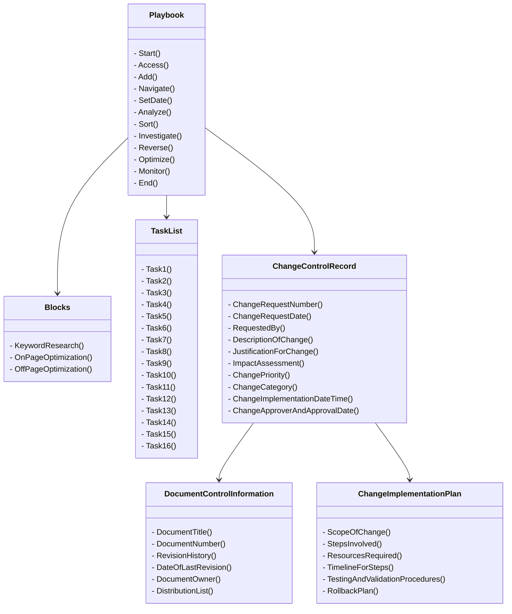

```mermaid
classDiagram
    class Playbook {
        - Start()
        - Access()
        - Add()
        - Navigate()
        - SetDate()
        - Analyze()
        - Sort()
        - Investigate()
        - Reverse()
        - Optimize()
        - Monitor()
        - End()
    }

    class Blocks {
        - KeywordResearch()
        - OnPageOptimization()
        - OffPageOptimization()
    }

    class TaskList {
        - Task1()
        - Task2()
        - Task3()
        - Task4()
        - Task5()
        - Task6()
        - Task7()
        - Task8()
        - Task9()
        - Task10()
        - Task11()
        - Task12()
        - Task13()
        - Task14()
        - Task15()
        - Task16()
    }

    class ChangeControlRecord {
        - ChangeRequestNumber()
        - ChangeRequestDate()
        - RequestedBy()
        - DescriptionOfChange()
        - JustificationForChange()
        - ImpactAssessment()
        - ChangePriority()
        - ChangeCategory()
        - ChangeImplementationDateTime()
        - ChangeApproverAndApprovalDate()
    }

    class DocumentControlInformation {
        - DocumentTitle()
        - DocumentNumber()
        - RevisionHistory()
        - DateOfLastRevision()
        - DocumentOwner()
        - DistributionList()
    }

    class ChangeImplementationPlan {
        - ScopeOfChange()
        - StepsInvolved()
        - ResourcesRequired()
        - TimelineForSteps()
        - TestingAndValidationProcedures()
        - RollbackPlan()
    }

    Playbook --> Blocks
    Playbook --> TaskList
    Playbook --> ChangeControlRecord
    ChangeControlRecord --> DocumentControlInformation
    ChangeControlRecord --> ChangeImplementationPlan

```
