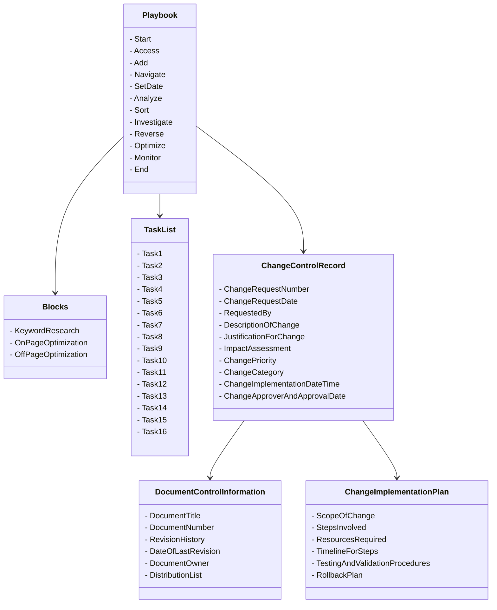
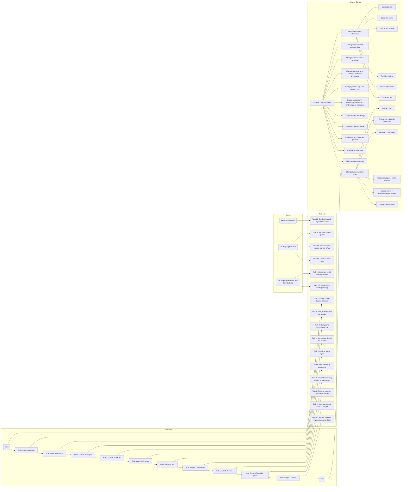
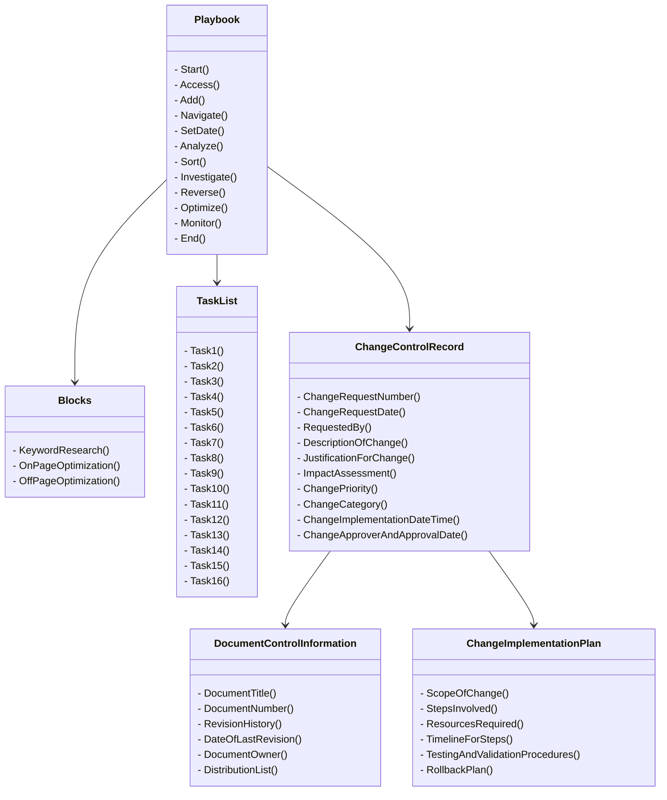

# Connecting the blocks

## Puting them together
### Notes about Class Diagram
    Class names are now in title case.
    Method names are enclosed in parentheses to indicate they are methods.
    Relationships between classes are represented using arrows.
    Each class and method is properly aligned for better readability.

