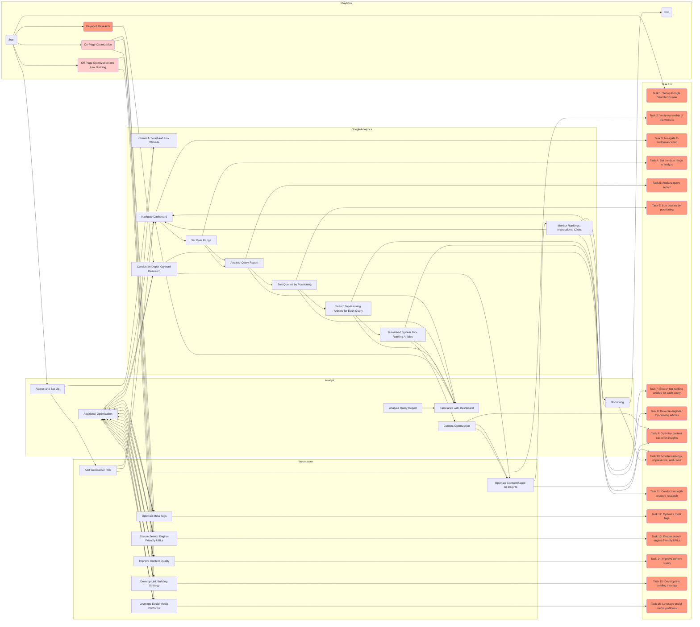

```mermaid
graph LR;

subgraph Analyst
    A[Access and Set Up]
    B[Familiarize with Dashboard]
    C[Analyze Query Report]
    D[Content Optimization]
    E[Monitoring]
    F[Additional Optimization]
end

subgraph Webmaster
    G[Add Webmaster Role]
    H[Optimize Content Based on Insights]
    I[Optimize Meta Tags]
    J[Ensure Search Engine-Friendly URLs]
    K[Improve Content Quality]
    L[Develop Link Building Strategy]
    M[Leverage Social Media Platforms]
end

subgraph GoogleAnalytics
    N[Create Account and Link Website]
    O[Navigate Dashboard]
    R[Set Date Range]
    S[Analyze Query Report]
    T[Sort Queries by Positioning]
    U[Search Top-Ranking Articles for Each Query]
    V[Reverse-Engineer Top-Ranking Articles]
    W[Monitor Rankings, Impressions, Clicks]
    X[Conduct In-Depth Keyword Research]
end

A --> N
B --> O
G --> N
C --> B
D --> H
E --> O
F --> O
F --> X
F --> I
F --> J
F --> K
F --> L
F --> M
S --> B
T --> B
U --> B
V --> B
R --> S
W --> O
X --> H
I --> F
J --> F
K --> F
L --> F
M --> F

subgraph Playbook
    Start(Start)
    End(End)
    Block1(Keyword Research)
    Block2(On-Page Optimization)
    Block3(Off-Page Optimization and Link Building)
    
    Start --> Block1
    Start --> Block2
    Start --> Block3
    
    Block1 --> X
    Block2 --> I
    Block2 --> J
    Block2 --> K
    Block3 --> L
    Block3 --> M
end

subgraph Task List
    T1(Task 1: Set up Google Search Console)
    T2(Task 2: Verify ownership of the website)
    T3(Task 3: Navigate to Performance tab)
    T4(Task 4: Set the date range to analyze)
    T5(Task 5: Analyze query report)
    T6(Task 6: Sort queries by positioning)
    T7(Task 7: Search top-ranking articles for each query)
    T8(Task 8: Reverse-engineer top-ranking articles)
    T9(Task 9: Optimize content based on insights)
    T10(Task 10: Monitor rankings, impressions, and clicks)
    T11(Task 11: Conduct in-depth keyword research)
    T12(Task 12: Optimize meta tags)
    T13(Task 13: Ensure search engine-friendly URLs)
    T14(Task 14: Improve content quality)
    T15(Task 15: Develop link building strategy)
    T16(Task 16: Leverage social media platforms)

    Start --> T1
    G --> T2
    O --> T3
    R --> T4
    S --> T5
    T --> T6
    U --> T7
    V --> T8
    D --> T9
    H --> T9
    W --> T10
    X --> T11
    I --> T12
    J --> T13
    K --> T14
    L --> T15
    M --> T16
    E --> T10
end;

style Block1 fill:#ff9980;
style Block2 fill:#ffcccc;
style Block3 fill:#ffcccc;

style T1 fill:#ff9980

;
style T2 fill:#ff9980;
style T3 fill:#ff9980;
style T4 fill:#ff9980;
style T5 fill:#ff9980;
style T6 fill:#ff9980;
style T7 fill:#ff9980;
style T8 fill:#ff9980;
style T9 fill:#ff9980;
style T10 fill:#ff9980;
style T11 fill:#ff9980;
style T12 fill:#ff9980;
style T13 fill:#ff9980;
style T14 fill:#ff9980;
style T15 fill:#ff9980;
style T16 fill:#ff9980;

Start --> A
A --> G
G --> O
O --> R
R --> S
S --> T
T --> U
U --> V
V --> D
D --> H
H --> W
X --> F
I --> F
J --> F
K --> F
L --> F
M --> F
W --> E
E --> End

```

# Reduced

```mermaid
graph LR;

subgraph Analyst
    A[Access and Set Up]
    B[Familiarize with Dashboard]
    C[Analyze Query Report]
    D[Content Optimization]
    E[Monitoring]
    F[Additional Optimization]
end

subgraph Webmaster
    G[Add Webmaster Role]
    H[Optimize Content Based on Insights]
    I[Optimize Meta Tags]
    J[Ensure Search Engine-Friendly URLs]
    K[Improve Content Quality]
    L[Develop Link Building Strategy]
    M[Leverage Social Media Platforms]
end

subgraph GoogleAnalytics
    N[Create Account and Link Website]
    O[Navigate Dashboard]
    R[Set Date Range]
    S[Analyze Query Report]
    T[Sort Queries by Positioning]
    U[Search Top-Ranking Articles for Each Query]
    V[Reverse-Engineer Top-Ranking Articles]
    W[Monitor Rankings, Impressions, Clicks]
    X[Conduct In-Depth Keyword Research]
end

A --> N
B --> O
G --> N
C --> B
D --> H
E --> O
F --> O
F --> X
F --> I
F --> J
F --> K
F --> L
F --> M
S --> B
T --> B
U --> B
V --> B
R --> S
W --> O
X --> H
I --> F
J --> F
K --> F
L --> F
M --> F

subgraph Playbook
    Start(Start)
    End(End)
    Block1(Keyword Research)
    Block2(On-Page Optimization)
    Block3(Off-Page Optimization and Link Building)
    
    Start --> Block1
    Start --> Block2
    Start --> Block3
    
    Block1 --> X
    Block2 --> I
    Block2 --> J
    Block2 --> K
    Block3 --> L
    Block3 --> M
end

subgraph Task List
    T1(Task 1: Set up Google Search Console)
    T2(Task 2: Verify ownership of the website)
    T3(Task 3: Navigate to Performance tab)
    T4(Task 4: Set the date range to analyze)
    T5(Task 5: Analyze query report)
    T6(Task 6: Sort queries by positioning)
    T7(Task 7: Search top-ranking articles for each query)
    T8(Task 8: Reverse-engineer top-ranking articles)
    T9(Task 9: Optimize content based on insights)
    T10(Task 10: Monitor rankings, impressions, and clicks)
    T11(Task 11: Conduct in-depth keyword research)
    T12(Task 12: Optimize meta tags)
    T13(Task 13: Ensure search engine-friendly URLs)
    T14(Task 14: Improve content quality)
    T15(Task 15: Develop link building strategy)
    T16(Task 16: Leverage social media platforms)

    Start --> T1
    G --> T2
    O --> T3
    R --> T4
    S --> T5
    T --> T6
    U --> T7
    V --> T8
    D --> T9
    H --> T9
    W --> T10
    X --> T11
    I --> T12
    J --> T13
    K --> T14
    L --> T15
    M --> T16
    E --> T10
end;

style Block1 fill:#ff9980;
style Block2 fill:#ffcccc;
style Block3 fill:#ffcccc;

style T1 fill:#ff9980;
style T2 fill:#ff9980;
style T3 fill:#ff9980;
style T4 fill:#ff9980;
style T5 fill:#ff9980;
style T6 fill:#ff9980;
style T7 fill:#ff9980;
style T8 fill:#ff9980;
style T9 fill:#ff9980;
style T10 fill:#ff9980;
style T11 fill:#ff9980;
style T12 fill:#ff9980;
style T13 fill:#ff9980;
style T14 fill:#ff9980;
style T15 fill:#ff9980;
style T16 fill:#ff9980;

Start --> A
A --> G
G --> O
O --> R
R --> S
S --> T
T --> U
U --> V
V --> D
D --> H
H --> W
X --> F
I --> F
J --> F
K --> F
L --> F
M --> F
W --> E
E --> End
```