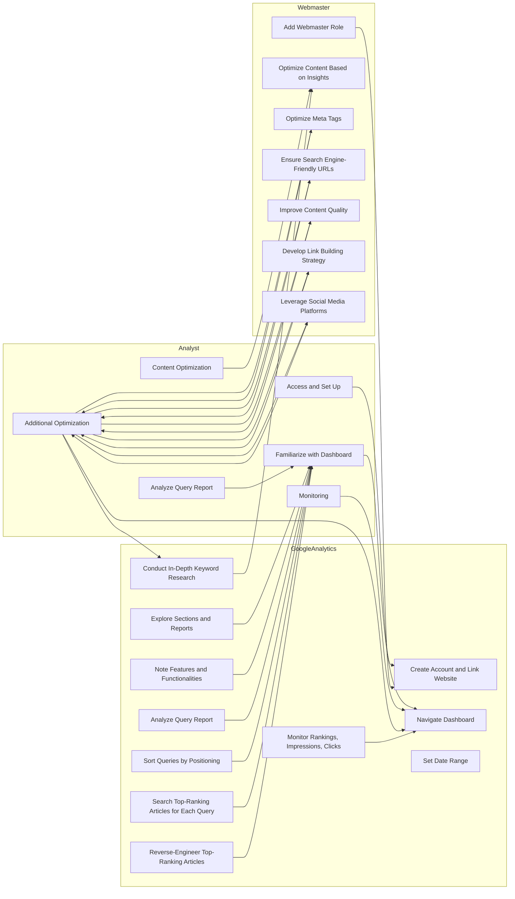
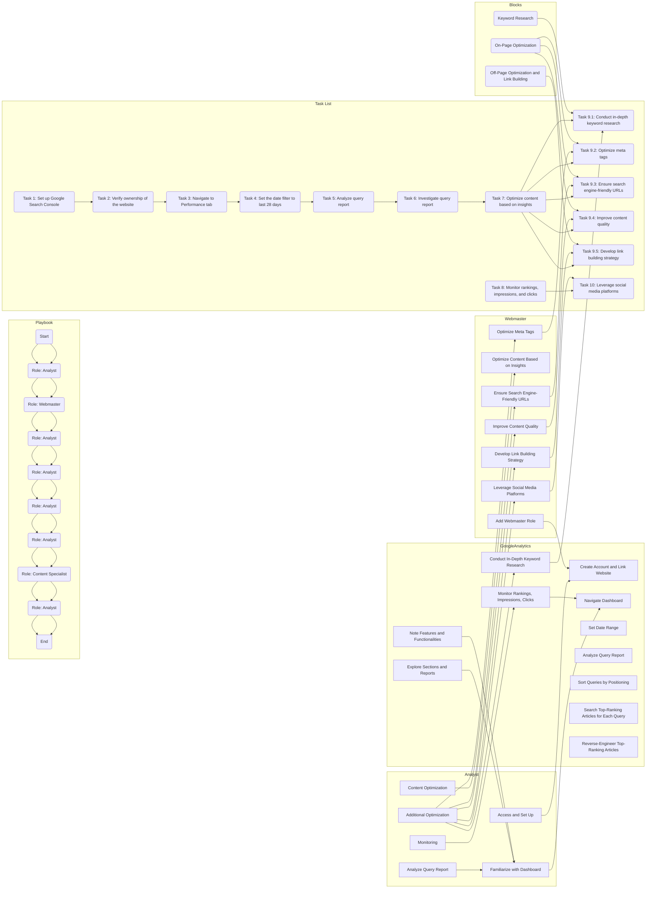
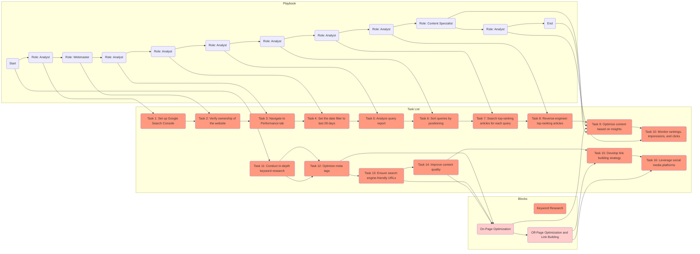
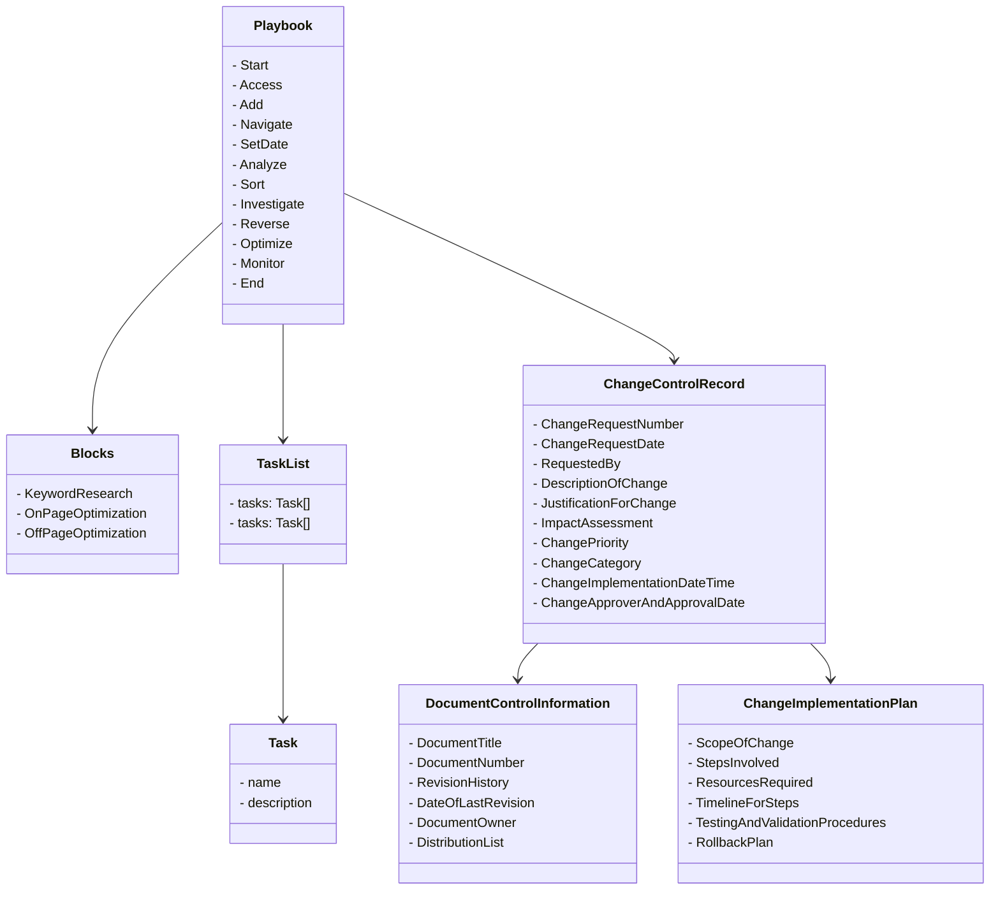
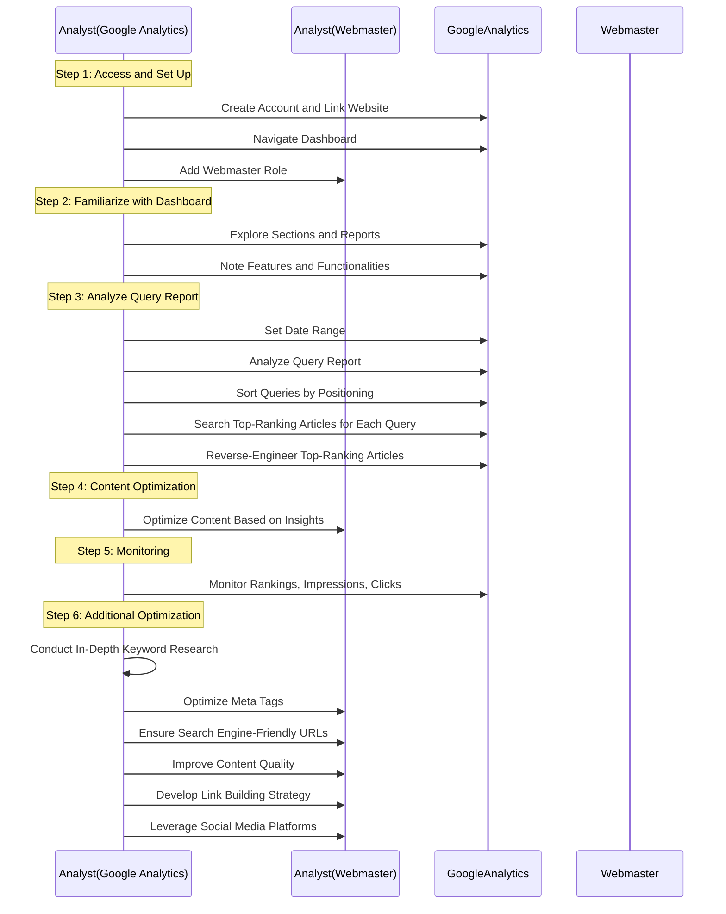
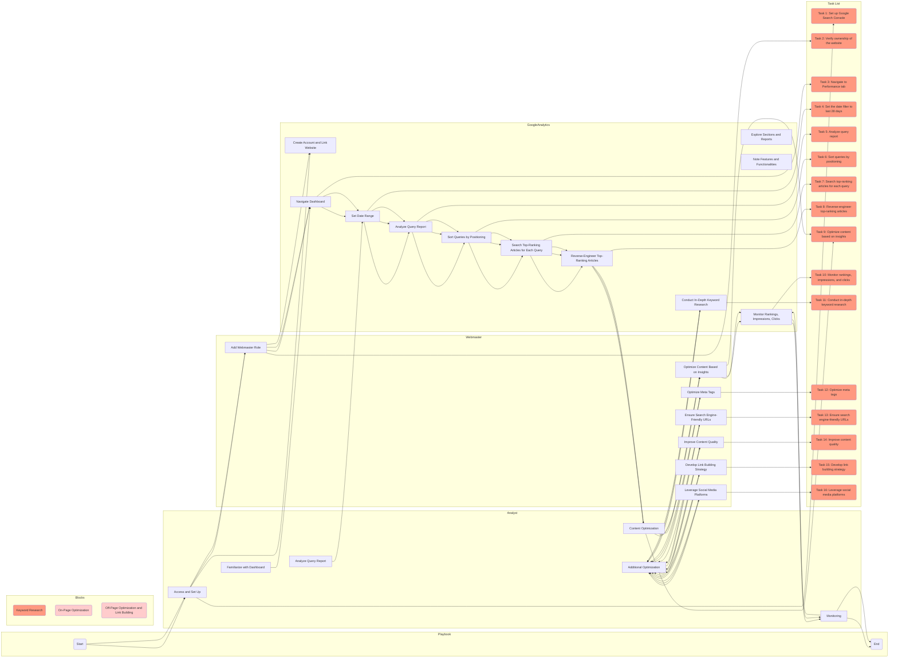
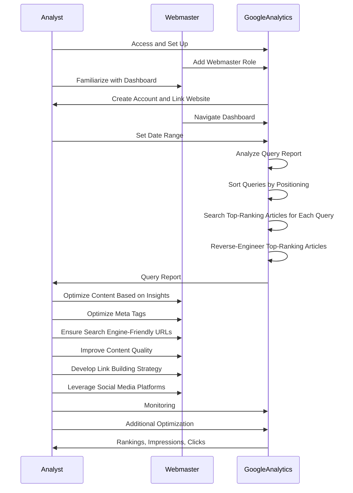

# Sequence Diagram
## Simplify connections: There are several connections in the diagram that can be simplified to improve readability and clarity. For example, the connections between the Analyst subgraph and the GoogleAnalytics subgraph can be streamlined by removing the intermediate nodes (R, S, T, U, and V) and connecting directly from C (Analyze Query Report) to B (Familiarize with Dashboard).
## Improve task list organization: The Task List subgraph can be organized in a more logical and structured manner. Group related tasks together and align them with the corresponding blocks (Block1, Block2, and Block3). This will make it easier to follow the flow and understand the tasks in relation to the blocks they belong to.
## Optimize content optimization tasks: The content optimization tasks (T9) can be further expanded and clarified. Consider breaking down the optimization process into specific subtasks, such as optimizing headings, improving readability, optimizing images, and so on. This will provide a more detailed and actionable list for content specialists to follow.
## Enhance link building strategy: The link building strategy tasks (T15) can be expanded to include specific actions for developing quality backlinks. Provide guidance on identifying relevant websites, reaching out to webmasters, and building mutually beneficial partnerships. This will help webmasters effectively execute the link building strategy.
## Clarify roles and responsibilities: Add labels or annotations to the diagram to clearly indicate which tasks and blocks are assigned to each role (Analyst, Webmaster, Content Specialist). This will ensure that responsibilities are clearly defined and help team members understand their roles in the optimization process.


# Streamlined Roles

# Class Diagram


# Sequence Diagram 



# Improved relationship mapping
    Consolidate and clarify steps: Some steps in the flowchart can be consolidated to make the overall process more streamlined. For example, steps related to accessing and setting up can be combined into a single step, and steps related to analyzing and optimizing can be grouped together.
    Reorganize flow for better readability: Rearrange the flow of steps to provide a more logical and readable sequence. For instance, it may be beneficial to move the "Content Optimization" step after the "Analyze Query Report" step since it relies on the insights gained from analysis.
    Refine participant roles: Refine the participant roles to better represent their responsibilities and expertise. The "Analyst" role can be further divided into specific roles like "Analyst (Google Analytics)" and "Analyst (Content Specialist)" to reflect their respective areas of focus.
    Improve naming conventions: Use more descriptive names for tasks and blocks to clearly convey their purpose. This will enhance understanding and maintain consistency throughout the flowchart.



```rust
sequenceDiagram
    participant Analyst
    participant Webmaster
    participant GoogleAnalytics

    Analyst->>GoogleAnalytics: Access and Set Up
    Webmaster->>GoogleAnalytics: Add Webmaster Role
    Analyst->>Webmaster: Familiarize with Dashboard
    GoogleAnalytics->>Analyst: Create Account and Link Website
    Webmaster->>GoogleAnalytics: Navigate Dashboard
    Analyst->>GoogleAnalytics: Set Date Range
    GoogleAnalytics->>GoogleAnalytics: Analyze Query Report
    GoogleAnalytics->>GoogleAnalytics: Sort Queries by Positioning
    GoogleAnalytics->>GoogleAnalytics: Search Top-Ranking Articles for Each Query
    GoogleAnalytics->>GoogleAnalytics: Reverse-Engineer Top-Ranking Articles
    GoogleAnalytics->>Analyst: Query Report
    Analyst->>Webmaster: Optimize Content Based on Insights
    Analyst->>Webmaster: Optimize Meta Tags
    Analyst->>Webmaster: Ensure Search Engine-Friendly URLs
    Analyst->>Webmaster: Improve Content Quality
    Analyst->>Webmaster: Develop Link Building Strategy
    Analyst->>Webmaster: Leverage Social Media Platforms
    Analyst->>GoogleAnalytics: Monitoring
    Analyst->>GoogleAnalytics: Additional Optimization
    GoogleAnalytics->>Analyst: Rankings, Impressions, Clicks
```

# Sequence Diagram



