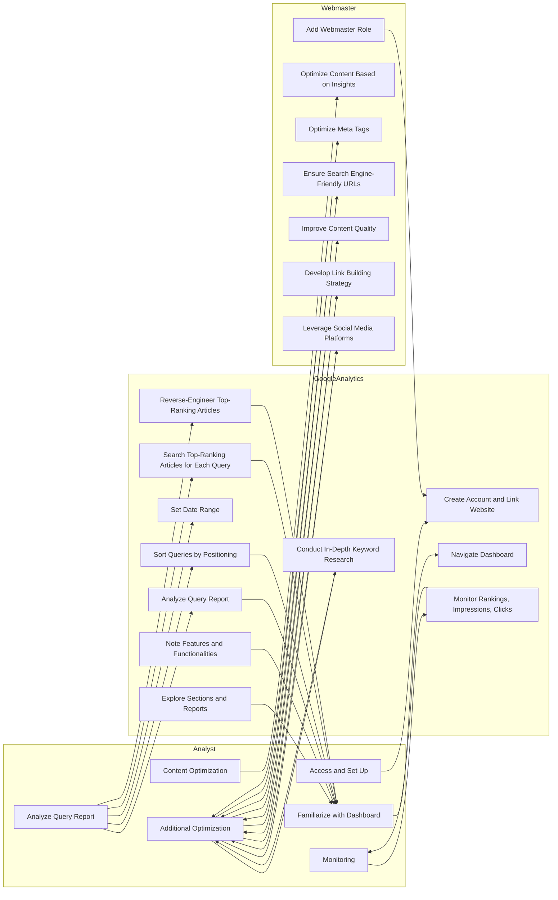

requirementdiagram.md

```mermaid
graph LR;
    subgraph Analyst
        A[Access and Set Up]
        B[Familiarize with Dashboard]
        C[Analyze Query Report]
        D[Content Optimization]
        E[Monitoring]
        F[Additional Optimization]
    end
    
    subgraph Webmaster
        G[Add Webmaster Role]
        H[Optimize Content Based on Insights]
        I[Optimize Meta Tags]
        J[Ensure Search Engine-Friendly URLs]
        K[Improve Content Quality]
        L[Develop Link Building Strategy]
        M[Leverage Social Media Platforms]
    end
    
    subgraph GoogleAnalytics
        N[Create Account and Link Website]
        O[Navigate Dashboard]
        P[Explore Sections and Reports]
        Q[Note Features and Functionalities]
        R[Set Date Range]
        S[Analyze Query Report]
        T[Sort Queries by Positioning]
        U[Search Top-Ranking Articles for Each Query]
        V[Reverse-Engineer Top-Ranking Articles]
        W[Monitor Rankings, Impressions, Clicks]
        X[Conduct In-Depth Keyword Research]
    end
    
    A --> N
    B --> O
    G --> N
    C --> R
    C --> S
    C --> T
    C --> U
    C --> V
    D --> H
    E --> W
    F --> X
    F --> I
    F --> J
    F --> K
    F --> L
    F --> M
    P --> B
    Q --> B
    S --> B
    T --> B
    U --> B
    V --> B
    W --> E
    X --> F
    I --> F
    J --> F
    K --> F
    L --> F
    M --> F
```
