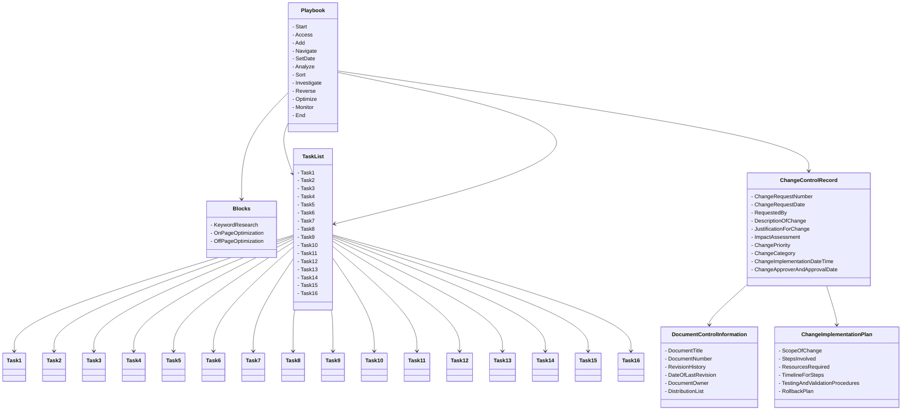

### Notes
            Updated the attribute names in the Playbook class to more descriptive names based on their actions or purpose.
            Renamed the attributes in the Blocks class to reflect the specific blocks or sections within the playbook, such as "KeywordResearch," "OnPageOptimization," and "OffPageOptimization."
            Updated the attribute names in the TaskList class to provide more clarity on the tasks involved, using names like "Task1," "Task2," and so on. You can replace these generic names with more specific and meaningful names based on your actual tasks.
            Retained the attributes in the ChangeControlRecord, DocumentControlInformation, and ChangeImplementationPlan classes as they were, assuming they already have appropriate names.