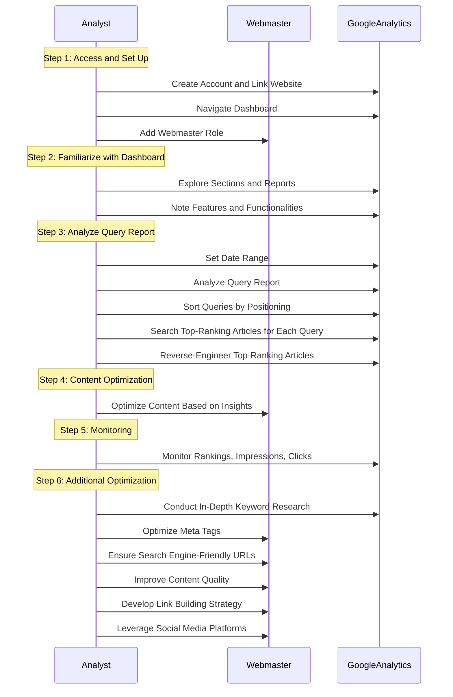

```mermaid
sequenceDiagram
    participant Analyst
    participant Webmaster
    participant GoogleAnalytics

    Note over Analyst: Step 1: Access and Set Up
    Analyst->>GoogleAnalytics: Create Account and Link Website
    Analyst->>GoogleAnalytics: Navigate Dashboard
    Analyst->>Webmaster: Add Webmaster Role

    Note over Analyst: Step 2: Familiarize with Dashboard
    Analyst->>GoogleAnalytics: Explore Sections and Reports
    Analyst->>GoogleAnalytics: Note Features and Functionalities

    Note over Analyst: Step 3: Analyze Query Report
    Analyst->>GoogleAnalytics: Set Date Range
    Analyst->>GoogleAnalytics: Analyze Query Report
    Analyst->>GoogleAnalytics: Sort Queries by Positioning
    Analyst->>GoogleAnalytics: Search Top-Ranking Articles for Each Query
    Analyst->>GoogleAnalytics: Reverse-Engineer Top-Ranking Articles

    Note over Analyst: Step 4: Content Optimization
    Analyst->>Webmaster: Optimize Content Based on Insights

    Note over Analyst: Step 5: Monitoring
    Analyst->>GoogleAnalytics: Monitor Rankings, Impressions, Clicks

    Note over Analyst: Step 6: Additional Optimization
    Analyst->>GoogleAnalytics: Conduct In-Depth Keyword Research
    Analyst->>Webmaster: Optimize Meta Tags
    Analyst->>Webmaster: Ensure Search Engine-Friendly URLs
    Analyst->>Webmaster: Improve Content Quality
    Analyst->>Webmaster: Develop Link Building Strategy
    Analyst->>Webmaster: Leverage Social Media Platforms
```
