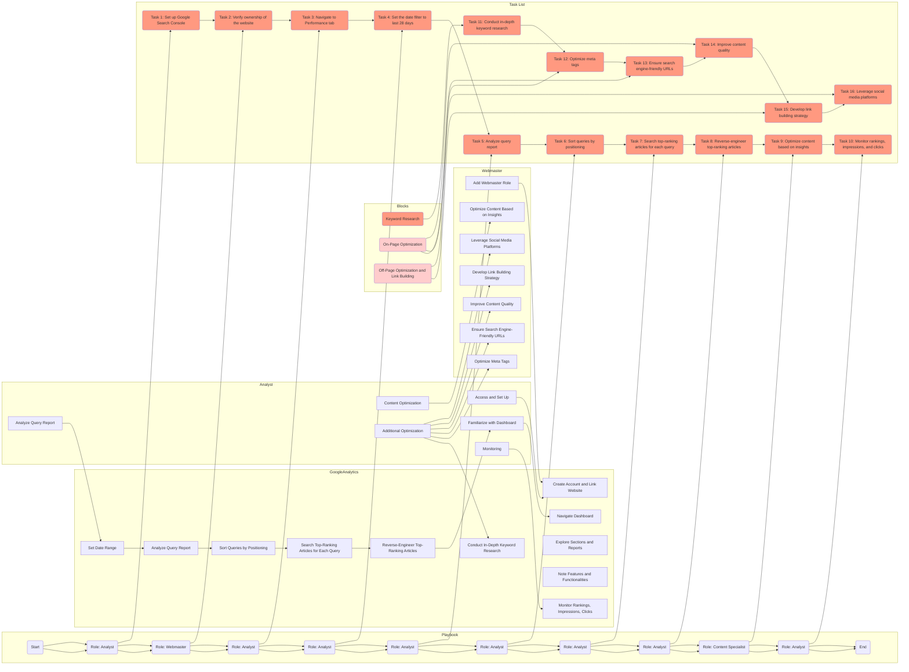

```mermaid
graph LR;
    subgraph Analyst
        A[Access and Set Up]
        B[Familiarize with Dashboard]
        C[Analyze Query Report]
        D[Content Optimization]
        E[Monitoring]
        F[Additional Optimization]
    end
    
    subgraph Webmaster
        G[Add Webmaster Role]
        H[Optimize Content Based on Insights]
        I[Optimize Meta Tags]
        J[Ensure Search Engine-Friendly URLs]
        K[Improve Content Quality]
        L[Develop Link Building Strategy]
        M[Leverage Social Media Platforms]
    end
    
    subgraph GoogleAnalytics
        N[Create Account and Link Website]
        O[Navigate Dashboard]
        P[Explore Sections and Reports]
        Q[Note Features and Functionalities]
        R[Set Date Range]
        S[Analyze Query Report]
        T[Sort Queries by Positioning]
        U[Search Top-Ranking Articles for Each Query]
        V[Reverse-Engineer Top-Ranking Articles]
        W[Monitor Rankings, Impressions, Clicks]
        X[Conduct In-Depth Keyword Research]
    end
    
    A --> N
    B --> O
    G --> N
    C --> R
    R --> S
    S --> T
    T --> U
    U --> V
    V --> B
    D --> H
    E --> W
    F --> X
    F --> I
    F --> J
    F --> K
    F --> L
    F --> M
    
    subgraph Playbook
        Start(Start)

        Start --> Access(Role: Analyst)
        Access --> Add(Role: Webmaster)
        Add --> Navigate(Role: Analyst)
        Navigate --> SetDate(Role: Analyst)
        SetDate --> Analyze(Role: Analyst)
        Analyze --> Sort(Role: Analyst)
        Sort --> Investigate(Role: Analyst)
        Investigate --> Reverse(Role: Analyst)
        Reverse --> Optimize(Role: Content Specialist)
        Optimize --> Monitor(Role: Analyst)
        Monitor --> End(End)
    end

    subgraph Blocks
        Block1(Keyword Research)
        Block2(On-Page Optimization)
        Block3(Off-Page Optimization and Link Building)
    end

    style Block1 fill:#ff9980;
    style Block2 fill:#ffcccc;
    style Block3 fill:#ffcccc;

    subgraph Task List
        T1(Task 1: Set up Google Search Console)
        T2(Task 2: Verify ownership of the website)
        T3(Task 3: Navigate to Performance tab)
        T4(Task 4: Set the date filter to last 28 days)
        T5(Task 5: Analyze query report)
        T6(Task 6: Sort queries by positioning)
        T7(Task 7: Search top-ranking articles for each query)
        T8(Task 8: Reverse-engineer top-ranking articles)
        T9(Task 9: Optimize content based on insights)
        T10(Task 10: Monitor rankings, impressions, and clicks)
        T11(Task 11: Conduct in-depth keyword research)
        T12(Task 12: Optimize meta tags)
        T13(Task 13: Ensure search engine-friendly URLs)
        T14(Task 14: Improve content quality)
        T15(Task 15: Develop link building strategy)
        T16(Task 16: Leverage social media platforms)

        T1 --> T2
        T2 --> T3
        T3 --> T4
        T4 --> T5
        T5 --> T6
        T6 --> T7
        T7 --> T8
        T8 --> T9
        T9 --> T10
        T11 --> T12
        T12 --> T13
        T13 --> T14
        T14 --> T15
        T15 --> T16
    end;

    style T1 fill:#ff9980;
    style T2 fill:#ff9980;
    style T3 fill:#ff9980;
    style T4 fill:#ff9980;
    style T5 fill:#ff9980;
    style T6 fill:#ff9980;
    style T7 fill:#ff9980;
    style T8 fill:#ff9980;
    style T9 fill:#ff9980;
    style T10 fill:#ff9980;
    style T11 fill:#ff9980;
    style T12 fill:#ff9980;
    style T13 fill:#ff9980;
    style T14 fill:#ff9980;
    style T15 fill:#ff9980;
    style T16 fill:#ff9980;

    Start --> Access
    Access --> Add
    Add --> Navigate
    Navigate --> SetDate
    SetDate --> Analyze
    Analyze --> Sort
    Sort --> Investigate
    Investigate --> Reverse
    Reverse --> Optimize
    Optimize --> Monitor
    Monitor --> End

    Access --> T1
    Add --> T2
    Navigate --> T3
    SetDate --> T4
    Analyze --> T5
    Sort --> T6
    Investigate --> T7
    Reverse --> T8
    Optimize --> T9
    Monitor --> T10

    Block1 --> T11
    Block2 --> T12
    Block2 --> T13
    Block2 --> T14
    Block3 --> T15
    Block3 --> T16
```
