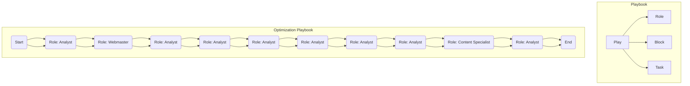
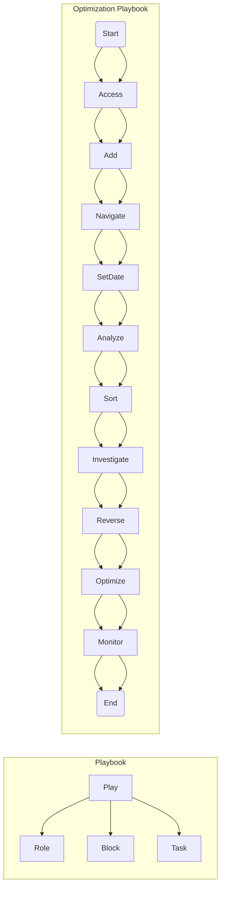
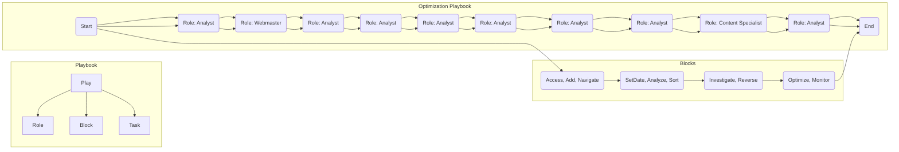
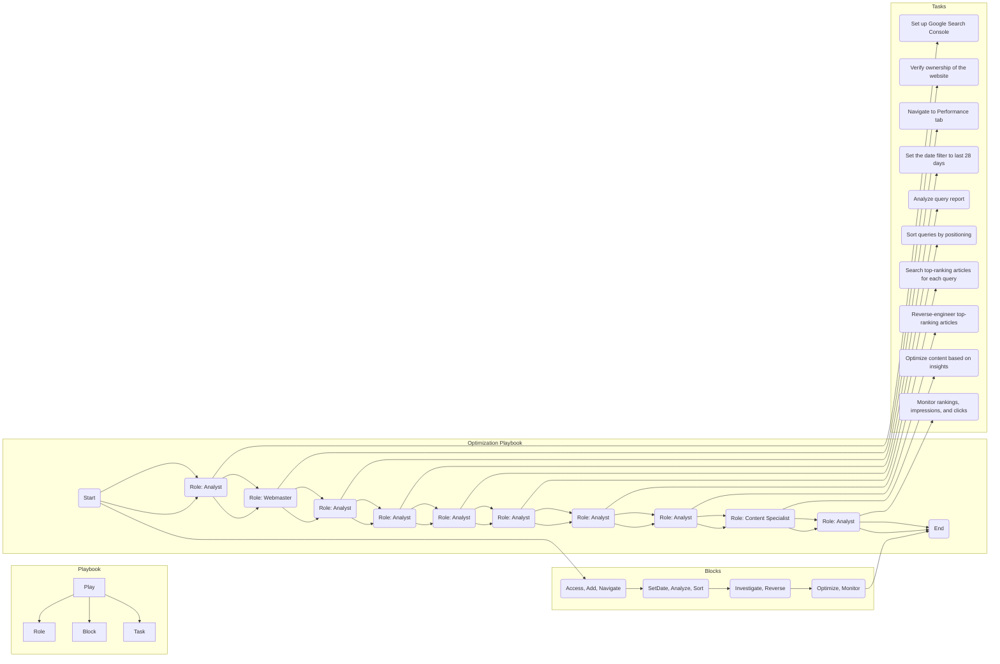
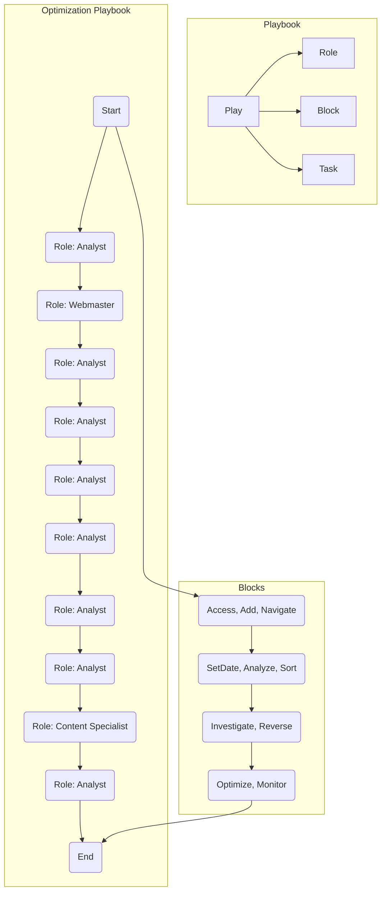
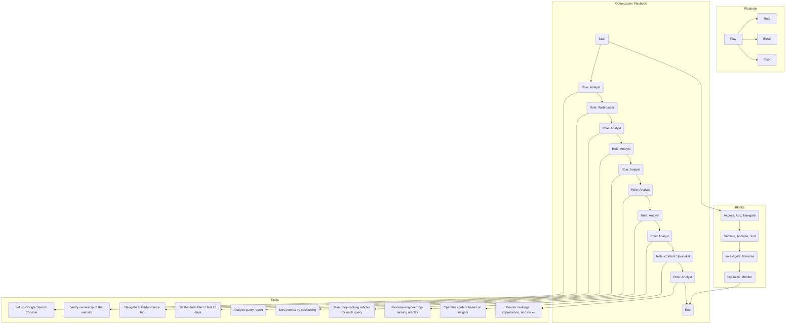
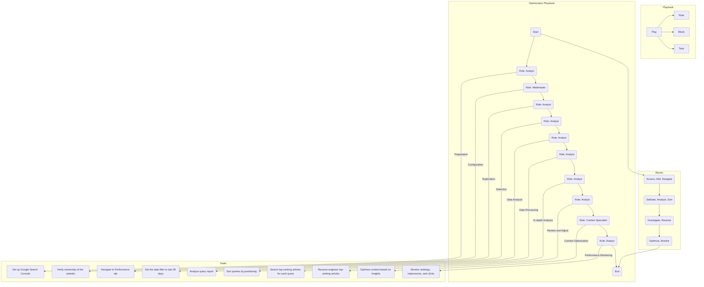

This playbook lets you manage your approach to technolgy more effectively, guide your process with playbooks. 

# Playbook
Here's a breakdown of the playbook:

Start: Represents the start of the optimization playbook.
Access: Refers to the step of accessing Google Search Console and signing in with your Google account.
Add: Involves adding your website to Google Search Console and verifying ownership.
Navigate: Describes the process of navigating to the Performance tab in Google Search Console.
SetDate: Instructs you to set the date filter to analyze the website's performance over the last 28 days.
Analyze: Refers to the analysis of the query report that shows the search terms for which your website is ranking.
Sort: Involves sorting the queries by positioning, from lowest to highest, to identify those nearing good rankings.
Investigate: Describes the step of investigating the top-ranking articles for the identified queries on Google to gain insights.
Reverse: Involves reverse-engineering the results by analyzing factors such as page structure, search intent, topic coverage, and media usage from the top-ranking articles.
Optimize: Refers to optimizing your content based on the insights gained from the top-ranking articles.
Monitor: Instructs you to monitor your website's performance in Google Search Console, specifically tracking changes in rankings, impressions, and clicks.
End: Represents the end of the optimization playbook.
You can use this playbook as a guide to systematically perform optimization tasks using Google Search Console.

subgraph Playbook
    Playbook[Playbook]

    subgraph Blocks
        Block1(Block 1)
        Block2(Block 2)
        Block3(Block 3)
    end

    subgraph Tasks
        Task1(Task 1)
        Task2(Task 2)
        Task3(Task 3)
        Task4(Task 4)
        Task5(Task 5)
        Task6(Task 6)
        Task7(Task 7)
    end

    Playbook --> Block1
    Playbook --> Block2
    Playbook --> Block3

    Block1 --> Task1
    Block1 --> Task2

    Block2 --> Task3
    Block2 --> Task4
    Block2 --> Task5

    Block3 --> Task6
    Block3 --> Task7
end

## User Journey

## Diagram

This diagram can be considerd in the design of your playbook

Relationship Diagram 

## Understanding the playbook

The diagram depicts an optimization playbook for SEO (Search Engine Optimization) tasks. It involves various functions and mappings related to Active Directory, Trouble Ticket Mapping System, Primary Work Role ID Mapping, Relationship Mapping, and executing specific tasks.

The optimization playbook aims to improve SEO performance by following a sequence of actions. It starts with the "Start" participant and involves roles such as Analyst, Webmaster, and Content Specialist. The playbook includes blocks and tasks that are executed by different participants based on their respective roles.

The objective of this optimization playbook is to enhance SEO by performing actions such as setting up Google Search Console, verifying website ownership, navigating to performance tabs, analyzing query reports, sorting queries, investigating top-ranking articles, reverse-engineering articles, optimizing content based on insights, and monitoring rankings, impressions, and clicks.

By implementing this playbook, organizations can optimize their SEO strategies and improve their online visibility, search engine rankings, and user engagement.

## Playbook Breakdown
	1. **Start**: Represents the start of the optimization playbook.
2. **Access**: Refers to the step of accessing Google Search Console and signing in with your Google account.
3. **Add**: Involves adding your website to Google Search Console and verifying ownership.
4. **Navigate**: Describes the process of navigating to the Performance tab in Google Search Console.
5. **SetDate**: Instructs you to set the date filter to analyze the website's performance over the last 28 days.
6. **Analyze**: Refers to the analysis of the query report that shows the search terms for which your website is ranking.
7. **Sort**: Involves sorting the queries by positioning, from lowest to highest, to identify those nearing good rankings.
8. **Investigate**: Describes the step of investigating the top-ranking articles for the identified queries on Google to gain insights.
9. **Reverse**: Involves reverse-engineering the results by analyzing factors such as page structure, search intent, topic coverage, and media usage from the top-ranking articles.
10. **Optimize**: Refers to optimizing your content based on the insights gained from the top-ranking articles.
11. **Monitor**: Instructs you to monitor your website's performance in Google Search Console, specifically tracking changes in rankings, impressions, and clicks.
12. **End**: Represents the end of the optimization playbook.

## Integrating Roles 

Here's a representation of Roles in the phases of the playbook 

## What about blocks ? 

## Creating Tasks
	1. **Access**: Task: Set up Google Search Console - This task involves accessing the Google Search Console website and signing in with your Google account.
	2. **Add**: Task: Verify ownership of the website - This task requires adding your website to Google Search Console and following the instructions to verify ownership.
	3. **Navigate**: Task: Navigate to the Performance tab - This task involves navigating to the Performance tab in Google Search Console after adding and verifying your website.
	4. **SetDate**: Task: Set the date filter to last 28 days - This task requires setting the date filter in the Performance tab to analyze the website's performance over the past month.
	5. **Analyze**: Task: Analyze query report - This task involves analyzing the query report in Google Search Console, which shows the keywords driving traffic to your site.
	6. **Sort**: Task: Sort queries by positioning - This task includes sorting the queries from lowest to highest position to identify those closest to ranking well.
	7. **Investigate**: Task: Search top-ranking articles for each query - This task involves searching for the queries nearing page 1 on Google and examining the top 3 ranking articles.
	8. **Reverse**: Task: Reverse-engineer top-ranking articles - This task requires analyzing the top-ranking articles to understand the factors contributing to their relevance and ranking.
	9. **Optimize**: Task: Optimize content based on insights - This task involves optimizing your own content

## On task 

```mermaid
graph TD;

Access[Access]
RoleAnalyst[Role: Analyst]
GainAccess[Gain access to the system or platform]

Add[Add]
RoleWebmaster[Role: Webmaster]
AddComponents[Add necessary components or elements to the system or platform]

Navigate[Navigate]
RoleAnalyst[Role: Analyst]
GatherInfo[Navigate through the system or platform to gather relevant information]

SetDate[SetDate]
RoleAnalyst[Role: Analyst]
SetDateTime[Set the desired date or time for analysis or optimization]

Analyze[Analyze]
RoleAnalyst[Role: Analyst]
PerformAnalysis[Perform analysis on the available data or information]

Sort[Sort]
RoleAnalyst[Role: Analyst]
OrganizeData[Organize or sort the data or information based on specific criteria]

Investigate[Investigate]
RoleAnalyst[Role: Analyst]
ExploreData[Investigate any anomalies or areas of interest within the data]

Reverse[Reverse]
RoleAnalyst[Role: Analyst]
Backtrack[Reverse or backtrack through the analysis process if necessary]

Optimize[Optimize]
RoleContentSpecialist[Role: Content Specialist]
ApplyOptimization[Apply optimization techniques or strategies to improve performance or quality]

Monitor[Monitor]
RoleAnalyst[Role: Analyst]
AssessImpact[Continuously monitor and assess the impact of the optimization efforts]

End[End]
Conclude[Conclude the optimization process or workflow]

Access --> RoleAnalyst
Access --> GainAccess
Add --> RoleWebmaster
Add --> AddComponents
Navigate --> RoleAnalyst
Navigate --> GatherInfo
SetDate --> RoleAnalyst
SetDate --> SetDateTime
Analyze --> RoleAnalyst
Analyze --> PerformAnalysis
Sort --> RoleAnalyst
Sort --> OrganizeData
Investigate --> RoleAnalyst
Investigate --> ExploreData
Reverse --> RoleAnalyst
Reverse --> Backtrack
Optimize --> RoleContentSpecialist
Optimize --> ApplyOptimization
Monitor --> RoleAnalyst
Monitor --> AssessImpact
End --> Conclude
```

### Visualizing Tasks 

### Tasks and blocks

## Putting them together 

## Adding Tasks to the Roles 

## Define relationship connections and dependencies 

