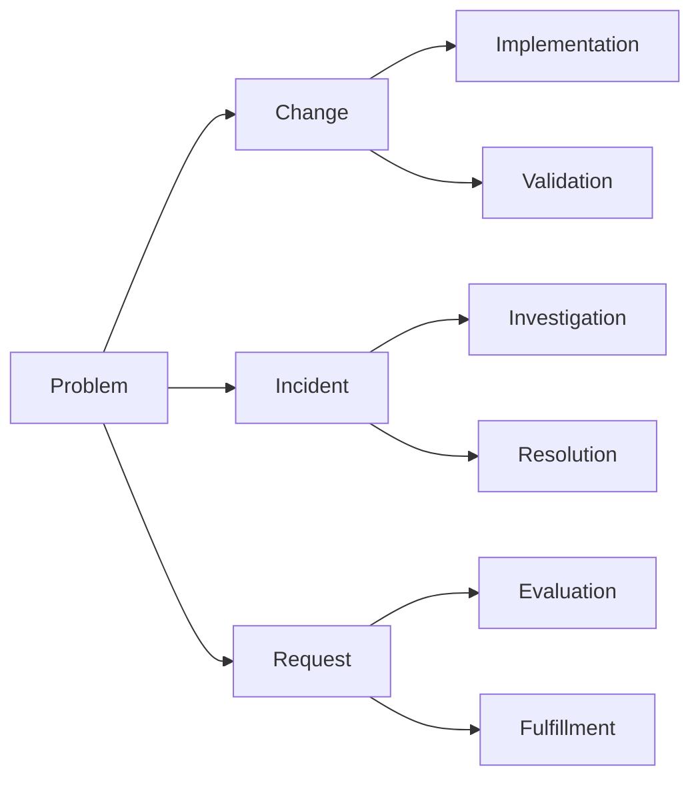

Configuration changes should be tracked with a change control 
Scoping optimziation requires steps, and reasons. 

1. Access Google Search Console: Visit the Google Search Console website (search.google.com/search-console) and sign in using your Google account.
    
2. Add your website: If you haven't done so already, add your website to Google Search Console. Click on the "Add Property" button and follow the instructions to verify ownership of your website.
    
3. Navigate to the Performance tab: Once your website is added and verified, select your website property from the dashboard. Then, click on the "Performance" tab in the left-hand menu.
    
4. Set the date filter: In the Performance tab, locate the date filter at the top right corner of the page. Click on it and select "Last 28 days" to analyze your website's performance over the past month.
    
5. Analyze the query report: Look for the section that displays queries (search terms) for which your website is ranking. This report shows the keywords that are driving traffic to your site.
    
6. Sort by positioning: Click on the "Position" column header to sort the queries from lowest to highest. This helps you identify the queries that are closest to ranking well, particularly those nearing the first page of search results.
    
7. Investigate the top-ranking articles: Take the queries that are nearing page 1 and search them on Google. Examine the top 3 ranking articles for each query to gain insights into what Google considers relevant for those specific queries.
    
8. Reverse engineer the results: Analyze the top-ranking articles and look for factors such as page structure, search intent (e.g., informational, transactional), topic coverage, and media usage (infographics, videos, images). This analysis will help you understand the characteristics that Google values for ranking content in those search results.
    
9. Optimize your content: Armed with the insights from the top-ranking articles, optimize your own content accordingly. Focus on aligning with search intent, creating comprehensive and unique content that exceeds the quality of the top-ranking results, and implementing relevant media elements if appropriate.
    
10. Monitor performance and iterate: After making optimizations, keep track of your website's performance in Google Search Console. Monitor the changes in rankings, impressions, and clicks for the targeted queries. Iterate and refine your content strategy based on the data and insights you gather from Search Console to continuously improve your website's performance.

The other documents in this structure create the visual diagrams to consider to develop a playbook 

Consider the change control framework for each component in your website structure you are considering changing. 

