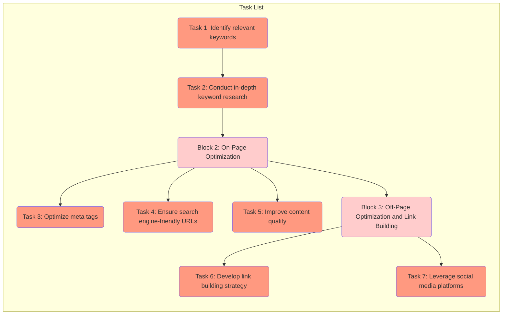
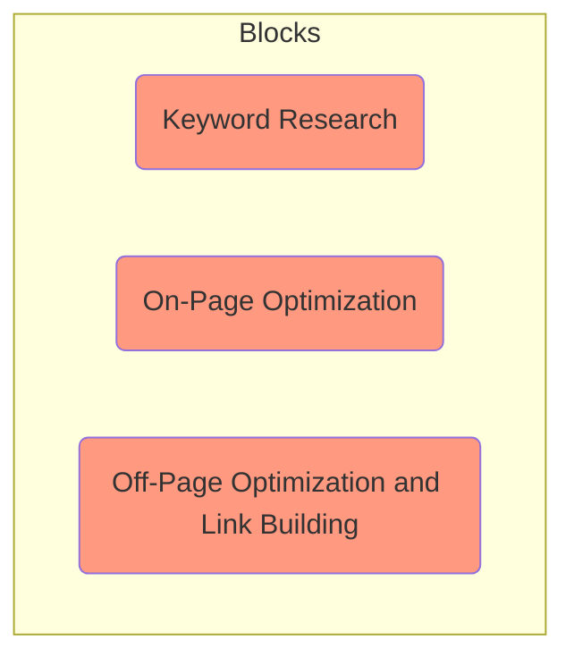
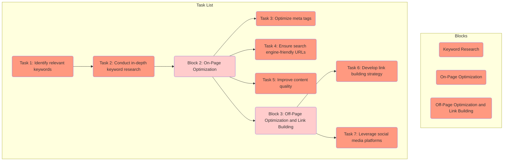
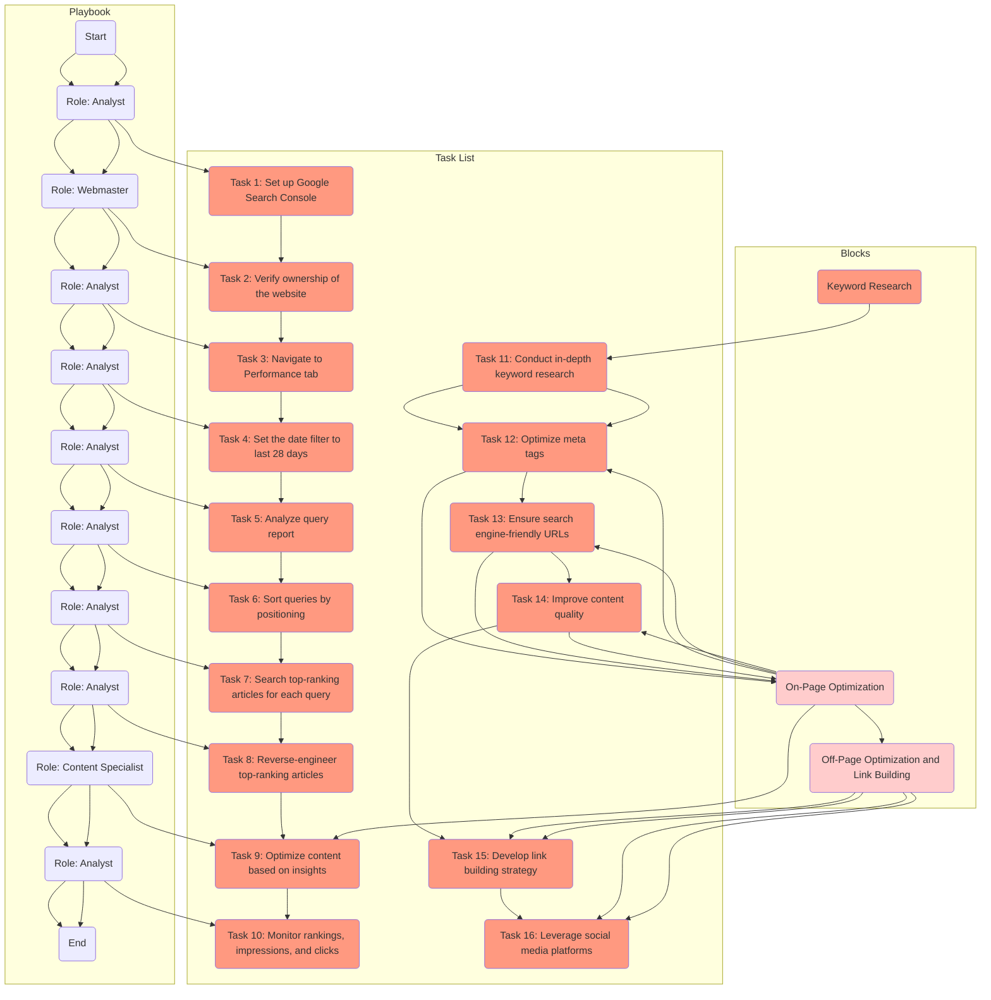
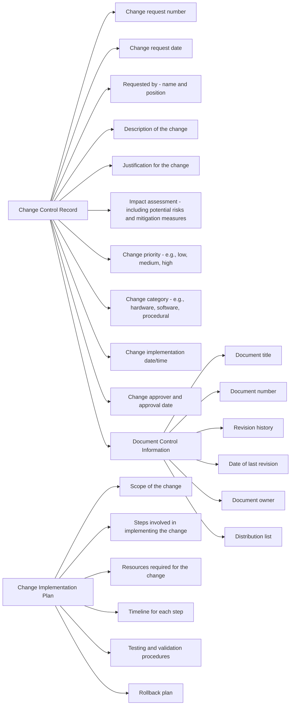
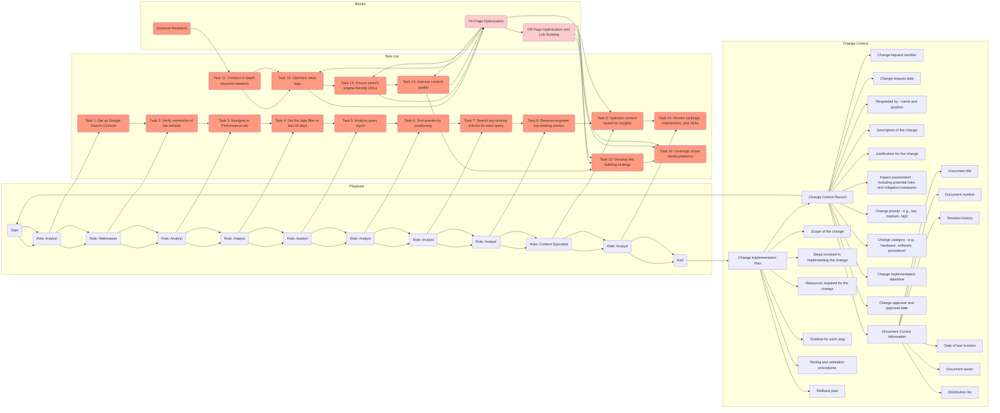

 Increasing SEO with Google: A Step-by-Step Playbook

 Search Engine Optimization (SEO) plays a crucial role in improving the visibility and ranking of websites in search engine results. One of the most powerful tools for SEO is Google. By effectively utilizing Google's features and tools, website owners and marketers can enhance their SEO strategies and attract more organic traffic. In this article, we'll explore a step-by-step playbook that outlines the key tasks and blocks to help you increase your SEO using Google.

## Playbook Structure:
To streamline your SEO efforts, we'll break down the process into a playbook consisting of blocks and tasks. Each block represents a specific stage or section, while the tasks represent individual actions to be taken. Let's dive into the playbook structure:

### Block 1: Keyword Research and Analysis

#### Task 1: Identify relevant keywords related to your website's content and target audience.
#### Task 2: Conduct in-depth keyword research using Google's Keyword Planner, Trends, and related tools to uncover valuable insights.
### Block 2: On-Page Optimization

#### Task 3: Optimize your website's meta tags, including title tags, meta descriptions, and header tags, using relevant keywords.
#### Task 4: Ensure your website's URLs are search engine-friendly, concise, and descriptive.
#### Task 5: Improve your website's overall content quality, readability, and relevance to target keywords.
### Block 3: Off-Page Optimization and Link Building

#### Task 6: Develop a link building strategy to acquire high-quality backlinks from reputable websites and online directories.
#### Task 7: Leverage social media platforms and online communities to promote your website and build brand visibility.
# Implementing the Playbook:
Now that we've outlined the blocks and tasks, let's see how they work together to improve your SEO:

Start by thoroughly researching and analyzing relevant keywords (Block 1, Task 1). Use Google's Keyword Planner and Trends to identify keywords with high search volume and low competition.
Conduct in-depth keyword research (Block 1, Task 2) to gain insights into user intent and identify long-tail keywords that can drive targeted traffic to your website.
Move to on-page optimization (Block 2) and ensure that your website's meta tags, URLs, and content are optimized (Tasks 3, 4, and 5). Use relevant keywords naturally and provide valuable information to both search engines and users.
Off-page optimization and link building (Block 3) are essential for building authority and credibility. Develop a link building strategy (Task 6) that focuses on acquiring backlinks from authoritative websites in your industry. Additionally, leverage social media platforms and online communities (Task 7) to amplify your content and engage with your target audience.
Continuously monitor and analyze the impact of your SEO efforts. Adjust and refine your strategies based on performance metrics such as organic traffic, keyword rankings, and conversion rates.
Conclusion:
By following this step-by-step playbook, you can effectively increase your SEO using Google's features and tools. Remember that SEO is an ongoing process, and staying up to date with the latest algorithm changes and best practices is crucial. Regularly monitor your website's performance, adapt your strategies, and always prioritize delivering valuable content to your audience. With dedication and consistent effort, you'll improve your website's visibility, attract more organic traffic, and ultimately achieve your SEO goals.

## Tasks

## Blocks

## Optimizing 

## Building the change control

#### Notes about the framework
    In this optimized version, the keyword research block (Block1) is connected to the on-page optimization block (Block2) through Task 11 (Conduct in-depth keyword research). Block2 contains tasks related to on-page optimization such as optimizing meta tags, ensuring search engine-friendly URLs, and improving content quality. Block2 is then connected to the off-page optimization and link building block (Block3) through Task 9 (Optimize content based on insights). Block3 includes tasks related to developing a link building strategy and leveraging social media platforms.

## Change Control

## Change Controls Mapped

