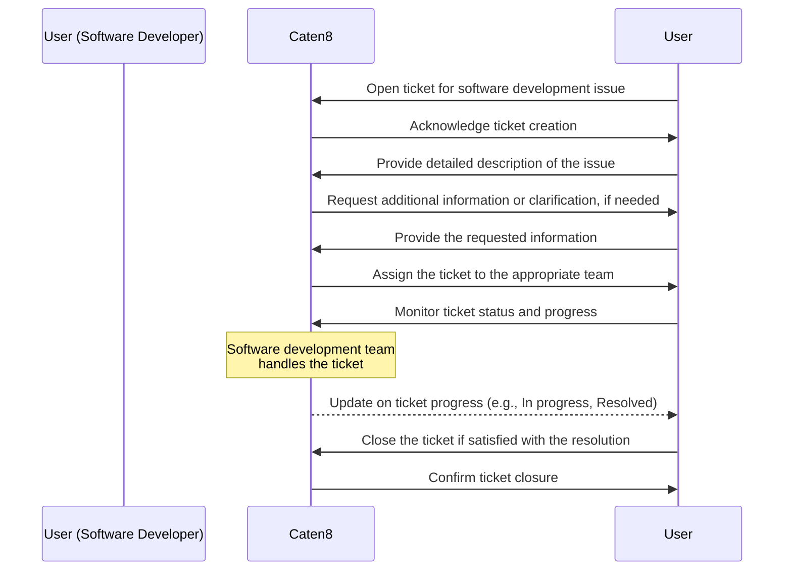

```mermaid
sequenceDiagram
    participant User (Software Developer)
    participant Caten8

    User ->> Caten8: Open ticket for software development issue
    Caten8 ->> User: Acknowledge ticket creation
    User ->> Caten8: Provide detailed description of the issue
    Caten8 ->> User: Request additional information or clarification, if needed
    User ->> Caten8: Provide the requested information
    Caten8 ->> User: Assign the ticket to the appropriate team
    User ->> Caten8: Monitor ticket status and progress
    Note over Caten8: Software development team<br/>handles the ticket
    Caten8 -->> User: Update on ticket progress (e.g., In progress, Resolved)
    User ->> Caten8: Close the ticket if satisfied with the resolution
    Caten8 ->> User: Confirm ticket closure
```