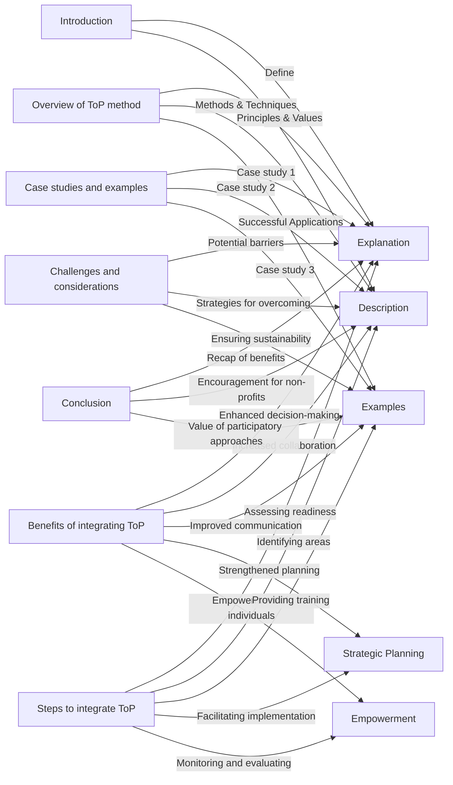

# Components

```mermaid
graph LR
    I[Introduction] --> |Define| A[ToP method]
    I[Introduction] --> |Purpose| B[Outline purpose]
    II[Overview of ToP method] --> |Principles & Values| A[Explanation]
    II[Overview of ToP method] --> |Methods & Techniques| B[Description]
    II[Overview of ToP method] --> |Successful Applications| C[Examples]
    III[Benefits of integrating ToP] --> |Enhanced decision-making| A
    III[Benefits of integrating ToP] --> |Increased collaboration| B
    III[Benefits of integrating ToP] --> |Improved communication| C
    III[Benefits of integrating ToP] --> |Strengthened planning| D[Strategic Planning]
    III[Benefits of integrating ToP] --> |Empowerment of individuals| E[Empowerment]
    IV[Steps to integrate ToP] --> |Assessing readiness| A
    IV[Steps to integrate ToP] --> |Identifying areas| B
    IV[Steps to integrate ToP] --> |Providing training| C
    IV[Steps to integrate ToP] --> |Facilitating implementation| D
    IV[Steps to integrate ToP] --> |Monitoring and evaluating| E
    V[Case studies and examples] --> |Case study 1| A
    V[Case studies and examples] --> |Case study 2| B
    V[Case studies and examples] --> |Case study 3| C
    VI[Challenges and considerations] --> |Potential barriers| A
    VI[Challenges and considerations] --> |Strategies for overcoming| B
    VI[Challenges and considerations] --> |Ensuring sustainability| C
    VII[Conclusion] --> |Recap of benefits| A
    VII[Conclusion] --> |Encouragement for non-profits| B
    VII[Conclusion] --> |Value of participatory approaches| C
```
∏