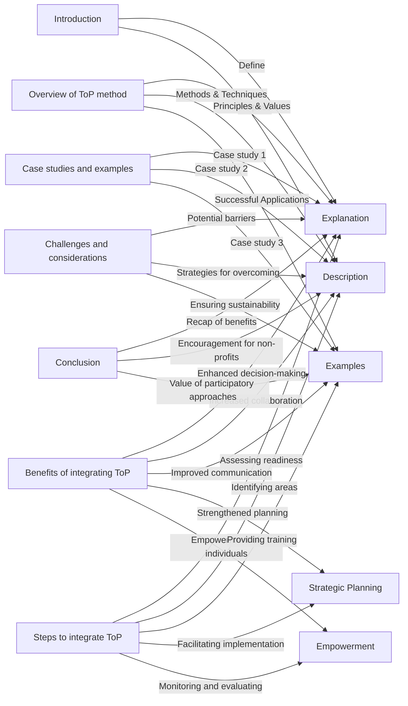

# Components

# Presentation 

Presentation: Exploring the Technology of Participation (ToP) Method

Introduction

Welcome and introduction to the board members
Overview of the presentation agenda
Slide 1: Introduction
Introduce the ToP Integration System
Define the Technology of Participation (ToP) method
Purpose of the presentation: Exploring the integration of ToP for non-profits
Connection to the organization's goals and objectives
Slide 2: Overview of ToP Method
Explain the principles and values of the ToP method
Highlight the importance of participatory approaches
Describe the core methods and techniques used in ToP
Showcase examples of successful applications in various contexts
Slide 3: Benefits of Integrating ToP
Present the benefits of integrating ToP for non-profit organizations
Enhanced decision-making processes
Increased collaboration and engagement among stakeholders
Improved communication and understanding within the organization
Strengthened strategic planning and goal-setting
Empowerment of individuals and teams within the organization
Slide 4: Steps to Integrate ToP
Outline the steps to integrate ToP into non-profit organizations
Assessing organizational readiness for adopting the ToP method
Identifying specific areas or processes where ToP can be applied
Providing training and capacity-building programs on ToP techniques
Facilitating the implementation of ToP in day-to-day operations
Monitoring and evaluating the impact of ToP integration
Slide 5: Case Studies and Examples
Present real-life case studies showcasing successful ToP integration
Case study 1: Non-profit organization A successfully integrates ToP in their strategic planning process
Case study 2: Non-profit organization B uses ToP techniques to enhance stakeholder engagement in program development
Case study 3: Non-profit organization C applies ToP methods for conflict resolution within their teams
Slide 6: Challenges and Considerations
Address potential barriers to adopting ToP in non-profit organizations
Strategies for overcoming resistance or skepticism towards ToP
Ensuring sustainability and long-term integration of ToP practices
Importance of change management and organizational culture
Slide 7: Conclusion
Recap the benefits and potential impact of integrating ToP in non-profits
Encourage non-profit organizations to explore and embrace ToP
Highlight the value of participatory approaches in driving positive change in the non-profit sector
Express gratitude to the board members for their time and attention
Q&A Session

Open the floor for questions and discussions
Provide additional information and clarification as needed
Address any concerns or doubts raised by the board members
Closing Remarks

Express appreciation for the board members' engagement and participation
Reiterate the potential benefits of integrating ToP for the organization
Offer support and resources for further exploration and implementation of ToP
Thank the board members for their time and involvement
