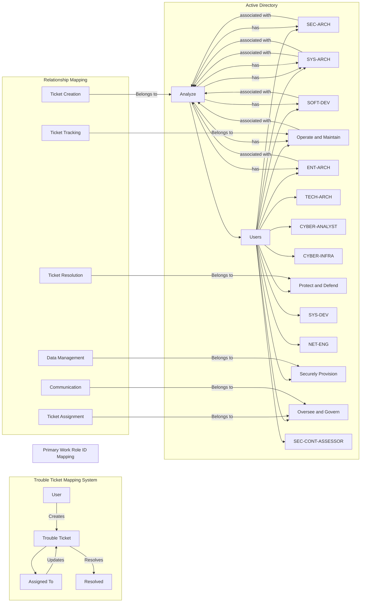

```mermaid
graph LR

subgraph Active Directory
    A[Root]
    A --> B[Users]
    B --> C[SEC-ARCH]
    B --> D[SYS-ARCH]
    B --> E[SOFT-DEV]
    B --> F[DATA-ARCH]
    B --> G[ENT-ARCH]
    B --> H[TECH-ARCH]
    B --> I[CYBER-ANALYST]
    B --> J[CYBER-INFRA]
    B --> K[DATA-ANALYST]
    B --> L[SYS-DEV]
    B --> M[NET-ENG]
    B --> N[SYS-ADMIN]
    B --> O[SEC-ASSESSOR]
    B --> P[SEC-CONT-ASSESSOR]
end

subgraph Trouble Ticket Mapping System
    Q[User] -- Creates --> R[Trouble Ticket]
    R --> S[Assigned To]
    S -- Updates --> R
    R -- Resolves --> T[Resolved]
end

subgraph Primary Work Role ID Mapping
    A -->|has| D
    A -->|has| C
    A -->|has| D
    A -->|has| E
    A -->|has| F
    A -->|has| G

    D -- associated with --> A
    C -- associated with --> A
    D -- associated with --> A
    E -- associated with --> A
    F -- associated with --> A
    G -- associated with --> A
end

subgraph Relationship Mapping
    TC[Ticket Creation] -- Belongs to --> A[Analyze]
    TA[Ticket Assignment] -- Belongs to --> O[Oversee and Govern]
    TT[Ticket Tracking] -- Belongs to --> F[Operate and Maintain]
    TR[Ticket Resolution] -- Belongs to --> K[Protect and Defend]
    DM[Data Management] -- Belongs to --> N[Securely Provision]
    CM[Communication] -- Belongs to --> O[Oversee and Govern]
end

```
