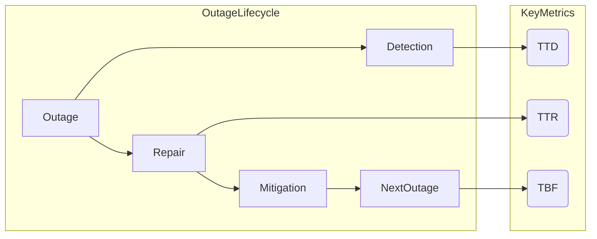
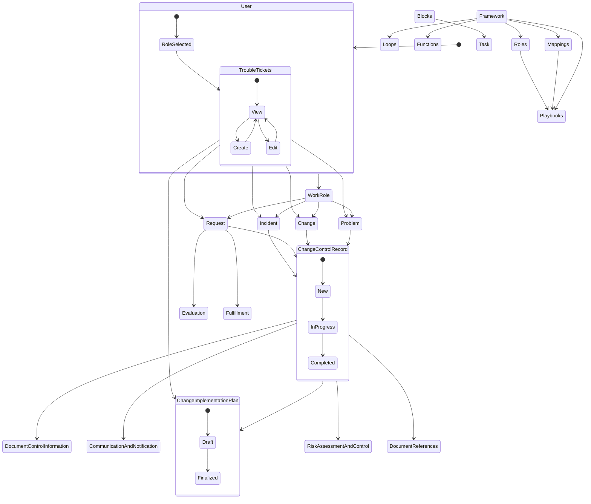
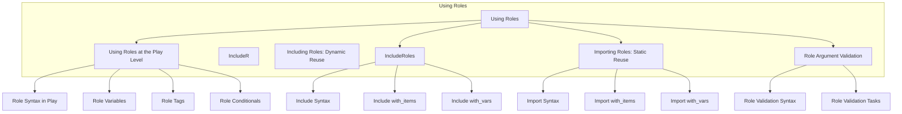
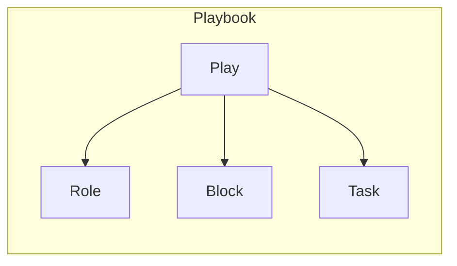
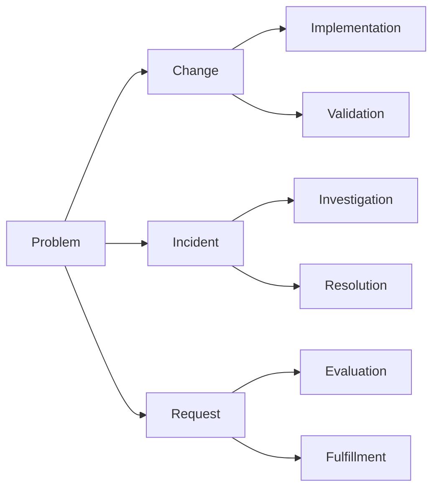
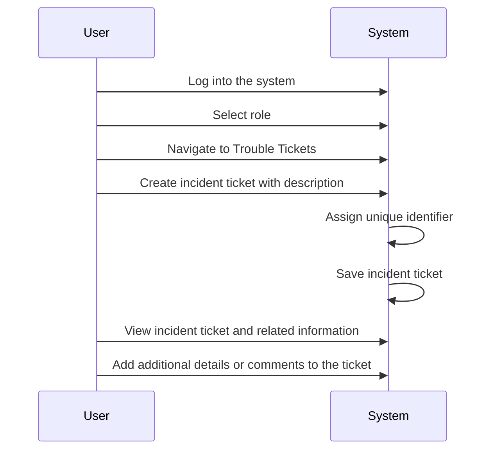
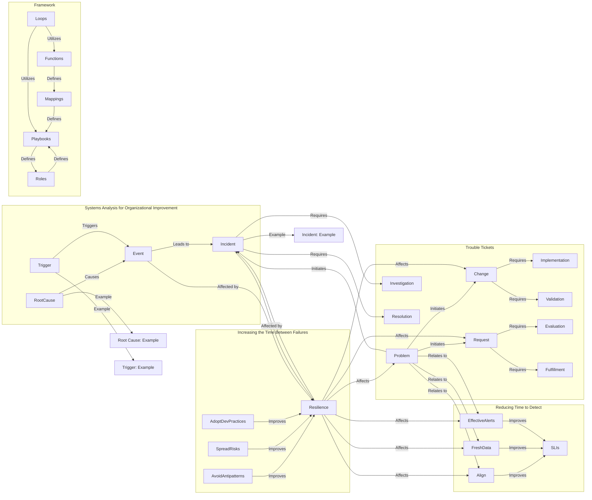

# Homepage 
A simplified homepage for the documentation here 

Before you get started [read](./About%20and%20README/README.md)
and check out the [license](./About%20and%20README/LICENSE)
As we get started, check out the  Business Continuity [link](./Business%20Continuity/business%20continuity.md)

>GRCandMe hereby acknowledges and informs all users, customers, and clients that the products, services, or information provided on our > platform, website, or any other medium are presented "as is" and without any warranties or guarantees of any kind, whether expressed or >implied.
>
> By accessing or using our products, services, or information, users explicitly agree that GRCandMe, its affiliates, employees, agents, or >representatives shall not be held liable for any inaccuracies, errors, omissions, damages, or losses arising from the use or reliance on >the provided content.
>
>We expressly disclaim all warranties, including but not limited to the implied warranties of merchantability, fitness for a particular >purpose, non-infringement, or any other warranty, condition, or representation. We make no warranty or guarantee that our products, >services, or information will meet individual requirements or expectations, or that they will be uninterrupted, secure, error-free, or >free from harmful components.
>
>Furthermore, GRCandMe shall not be responsible for any damages or losses incurred by users, customers, or clients due to any reliance on >the information, advice, or recommendations provided on our platform, website, or any other communication channels. It is the sole >responsibility of users to evaluate the accuracy, completeness, and usefulness of the content.
>
>This no warranties statement applies to all products, services, or information offered by GRCandMe and extends to any third-party content, >links, or references provided within our offerings. Any third-party content or services accessed through our platform are subject to their >respective terms, conditions, and warranties.
>
>Users are encouraged to seek professional advice, verify information, and exercise their own judgment when using our products, services, >or information. By continuing to use our offerings, users accept the terms of this no warranties statement and agree to hold GRCandMe >harmless from any claims, liabilities, or damages resulting from the use of our products, services, or information.
>
>This no warranties statement is binding upon all users, customers, and clients, and supersedes any prior agreements or representations, >whether written or verbal, regarding the warranties or guarantees of our products, services, or information.
>
>GRCandMe reserves the right to modify or update this no warranties statement at any time without prior notice. Users are advised to review >this statement periodically for any changes or updates.

This documentation is vast, I have focused on articulating the details in as verbose of method as possible. 

# System Components

# User:
Attributes: name (string), role (WorkRole)
Represents a user within the system and contains their name and assigned work role.
# WorkRole:
## Attributes: name (string)
Represents a specific work role within the system.
Problem, Change, Request, Incident:
## Attributes: description (string)
Represents different types of tickets or issues within the system.
Associated with WorkRoles.
# ChangeControlRecord:
## Attributes: documentControl (DocumentControlInformation), implementationPlan (ChangeImplementationPlan), communication (CommunicationAndNotification), riskAssessment (RiskAssessmentAndControl), documentReferences (array of DocumentReferences)
Represents a change control record that includes information related to document control, implementation plan, communication, risk assessment, and document references.
DocumentControlInformation, ChangeImplementationPlan, CommunicationAndNotification, RiskAssessmentAndControl:
## Attributes: content (string)
Represents different aspects of the change control record, containing relevant content.
# DocumentReferences:
## Attributes: title (string), url (string)
Represents references to external documents related to the change control record.
TroubleTickets:
## Attributes: problems (array of Problem), changes (array of Change), incidents (array of Incident), requests (array of Request), implementationPlan (ChangeImplementationPlan)
Represents a collection of trouble tickets including problems, changes, incidents, and requests.
Associated with ChangeImplementationPlan.
Framework:
## Attributes: loops (Loops), functions (Functions), playbooks (Playbooks), mappings (Mappings), roles (Roles)
Represents a framework within the system that includes loops, functions, playbooks, mappings, and roles.
Loops, Functions, Playbooks, Mappings, Roles:
Attributes: description (string)
Represents different components within the framework, each containing a description.
Evaluation, Fulfillment:
## Attributes: description (string)
Represents components related to evaluation and fulfillment within the system.
# Block:
## Attributes: tasks (array of Task)
Represents a block of tasks within the system.
# Task:
## Attributes: description (string)
Represents an individual task within a block.

# Active Directory
If you are looking for resources related to [Active Directory](./Active%20Directory/active%20directory.md)
If you are looking for [Active Directory Structure](./Active%20Directory/active%20directory%20structure.md)
And check out the [Active Directory Security Groups](./Active%20Directory/active%20directory%20security%20groups.md)

## About Active Directory
    Functions:
    Active Directory (AD): This is the central component of the system.
    Trouble Ticket Mapping System (TTMS): Manages trouble tickets and their assignments.
    Primary Work Role ID Mapping (PWRI): Maps primary work roles to specific functions.
    Relationship Mapping (RM): Maps relationships between different system functions.
    Users:
    Users are divided into several categories, including:
    SEC-ARCH (Security Architect)
    SYS-ARCH (Systems Architect)
    SOFT-DEV (Software Developer)
    DATA-ARCH (Data Architect)
    ENT-ARCH (Enterprise Architect)
    TECH-ARCH (Technical Architect)
    CYBER-ANALYST (Cybersecurity Analyst)
    CYBER-INFRA (Cybersecurity Infrastructure Specialist)
    DATA-ANALYST (Data Analyst)
    SYS-DEV (Systems Developer)
    NET-ENG (Network Engineer)
    SYS-ADMIN (System Administrator)
    SEC-ASSESSOR (Security Assessor)
    SEC-CONT-ASSESSOR (Security Controls Assessor)
    Trouble Ticket Mapping System (TTMS):
    Manages trouble tickets and their lifecycle.
    Users can create trouble tickets (TT), which are assigned to specific users (AT) and can be updated by other users (UB).
    Trouble tickets can be marked as resolved.
    Primary Work Role ID Mapping (PWRI):
    Maps primary work roles to specific functions within the system.
    There are various roles, such as Security Architect, Systems Architect, Software Developer, Data Architect, and Enterprise Architect, each associated with specific responsibilities.
    Relationship Mapping (RM):
    Maps relationships between different system functions.
    The relationships include Ticket Creation (TC), Ticket Assignment (TA), Ticket Tracking (TT), Ticket Resolution (TR), and Data Management (DM).
    Each relationship is associated with specific actions and responsibilities.
    Mappings:
    The diagram includes mappings of various roles and their associated knowledge, skills, and abilities (KSA).
    Roles such as Information System Owner (ISO), Authorizing Official (AO), Chief Information Officer (CIO), Security Control Assessor (SCA), System Administrator (SYS_ADMIN), Network Administrator (NET_ADMIN), Database Administrator (DB_ADMIN), Security Architect (SEC_ARCH), Application Developer (APP_DEV), Incident Responder (INC_RESP), and Threat Analyst (THREAT_ANALYST) are mapped to specific KSAs.
## Active Directory Relationship Considerations
### Active Directory:
#### The Active Directory (AD) consists of a root node (A) and a Users node (B). The Users node (B) has multiple child nodes representing different user categories, such as SEC-ARCH, SYS-ARCH, SOFT-DEV, DATA-ARCH, ENT-ARCH, TECH-ARCH, CYBER-ANALYST, CYBER-INFRA, DATA-ANALYST, SYS-DEV, NET-ENG, SYS-ADMIN, SEC-ASSESSOR, and SEC-CONT-ASSESSOR.
### Trouble Ticket Mapping System:
#### The Trouble Ticket Mapping System allows users (Q) to create trouble tickets (R). Trouble tickets can be assigned to specific users (S), who can then update the ticket. Tickets can also be marked as resolved (T).
### Primary Work Role ID Mapping:
#### The Primary Work Role ID Mapping indicates that the root node (A) has associations (has) with different user categories.Each user category (C, D, E, F, G) is associated with the root node (A), indicating that they belong to the Active Directory structure.

# Business Continuity
[Business Continuity](./Business%20Continuity/business%20continuity.md) and [Financial Considerations](./Financial%20Considerations/Financial%20Considerations.md) along with the [Roles](./Financial%20Considerations/Roles%20supporting%20financial%20considerations.md) 
that support your financial considerations in Cyber Security and Change Management. 
[Insider Threat](./Insider%20Threat/Insider%20Threat.md%20) contains a cusory document about the roles that reduce the likelyhood. 
Perhaps you are considering how the [Partners](./Partner%20Ecosystem%20/roles%20partner%20ecosystem) can be support with Cyber Security Roles? 

[Failure Planning](./Relationship%20Diagrams/Roles/Failure%20Planning/failure%20planning%20diagram.md)

# Systems for Business

# Systems Analysis for Organizational Improvement:
## Components: RootCause, Trigger, Event, Incident
## Relationships: RootCause causes Event, Trigger triggers Event, Event leads to Incident

# Increasing the Time Between Failures:
## Components: AvoidAntipatterns, SpreadRisks, AdoptDevPractices
## Relationships: AvoidAntipatterns improves Resilience, SpreadRisks improves Resilience, AdoptDevPractices improves Resilience

# Trouble Tickets:
## Components: Problem, Change, Incident, Request, Implementation, Validation, Investigation, Resolution, Evaluation, Fulfillment
## Relationships: Problem initiates Change, Incident, and Request; Change requires Implementation and Validation; Incident requires Investigation and Resolution; Request requires Evaluation and Fulfillment

# Framework:
## Components: Loops, Functions, Playbooks, Mappings, Roles
## Relationships: Loops utilize Functions, Loops utilize Playbooks, Functions define Mappings, Mappings define Playbooks, Playbooks define Roles, Roles define Playbooks

# Reducing Time to Detect:
## Components: Align, FreshData, EffectiveAlerts
## Relationships: Align improves SLIs, FreshData improves SLIs, EffectiveAlerts improves SLIs

# Site Reliability Diagram

# Compliant Folder Structure 
[Folder Structure](./Organizational%20Folder%20Structure%20/organizational%20folder%20structure.md)
Consider configuring SQL for your folder structure located 
[SQL Structure](./Organizational%20Folder%20Structure%20/folderstructure.sql)

# Concept

# Roles 
There's much to talk about with [Integrating Roles](./Roles/Integrating%20roles.md), like [Relationship Diagrams in Active Directory](./Relationship%20Diagrams/building%20effective%20relationship%20diagram.md)

# Playboooks

# Playbooks and Trouble Tickets 

# Ticketing System
[Ticketing System](./Ticketing%20System/ticket%20system.md)

# About the Ticketing System 
### Systems Analysis for Organizational Improvement: 
#### This component focuses on identifying the root causes and triggers of events, which subsequently lead to incidents. Understanding these causes helps in analyzing and improving organizational processes.
### Increasing the Time Between Failures: 
#### This subcomponent aims to enhance system resilience by avoiding anti-patterns, spreading risks, and adopting development practices that contribute to a longer time between failures.
### Trouble Tickets: 
#### This component involves the initiation of various tickets, including problem, incident, and request tickets. Problems can trigger changes, incidents require investigation and resolution, and requests necessitate evaluation and fulfillment.
### Framework: 
#### The framework component utilizes loops, functions, playbooks, mappings, and roles to define and manage ticketing processes effectively.
### Reducing Time to Detect: 
#### This subcomponent focuses on improving Service Level Indicators (SLIs) by aligning systems, utilizing fresh data, and implementing effective alert mechanisms.
### Relationships and Interactions: 
#### Problems are related to alignment, fresh data, and effective alerts. Resilience affects changes, incidents, requests, problems, alignment, fresh data, and effective alerts. Events and incidents are affected by system resilience.

# Graphic Representation of the system with high level components. 

See [Trouble Tickets](./Relationship%20Diagrams/Trouble%20Tickets/)

