# The step by step guide for this Framework
Harnessing the Power of the Framework: A Step-by-Step Guide

# Introduction:
Implementing a comprehensive framework is essential for organizations aiming to streamline their processes and optimize productivity. In this article, we will guide you through the practical utilization of a framework, using a specific example. By leveraging the components and relationships within the framework, you can effectively manage trouble tickets, assign roles, and orchestrate tasks. Let's dive into the step-by-step process.

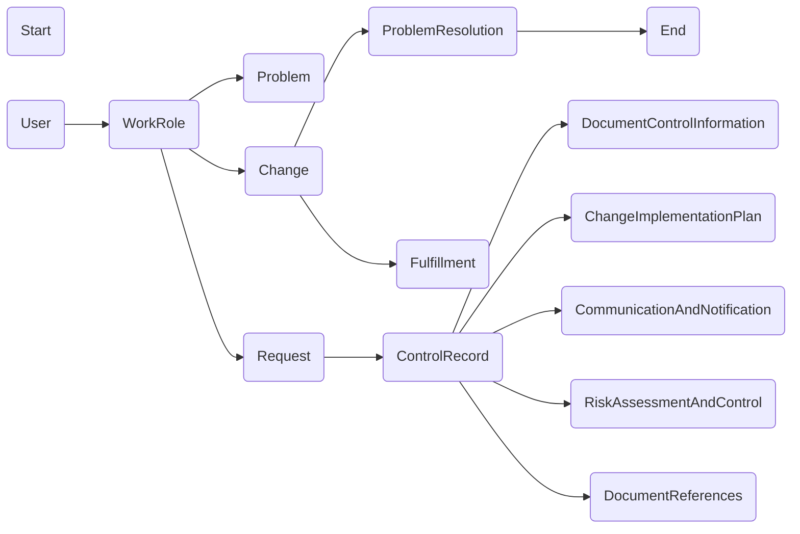
```mermaid
graph LR
    A(Start)
    B(User) --> C(WorkRole)
    C --> D(Problem)
    C --> E(Change)
    C --> F(Request)
    F --> G(ControlRecord)
    G --> H(DocumentControlInformation)
    G --> I(ChangeImplementationPlan)
    G --> J(CommunicationAndNotification)
    G --> K(RiskAssessmentAndControl)
    G --> L(DocumentReferences)
    E --> M(Fulfillment)
    E --> N(ProblemResolution)
    N --> O(End)
```

# Step 1: Understanding the Framework:
The framework consists of five key components: Loops, Functions, Playbooks, Mappings, and Roles. Loops and Functions work together to define the workflow, while Playbooks provide guidance on executing specific tasks. Mappings establish relationships between different components, and Roles define the responsibilities of individuals within the system.


# Step 2: Defining Roles and Access:
To begin, users (A) must select their specific work role (B). Each work role has a defined set of responsibilities, which allows users to access relevant features and perform specific tasks. For example, a user may select the "Analyst" role, granting them access to various functionalities.

# Step 3: Trouble Ticket Management:
The Trouble Tickets component (C) enables users to address problems, initiate changes, and submit requests. As a user identifies a problem, they create a trouble ticket, which triggers a ChangeControlRecord (F). This record captures essential information related to the problem, such as the DocumentControlInformation (G), ChangeImplementationPlan (H), CommunicationAndNotification (I), RiskAssessmentAndControl (J), and DocumentReferences (K).

# Step 4: Task Execution:
Tasks are organized within Blocks (T) and can be assigned to specific users based on their roles. For instance, an Analyst role can be assigned tasks related to keyword research, on-page optimization, off-page optimization, and link building.

# Step 5: Playbooks for Guidance:
Playbooks provide step-by-step instructions for executing specific tasks. In our example, the Playbook guides users through the process of conducting keyword research, optimizing meta tags, ensuring search engine-friendly URLs, improving content quality, and developing a link-building strategy.

# Step 6: Task Completion and Progress Tracking:
Users access the Trouble Tickets system (X) to view and interact with their assigned tasks. The View (Y) functionality allows users to create new tasks (Z), revert changes, edit existing tasks (AA), and monitor the progress of ongoing tasks. By utilizing this system, users can ensure that tasks are completed efficiently and progress is tracked effectively.

# Step 7: Managing Change Control:
Users responsible for ChangeControlRecords (F) create new records (AB), start them (AC), and mark them as completed (AD). Additionally, they create ChangeImplementationPlans (H) and finalize them (AF), ensuring smooth execution of changes.

# Conclusion:
Effectively utilizing a framework enhances organizational efficiency and productivity by providing a structured approach to task management, role assignment, and trouble ticket handling. By following the step-by-step guide outlined above, organizations can leverage the power of a framework to streamline their operations, improve collaboration, and achieve their desired outcomes. Embrace the potential of frameworks and propel your organization towards greater success.

# Considerations for use in your Environment
Simplify the component relationships: The framework currently has multiple overlapping relationships between components, which can make it complex and harder to understand. Consider streamlining the relationships to make them more intuitive and straightforward.

## Simple
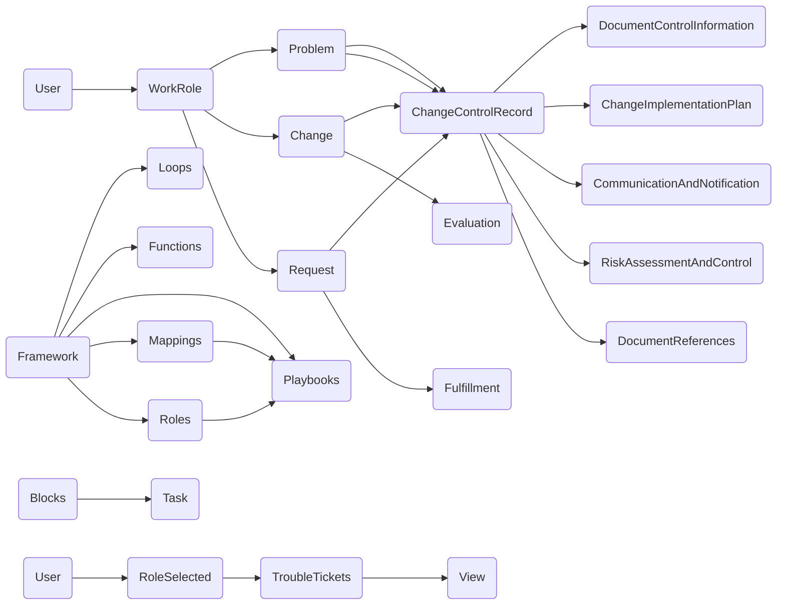
```mermaid
graph LR
    A(User)
    B(WorkRole)
    C(Problem)
    D(Change)
    E(Request)
    F(ChangeControlRecord)
    G(DocumentControlInformation)
    H(ChangeImplementationPlan)
    I(CommunicationAndNotification)
    J(RiskAssessmentAndControl)
    K(DocumentReferences)
    L(Evaluation)
    M(Fulfillment)
    N(Framework)
    O(Loops)
    P(Functions)
    Q(Playbooks)
    R(Mappings)
    S(Roles)
    T(Blocks)
    U(Task)
    V(User)
    W(RoleSelected)
    X(TroubleTickets)
    Y(View)

    A --> B
    B --> C
    B --> D
    B --> E
    C --> F
    D --> F
    E --> F
    F --> G
    F --> H
    F --> I
    F --> J
    F --> K
    C --> F
    D --> L
    E --> M
    N --> O
    N --> P
    N --> Q
    N --> R
    N --> S
    R --> Q
    S --> Q
    T --> U
    V --> W
    W --> X
    X --> Y
```
Clarify the purpose of each component: Some of the components, such as User, RoleSelected, and View, have vague or unclear purposes. Clearly define the role and purpose of each component to ensure their relevance within the framework.

## Clear

```

    A(User)
    B(WorkRole)
    C(Problem)
    D(Change)
    E(Request)
    F(ChangeControlRecord)
    G(DocumentControlInformation)
    H(ChangeImplementationPlan)
    I(CommunicationAndNotification)
    J(RiskAssessmentAndControl)
    K(DocumentReferences)
    L(Evaluation)
    M(Fulfillment)
    N(Framework)
    O(Loops)
    P(Functions)
    Q(Playbooks)
    R(Mappings)
    S(Roles)
    T(Blocks)
    U(Task)
    V(User)
    W(RoleSelected)
    X(TroubleTickets)
    Y(View)

    A(User) --> B(WorkRole)
    B(WorkRole) --> C(Problem)
    B(WorkRole) --> D(Change)
    B(WorkRole) --> E(Request)
    C(Problem) --> F(ChangeControlRecord)
    D(Change) --> F(ChangeControlRecord)
    E(Request) --> F(ChangeControlRecord)
    F(ChangeControlRecord) --> G(DocumentControlInformation)
    F(ChangeControlRecord) --> H(ChangeImplementationPlan)
    F(ChangeControlRecord) --> I(CommunicationAndNotification)
    F(ChangeControlRecord) --> J(RiskAssessmentAndControl)
    F(ChangeControlRecord) --> K(DocumentReferences)
    C(Problem) --> F(ChangeControlRecord)
    D(Change) --> L(Evaluation)
    E(Request) --> M(Fulfillment)
    N(Framework) --> O(Loops)
    N(Framework) --> P(Functions)
    N(Framework) --> Q(Playbooks)
    N(Framework) --> R(Mappings)
    N(Framework) --> S(Roles)
    R(Mappings) --> Q(Playbooks)
    S(Roles) --> Q(Playbooks)
    T(Blocks) --> U(Task)
    V(User) --> W(RoleSelected)
    W(RoleSelected) --> X(TroubleTickets)
    X(TroubleTickets) --> Y(View)
```
Reorganize the components: Group related components together to create a more cohesive and logical structure. For example, place the components related to problem management (Problem, Change, Request, Incident) closer to each other to emphasize their interconnectedness.

## Organize 

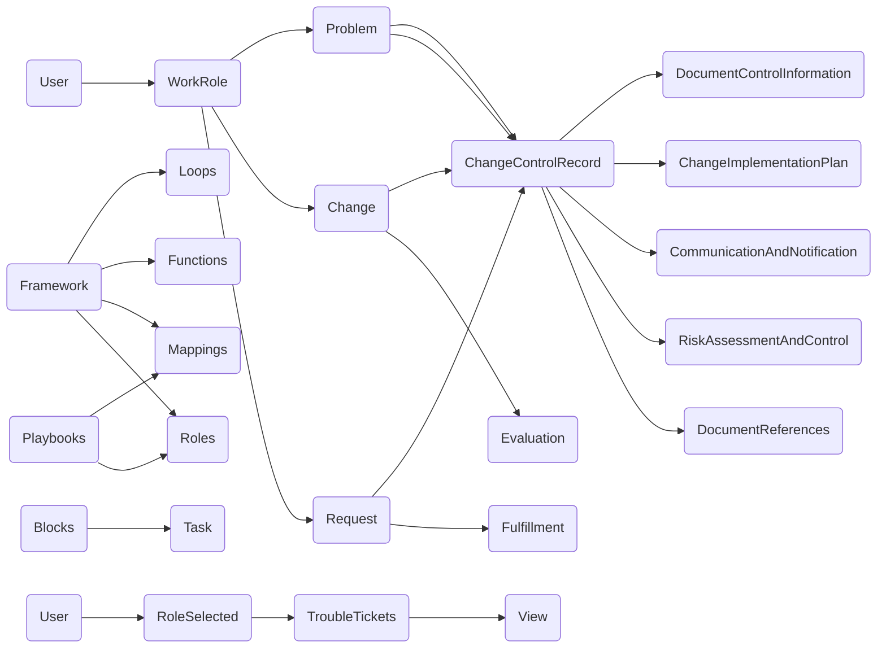
```mermaid
graph LR
    A(User)
    B(WorkRole)
    C(Problem)
    D(Change)
    E(Request)
    F(ChangeControlRecord)
    G(DocumentControlInformation)
    H(ChangeImplementationPlan)
    I(CommunicationAndNotification)
    J(RiskAssessmentAndControl)
    K(DocumentReferences)
    L(Evaluation)
    M(Fulfillment)
    N(Framework)
    O(Loops)
    P(Functions)
    Q(Playbooks)
    R(Mappings)
    S(Roles)
    T(Blocks)
    U(Task)
    V(User)
    W(RoleSelected)
    X(TroubleTickets)
    Y(View)

    A(User) --> B(WorkRole)
    B(WorkRole) --> C(Problem)
    B(WorkRole) --> D(Change)
    B(WorkRole) --> E(Request)
    C(Problem) --> F(ChangeControlRecord)
    D(Change) --> F(ChangeControlRecord)
    E(Request) --> F(ChangeControlRecord)
    F(ChangeControlRecord) --> G(DocumentControlInformation)
    F(ChangeControlRecord) --> H(ChangeImplementationPlan)
    F(ChangeControlRecord) --> I(CommunicationAndNotification)
    F(ChangeControlRecord) --> J(RiskAssessmentAndControl)
    F(ChangeControlRecord) --> K(DocumentReferences)
    C(Problem) --> F(ChangeControlRecord)
    D(Change) --> L(Evaluation)
    E(Request) --> M(Fulfillment)
    N(Framework) --> O(Loops)
    N(Framework) --> P(Functions)
    N(Framework) --> R(Mappings)
    N(Framework) --> S(Roles)
    Q(Playbooks) --> R(Mappings)
    Q(Playbooks) --> S(Roles)
    T(Blocks) --> U(Task)
    V(User) --> W(RoleSelected)
    W(RoleSelected) --> X(TroubleTickets)
    X(TroubleTickets) --> Y(View)
```
Reduce unnecessary complexity: If certain components or relationships are not essential to the core functionality of the framework, consider removing or simplifying them. This will help streamline the framework and make it more focused.

```

    A(User)
    B(WorkRole)
    C(Problem)
    D(Change)
    E(Request)
    F(ChangeControlRecord)
    G(DocumentControlInformation)
    H(ChangeImplementationPlan)
    I(CommunicationAndNotification)
    J(RiskAssessmentAndControl)
    K(DocumentReferences)
    L(Evaluation)
    M(Fulfillment)
    N(Framework)
    O(Loops)
    P(Functions)
    Q(Playbooks)
    R(Mappings)
    S(Roles)
    T(Blocks)
    U(Task)
    V(User)
    W(RoleSelected)
    X(TroubleTickets)
    Y(View)

    A(User) --> B(WorkRole)
    B(WorkRole) --> C(Problem)
    B(WorkRole) --> D(Change)
    B(WorkRole) --> E(Request)
    C(Problem) --> F(ChangeControlRecord)
    D(Change) --> F(ChangeControlRecord)
    E(Request) --> F(ChangeControlRecord)
    F(ChangeControlRecord) --> G(DocumentControlInformation)
    F(ChangeControlRecord) --> H(ChangeImplementationPlan)
    F(ChangeControlRecord) --> I(CommunicationAndNotification)
    F(ChangeControlRecord) --> J(RiskAssessmentAndControl)
    F(ChangeControlRecord) --> K(DocumentReferences)
    D(Change) --> L(Evaluation)
    E(Request) --> M(Fulfillment)
    N(Framework) --> O(Loops)
    N(Framework) --> P(Functions)
    N(Framework) --> Q(Playbooks)
    N(Framework) --> R(Mappings)
    N(Framework) --> S(Roles)
    Q(Playbooks) --> R(Mappings)
    Q(Playbooks) --> S(Roles)
    T(Blocks) --> U(Task)
    V(User) --> W(RoleSelected)
    W(RoleSelected) --> X(TroubleTickets)
    X(TroubleTickets) --> Y(View)
```
Consider naming conventions: Ensure that the component names accurately reflect their purpose and role in the framework. Clear and consistent naming conventions can improve understanding and maintainability.

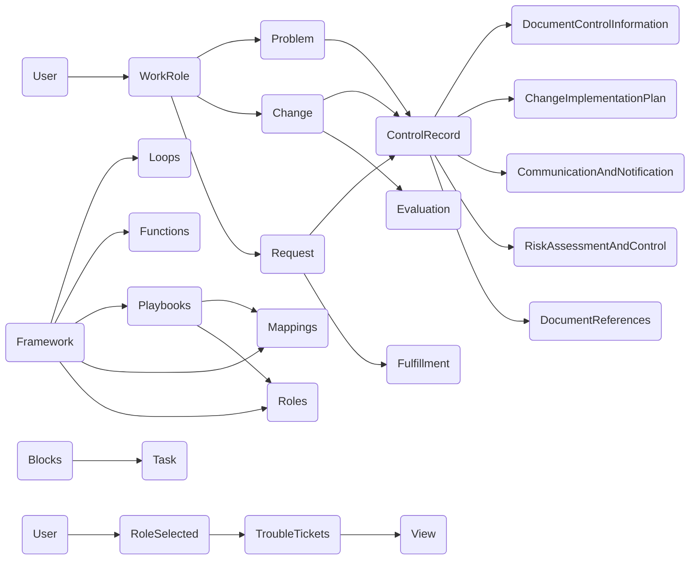
```mermaid
graph LR
    A(User)
    B(WorkRole)
    C(Problem)
    D(Change)
    E(Request)
    F(ControlRecord)
    G(DocumentControlInformation)
    H(ChangeImplementationPlan)
    I(CommunicationAndNotification)
    J(RiskAssessmentAndControl)
    K(DocumentReferences)
    L(Evaluation)
    M(Fulfillment)
    N(Framework)
    O(Loops)
    P(Functions)
    Q(Playbooks)
    R(Mappings)
    S(Roles)
    T(Blocks)
    U(Task)
    V(User)
    W(RoleSelected)
    X(TroubleTickets)
    Y(View)

    A(User) --> B(WorkRole)
    B(WorkRole) --> C(Problem)
    B(WorkRole) --> D(Change)
    B(WorkRole) --> E(Request)
    C(Problem) --> F(ControlRecord)
    D(Change) --> F(ControlRecord)
    E(Request) --> F(ControlRecord)
    F(ControlRecord) --> G(DocumentControlInformation)
    F(ControlRecord) --> H(ChangeImplementationPlan)
    F(ControlRecord) --> I(CommunicationAndNotification)
    F(ControlRecord) --> J(RiskAssessmentAndControl)
    F(ControlRecord) --> K(DocumentReferences)
    D(Change) --> L(Evaluation)
    E(Request) --> M(Fulfillment)
    N(Framework) --> O(Loops)
    N(Framework) --> P(Functions)
    N(Framework) --> Q(Playbooks)
    N(Framework) --> R(Mappings)
    N(Framework) --> S(Roles)
    Q(Playbooks) --> R(Mappings)
    Q(Playbooks) --> S(Roles)
    T(Blocks) --> U(Task)
    V(User) --> W(RoleSelected)
    W(RoleSelected) --> X(TroubleTickets)
    X(TroubleTickets) --> Y(View)
```


Provide additional context or documentation: Depending on the purpose and audience of the framework, it may be helpful to provide supplementary documentation or context to explain the overall goal, usage guidelines, and any specific conventions or best practices associated with the framework. This repository should serve with enough components for you to be successful on your journey. 

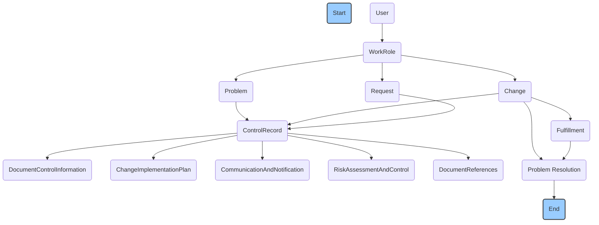
```mermaid
graph TB
    A(Start)
    B(User) --> C(WorkRole)
    C --> D(Problem)
    C --> E(Change)
    C --> F(Request)
    D --> G(ControlRecord)
    E --> G(ControlRecord)
    F --> G(ControlRecord)
    G --> H(DocumentControlInformation)
    G --> I(ChangeImplementationPlan)
    G --> J(CommunicationAndNotification)
    G --> K(RiskAssessmentAndControl)
    G --> L(DocumentReferences)
    E --> M(Fulfillment)
    E --> N(Problem Resolution)
    M --> N
    N --> O(End)

    style A fill:#99ccff, stroke:#333, stroke-width:2px
    style O fill:#99ccff, stroke:#333, stroke-width:2px
```

## About the System
The journey starts at the "Start" node.
The user (represented by User) assumes a specific work role (WorkRole).
The user encounters a problem (Problem) and initiates a change (Change) and a change request (Request).
The change and request are associated with a control record (ControlRecord) that includes document control information, change implementation plan, communication and notification, risk assessment and control, and document references.
The change and request are evaluated and fulfilled.
The problem is resolved, and the journey ends at the "End" node.

# System States 

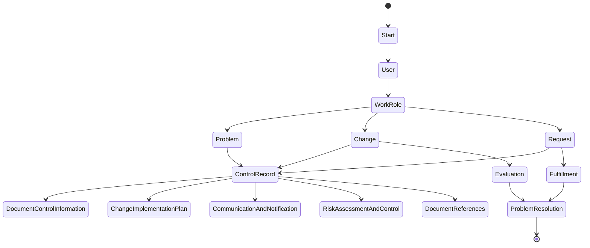
```mermaid
stateDiagram
    [*] --> Start
    Start --> User
    User --> WorkRole
    WorkRole --> Problem
    WorkRole --> Change
    WorkRole --> Request
    Change --> ControlRecord
    Request --> ControlRecord
    Problem --> ControlRecord
    ControlRecord --> DocumentControlInformation
    ControlRecord --> ChangeImplementationPlan
    ControlRecord --> CommunicationAndNotification
    ControlRecord --> RiskAssessmentAndControl
    ControlRecord --> DocumentReferences
    Change --> Evaluation
    Request --> Fulfillment
    Fulfillment --> ProblemResolution
    Evaluation --> ProblemResolution
    ProblemResolution --> [*]
```
## About States
The initial state is "Start."
The user progresses to the "User" state and assumes a specific work role in the "WorkRole" state.
The user can encounter a "Problem" state and initiate a "Change" state and a "Request" state.
Both the "Change" and "Request" states transition to the "ControlRecord" state, which includes sub-states for document control information, change implementation plan, communication and notification, risk assessment and control, and document references.
The "Change" state transitions to an "Evaluation" state, while the "Request" state transitions to a "Fulfillment" state.
Both the "Evaluation" and "Fulfillment" states transition to a "ProblemResolution" state.
The "ProblemResolution" state transitions back to the initial state, representing the end of the process.

# System 

```sql
User ----< WorkRole
WorkRole ----< Problem
WorkRole ----< Change
WorkRole ----< Request
Problem ----< ControlRecord
Change ----< ControlRecord
Request ----< ControlRecord
ControlRecord ----< DocumentControlInformation
ControlRecord ----< ChangeImplementationPlan
ControlRecord ----< CommunicationAndNotification
ControlRecord ----< RiskAssessmentAndControl
ControlRecord ----< DocumentReferences
Change ----< Evaluation
Request ----< Fulfillment
Fulfillment ----< ProblemResolution
Evaluation ----< ProblemResolution
```
## About the system
Each entity is represented by a box.
The arrow symbol "--<" indicates a one-to-many relationship, meaning that one entity can be related to multiple instances of another entity.
For example, a User can have multiple WorkRoles, and each WorkRole can be associated with multiple Problems, Changes, and Requests.
Similarly, a Problem, Change, or Request can be associated with multiple ControlRecords, and each ControlRecord can have multiple DocumentControlInformation, ChangeImplementationPlan, CommunicationAndNotification, RiskAssessmentAndControl, and DocumentReferences.
The Change entity is related to Evaluation, and the Request entity is related to Fulfillment, both indicating a one-to-many relationship.
Finally, Fulfillment and Evaluation entities are both related to ProblemResolution, suggesting a one-to-many relationship.

# System Class
```sql
             +--------+
             |  User  |
             +--------+
                |
                |
             +--------+
             |WorkRole|
             +--------+
                |
       +--------+-------+
       |                |
  +---------+      +-----------+
  | Problem |      |   Change  |
  +---------+      +-----------+
       |                |
       |                |
  +---------+      +-----------+
  | Request |      | ControlRecord |
  +---------+      +-----------+
                         |
                         |
      +-------------------------------+
      |                               |
+----------------------+   +------------------------+
| DocumentControlInformation |   | ChangeImplementationPlan |
+----------------------+   +------------------------+
      |                               |
      |                               |
+------------------------+   +------------------------+
| CommunicationAndNotification |   | RiskAssessmentAndControl |
+------------------------+   +------------------------+
      |
      |
+------------------+
| DocumentReferences |
+------------------+
      |
      |
  +---------+
  | Evaluation |
  +---------+
      |
      |
  +---------------+
  | Fulfillment |
  +---------------+
      |
      |
+-------------------+
| ProblemResolution |
+-------------------+
```

## About The Classes
Each entity is represented as a class.
Associations between classes are represented by lines connecting them.
Multiplicity is indicated near the associations to show the cardinality of the relationship.
For example, the User class has a one-to-many relationship with the WorkRole class, and the WorkRole class has a one-to-many relationship with the Problem, Change, and Request classes.
The ControlRecord class is associated with the DocumentControlInformation, ChangeImplementationPlan, CommunicationAndNotification, RiskAssessmentAndControl, and DocumentReferences classes, indicating a composition relationship.
The Change class has a one-to-many relationship with the Evaluation class, and the Request class has a one-to-many relationship with the Fulfillment class.
Finally, both the Fulfillment and Evaluation classes are associated with the ProblemResolution class, suggesting a composition relationship.

# Atributes
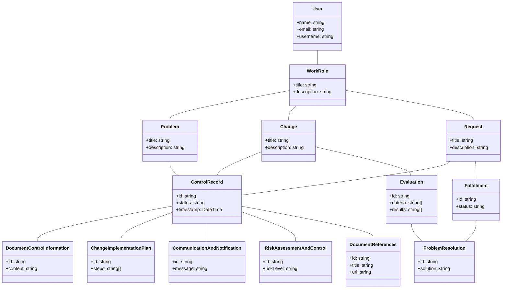
```mermaid
classDiagram
  class User {
    +name: string
    +email: string
    +username: string
  }

  class WorkRole {
    +title: string
    +description: string
  }

  class Problem {
    +title: string
    +description: string
  }

  class Change {
    +title: string
    +description: string
  }

  class Request {
    +title: string
    +description: string
  }

  class ControlRecord {
    +id: string
    +status: string
    +timestamp: DateTime
  }

  class DocumentControlInformation {
    +id: string
    +content: string
  }

  class ChangeImplementationPlan {
    +id: string
    +steps: string[]
  }

  class CommunicationAndNotification {
    +id: string
    +message: string
  }

  class RiskAssessmentAndControl {
    +id: string
    +riskLevel: string
  }

  class DocumentReferences {
    +id: string
    +title: string
    +url: string
  }

  class Evaluation {
    +id: string
    +criteria: string[]
    +results: string[]
  }

  class Fulfillment {
    +id: string
    +status: string
  }

  class ProblemResolution {
    +id: string
    +solution: string
  }

  User -- WorkRole
  WorkRole -- Problem
  WorkRole -- Change
  WorkRole -- Request
  Problem -- ControlRecord
  Change -- ControlRecord
  Request -- ControlRecord
  ControlRecord -- DocumentControlInformation
  ControlRecord -- ChangeImplementationPlan
  ControlRecord -- CommunicationAndNotification
  ControlRecord -- RiskAssessmentAndControl
  ControlRecord -- DocumentReferences
  Change -- Evaluation
  Request -- Fulfillment
  Fulfillment -- ProblemResolution
  Evaluation -- ProblemResolution
```
# Entitites and Relationships 
Entities: The diagram includes several entities represented by nodes, such as User (A), WorkRole (B), Problem (C), Change (D), Request (E), ChangeControlRecord (F), DocumentControlInformation (G), ChangeImplementationPlan (H), CommunicationAndNotification (I), RiskAssessmentAndControl (J), DocumentReferences (K), Evaluation (L), Fulfillment (M), Framework (N), Loops (O), Functions (P), Playbooks (Q), Mappings (R), Roles (S), Blocks (T), Task (U), and View (Y).
Relationships: The arrows connecting the entities represent relationships or actions between them. For example:
A performs B: User (A) performs the WorkRole (B).
B has C: WorkRole (B) has a relation with the Problem (C).
B initiates D: WorkRole (B) initiates the Change (D).
B submits E: WorkRole (B) submits the Request (E).
C triggers F: Problem (C) triggers the ChangeControlRecord (F).
D relates to F: Change (D) relates to the ChangeControlRecord (F).
E triggers F: Request (E) triggers the ChangeControlRecord (F).
F has G: ChangeControlRecord (F) has a relation with the DocumentControlInformation (G).
F has H: ChangeControlRecord (F) has a relation with the ChangeImplementationPlan (H).
F notifies I: ChangeControlRecord (F) notifies the CommunicationAndNotification (I).
F assesses J: ChangeControlRecord (F) assesses the RiskAssessmentAndControl (J).
F refers to K: ChangeControlRecord (F) refers to the DocumentReferences (K).
D relates to L: Change (D) relates to the Evaluation (L).
E relates to M: Request (E) relates to the Fulfillment (M).
N consists of O, P, Q, R, S: Framework (N) consists of Loops (O), Functions (P), Playbooks (Q), Mappings (R), and Roles (S).
R used by Q: Mappings (R) are used by Playbooks (Q).
S used by Q: Roles (S) are used by Playbooks (Q).
T contains U: Blocks (T) contains the Task (U).
V selects W: User (V) selects the RoleSelected (W).
W accesses X: RoleSelected (W) accesses the TroubleTickets (X).
X views Y: TroubleTickets (X) views the View (Y).

# Diagram
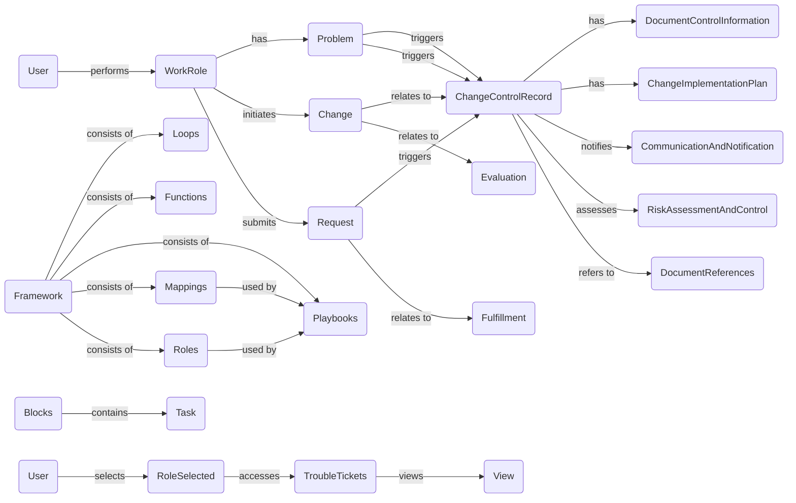
```mermaid
graph LR
    A(User)
    B(WorkRole)
    C(Problem)
    D(Change)
    E(Request)
    F(ChangeControlRecord)
    G(DocumentControlInformation)
    H(ChangeImplementationPlan)
    I(CommunicationAndNotification)
    J(RiskAssessmentAndControl)
    K(DocumentReferences)
    L(Evaluation)
    M(Fulfillment)
    N(Framework)
    O(Loops)
    P(Functions)
    Q(Playbooks)
    R(Mappings)
    S(Roles)
    T(Blocks)
    U(Task)
    V(User)
    W(RoleSelected)
    X(TroubleTickets)
    Y(View)

    A -->|performs| B
    B -->|has| C
    B -->|initiates| D
    B -->|submits| E
    C -->|triggers| F
    D -->|relates to| F
    E -->|triggers| F
    F -->|has| G
    F -->|has| H
    F -->|notifies| I
    F -->|assesses| J
    F -->|refers to| K
    C -->|triggers| F
    D -->|relates to| L
    E -->|relates to| M
    N -->|consists of| O
    N -->|consists of| P
    N -->|consists of| Q
    N -->|consists of| R
    N -->|consists of| S
    R -->|used by| Q
    S -->|used by| Q
    T -->|contains| U
    V -->|selects| W
    W -->|accesses| X
    X -->|views| Y
```
## System Requirements
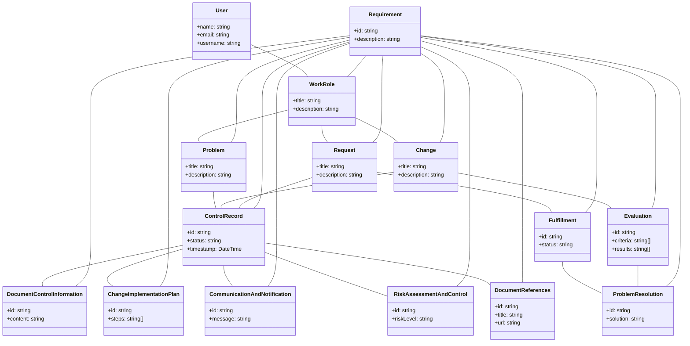
```mermaid
classDiagram
  class User {
    +name: string
    +email: string
    +username: string
  }

  class WorkRole {
    +title: string
    +description: string
  }

  class Problem {
    +title: string
    +description: string
  }

  class Change {
    +title: string
    +description: string
  }

  class Request {
    +title: string
    +description: string
  }

  class ControlRecord {
    +id: string
    +status: string
    +timestamp: DateTime
  }

  class DocumentControlInformation {
    +id: string
    +content: string
  }

  class ChangeImplementationPlan {
    +id: string
    +steps: string[]
  }

  class CommunicationAndNotification {
    +id: string
    +message: string
  }

  class RiskAssessmentAndControl {
    +id: string
    +riskLevel: string
  }

  class DocumentReferences {
    +id: string
    +title: string
    +url: string
  }

  class Evaluation {
    +id: string
    +criteria: string[]
    +results: string[]
  }

  class Fulfillment {
    +id: string
    +status: string
  }

  class ProblemResolution {
    +id: string
    +solution: string
  }

  class Requirement {
    +id: string
    +description: string
  }

  User -- WorkRole
  WorkRole -- Problem
  WorkRole -- Change
  WorkRole -- Request
  Problem -- ControlRecord
  Change -- ControlRecord
  Request -- ControlRecord
  ControlRecord -- DocumentControlInformation
  ControlRecord -- ChangeImplementationPlan
  ControlRecord -- CommunicationAndNotification
  ControlRecord -- RiskAssessmentAndControl
  ControlRecord -- DocumentReferences
  Change -- Evaluation
  Request -- Fulfillment
  Fulfillment -- ProblemResolution
  Evaluation -- ProblemResolution
  Requirement -- WorkRole
  Requirement -- Problem
  Requirement -- Change
  Requirement -- Request
  Requirement -- ControlRecord
  Requirement -- DocumentControlInformation
  Requirement -- ChangeImplementationPlan
  Requirement -- CommunicationAndNotification
  Requirement -- RiskAssessmentAndControl
  Requirement -- DocumentReferences
  Requirement -- Evaluation
  Requirement -- Fulfillment
  Requirement -- ProblemResolution
```

# User Journey

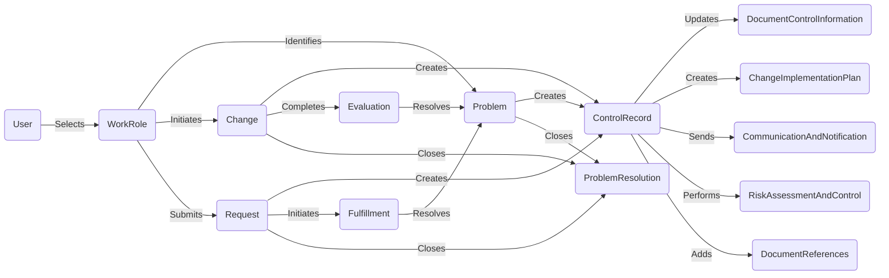
```mermaid
graph LR
  A(User)
  B(WorkRole)
  C(Problem)
  D(Change)
  E(Request)
  F(ControlRecord)
  G(DocumentControlInformation)
  H(ChangeImplementationPlan)
  I(CommunicationAndNotification)
  J(RiskAssessmentAndControl)
  K(DocumentReferences)
  L(Evaluation)
  M(Fulfillment)
  N(ProblemResolution)

  A(User) -->|Selects| B(WorkRole)
  B(WorkRole) -->|Identifies| C(Problem)
  B(WorkRole) -->|Initiates| D(Change)
  B(WorkRole) -->|Submits| E(Request)
  C(Problem) -->|Creates| F(ControlRecord)
  D(Change) -->|Creates| F(ControlRecord)
  E(Request) -->|Creates| F(ControlRecord)
  F(ControlRecord) -->|Updates| G(DocumentControlInformation)
  F(ControlRecord) -->|Creates| H(ChangeImplementationPlan)
  F(ControlRecord) -->|Sends| I(CommunicationAndNotification)
  F(ControlRecord) -->|Performs| J(RiskAssessmentAndControl)
  F(ControlRecord) -->|Adds| K(DocumentReferences)
  D(Change) -->|Completes| L(Evaluation)
  E(Request) -->|Initiates| M(Fulfillment)
  M(Fulfillment) -->|Resolves| C(Problem)
  L(Evaluation) -->|Resolves| C(Problem)
  C(Problem) -->|Closes| N(ProblemResolution)
  D(Change) -->|Closes| N(ProblemResolution)
  E(Request) -->|Closes| N(ProblemResolution)
```

## Journey

```rust
sequenceDiagram
  participant User
  participant WorkRole
  participant Problem
  participant ControlRecord
  participant CommunicationAndNotification
  participant Fulfillment
  participant ProblemResolution

  User->WorkRole: Submit ticket
  WorkRole->Problem: Create problem
  Problem->ControlRecord: Create control record
  ControlRecord->CommunicationAndNotification: Notify stakeholders
  CommunicationAndNotification->Fulfillment: Assign ticket
  Fulfillment->ProblemResolution: Resolve problem
  Fulfillment-->User: Notify user of resolution
```

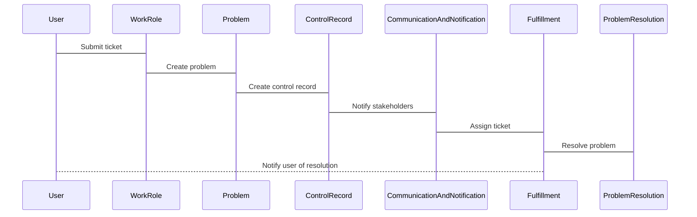
```mermaid
sequenceDiagram
  participant User
  participant WorkRole
  participant Problem
  participant ControlRecord
  participant CommunicationAndNotification
  participant Fulfillment
  participant ProblemResolution

  User->WorkRole: Submit ticket
  WorkRole->Problem: Create problem
  Problem->ControlRecord: Create control record
  ControlRecord->CommunicationAndNotification: Notify stakeholders
  CommunicationAndNotification->Fulfillment: Assign ticket
  Fulfillment->ProblemResolution: Resolve problem
  Fulfillment-->User: Notify user of resolution
```

# Homepage 


Before you get started [read](./About%20and%20README/README.md)
and check out the [license](./About%20and%20README/LICENSE)
As we get started, check out the  Business Continuity [link](./Business%20Continuity/business%20continuity.md)

>GRCandMe hereby acknowledges and informs all users, customers, and clients that the products, services, or information provided on our > platform, website, or any other medium are presented "as is" and without any warranties or guarantees of any kind, whether expressed or >implied.
>
> By accessing or using our products, services, or information, users explicitly agree that GRCandMe, its affiliates, employees, agents, or >representatives shall not be held liable for any inaccuracies, errors, omissions, damages, or losses arising from the use or reliance on >the provided content.
>
>We expressly disclaim all warranties, including but not limited to the implied warranties of merchantability, fitness for a particular >purpose, non-infringement, or any other warranty, condition, or representation. We make no warranty or guarantee that our products, >services, or information will meet individual requirements or expectations, or that they will be uninterrupted, secure, error-free, or >free from harmful components.
>
>Furthermore, GRCandMe shall not be responsible for any damages or losses incurred by users, customers, or clients due to any reliance on >the information, advice, or recommendations provided on our platform, website, or any other communication channels. It is the sole >responsibility of users to evaluate the accuracy, completeness, and usefulness of the content.
>
>This no warranties statement applies to all products, services, or information offered by GRCandMe and extends to any third-party content, >links, or references provided within our offerings. Any third-party content or services accessed through our platform are subject to their >respective terms, conditions, and warranties.
>
>Users are encouraged to seek professional advice, verify information, and exercise their own judgment when using our products, services, >or information. By continuing to use our offerings, users accept the terms of this no warranties statement and agree to hold GRCandMe >harmless from any claims, liabilities, or damages resulting from the use of our products, services, or information.
>
>This no warranties statement is binding upon all users, customers, and clients, and supersedes any prior agreements or representations, >whether written or verbal, regarding the warranties or guarantees of our products, services, or information.
>
>GRCandMe reserves the right to modify or update this no warranties statement at any time without prior notice. Users are advised to review >this statement periodically for any changes or updates.


This documentation is vast, I have focused on articulating the details in as verbose of method as possible. 

# System Components

# User:
Attributes: name (string), role (WorkRole)
Represents a user within the system and contains their name and assigned work role.
# WorkRole:
## Attributes: name (string)
Represents a specific work role within the system.
Problem, Change, Request, Incident:
## Attributes: description (string)
Represents different types of tickets or issues within the system.
Associated with WorkRoles.
# ChangeControlRecord:
## Attributes: documentControl (DocumentControlInformation), implementationPlan (ChangeImplementationPlan), communication (CommunicationAndNotification), riskAssessment (RiskAssessmentAndControl), documentReferences (array of DocumentReferences)
Represents a change control record that includes information related to document control, implementation plan, communication, risk assessment, and document references.
DocumentControlInformation, ChangeImplementationPlan, CommunicationAndNotification, RiskAssessmentAndControl:
## Attributes: content (string)
Represents different aspects of the change control record, containing relevant content.
# DocumentReferences:
## Attributes: title (string), url (string)
Represents references to external documents related to the change control record.
TroubleTickets:
## Attributes: problems (array of Problem), changes (array of Change), incidents (array of Incident), requests (array of Request), implementationPlan (ChangeImplementationPlan)
Represents a collection of trouble tickets including problems, changes, incidents, and requests.
Associated with ChangeImplementationPlan.
Framework:
## Attributes: loops (Loops), functions (Functions), playbooks (Playbooks), mappings (Mappings), roles (Roles)
Represents a framework within the system that includes loops, functions, playbooks, mappings, and roles.
Loops, Functions, Playbooks, Mappings, Roles:
Attributes: description (string)
Represents different components within the framework, each containing a description.
Evaluation, Fulfillment:
## Attributes: description (string)
Represents components related to evaluation and fulfillment within the system.
# Block:
## Attributes: tasks (array of Task)
Represents a block of tasks within the system.
# Task:
## Attributes: description (string)
Represents an individual task within a block.

# Active Directory
If you are looking for resources related to [Active Directory](./Active%20Directory/active%20directory.md)
If you are looking for [Active Directory Structure](./Active%20Directory/active%20directory%20structure.md)
And check out the [Active Directory Security Groups](./Active%20Directory/active%20directory%20security%20groups.md)

## About Active Directory
    Functions:
    Active Directory (AD): This is the central component of the system.
    Trouble Ticket Mapping System (TTMS): Manages trouble tickets and their assignments.
    Primary Work Role ID Mapping (PWRI): Maps primary work roles to specific functions.
    Relationship Mapping (RM): Maps relationships between different system functions.
    Users:
    Users are divided into several categories, including:
    SEC-ARCH (Security Architect)
    SYS-ARCH (Systems Architect)
    SOFT-DEV (Software Developer)
    DATA-ARCH (Data Architect)
    ENT-ARCH (Enterprise Architect)
    TECH-ARCH (Technical Architect)
    CYBER-ANALYST (Cybersecurity Analyst)
    CYBER-INFRA (Cybersecurity Infrastructure Specialist)
    DATA-ANALYST (Data Analyst)
    SYS-DEV (Systems Developer)
    NET-ENG (Network Engineer)
    SYS-ADMIN (System Administrator)
    SEC-ASSESSOR (Security Assessor)
    SEC-CONT-ASSESSOR (Security Controls Assessor)
    Trouble Ticket Mapping System (TTMS):
    Manages trouble tickets and their lifecycle.
    Users can create trouble tickets (TT), which are assigned to specific users (AT) and can be updated by other users (UB).
    Trouble tickets can be marked as resolved.
    Primary Work Role ID Mapping (PWRI):
    Maps primary work roles to specific functions within the system.
    There are various roles, such as Security Architect, Systems Architect, Software Developer, Data Architect, and Enterprise Architect, each associated with specific responsibilities.
    Relationship Mapping (RM):
    Maps relationships between different system functions.
    The relationships include Ticket Creation (TC), Ticket Assignment (TA), Ticket Tracking (TT), Ticket Resolution (TR), and Data Management (DM).
    Each relationship is associated with specific actions and responsibilities.
    Mappings:
    The diagram includes mappings of various roles and their associated knowledge, skills, and abilities (KSA).
    Roles such as Information System Owner (ISO), Authorizing Official (AO), Chief Information Officer (CIO), Security Control Assessor (SCA), System Administrator (SYS_ADMIN), Network Administrator (NET_ADMIN), Database Administrator (DB_ADMIN), Security Architect (SEC_ARCH), Application Developer (APP_DEV), Incident Responder (INC_RESP), and Threat Analyst (THREAT_ANALYST) are mapped to specific KSAs.
## Active Directory Relationship Considerations
### Active Directory:
#### The Active Directory (AD) consists of a root node (A) and a Users node (B). The Users node (B) has multiple child nodes representing different user categories, such as SEC-ARCH, SYS-ARCH, SOFT-DEV, DATA-ARCH, ENT-ARCH, TECH-ARCH, CYBER-ANALYST, CYBER-INFRA, DATA-ANALYST, SYS-DEV, NET-ENG, SYS-ADMIN, SEC-ASSESSOR, and SEC-CONT-ASSESSOR.
### Trouble Ticket Mapping System:
#### The Trouble Ticket Mapping System allows users (Q) to create trouble tickets (R). Trouble tickets can be assigned to specific users (S), who can then update the ticket. Tickets can also be marked as resolved (T).
### Primary Work Role ID Mapping:
#### The Primary Work Role ID Mapping indicates that the root node (A) has associations (has) with different user categories.Each user category (C, D, E, F, G) is associated with the root node (A), indicating that they belong to the Active Directory structure.

# Business Continuity
[Business Continuity](./Business%20Continuity/business%20continuity.md) and [Financial Considerations](./Financial%20Considerations/Financial%20Considerations.md) along with the [Roles](./Financial%20Considerations/Roles%20supporting%20financial%20considerations.md) 
that support your financial considerations in Cyber Security and Change Management. 
[Insider Threat](./Insider%20Threat/Insider%20Threat.md%20) contains a cusory document about the roles that reduce the likelyhood. 
Perhaps you are considering how the [Partners](./Partner%20Ecosystem%20/roles%20partner%20ecosystem) can be support with Cyber Security Roles? 

[Failure Planning](./Relationship%20Diagrams/Roles/Failure%20Planning/failure%20planning%20diagram.md)

# Systems for Business

# Systems Analysis for Organizational Improvement:
## Components: RootCause, Trigger, Event, Incident
## Relationships: RootCause causes Event, Trigger triggers Event, Event leads to Incident

# Increasing the Time Between Failures:
## Components: AvoidAntipatterns, SpreadRisks, AdoptDevPractices
## Relationships: AvoidAntipatterns improves Resilience, SpreadRisks improves Resilience, AdoptDevPractices improves Resilience

# Trouble Tickets:
## Components: Problem, Change, Incident, Request, Implementation, Validation, Investigation, Resolution, Evaluation, Fulfillment
## Relationships: Problem initiates Change, Incident, and Request; Change requires Implementation and Validation; Incident requires Investigation and Resolution; Request requires Evaluation and Fulfillment

# Framework:
## Components: Loops, Functions, Playbooks, Mappings, Roles
## Relationships: Loops utilize Functions, Loops utilize Playbooks, Functions define Mappings, Mappings define Playbooks, Playbooks define Roles, Roles define Playbooks

# Reducing Time to Detect:
## Components: Align, FreshData, EffectiveAlerts
## Relationships: Align improves SLIs, FreshData improves SLIs, EffectiveAlerts improves SLIs

# Site Reliability Diagram

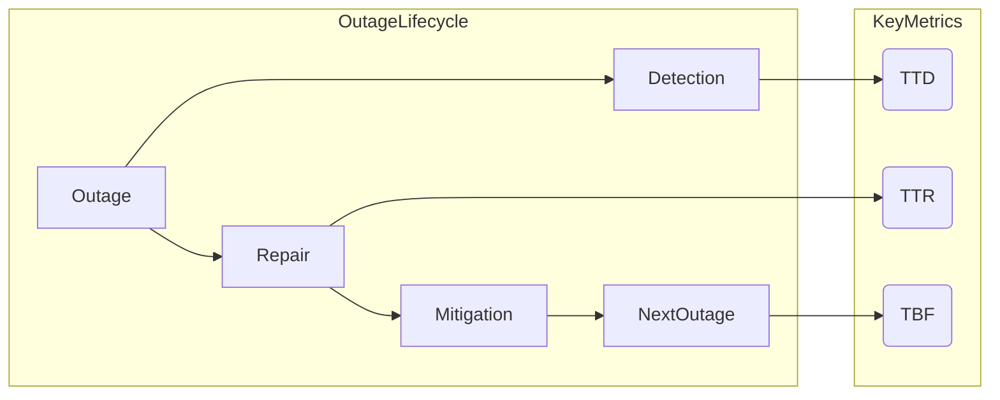
```mermaid
graph LR
    subgraph OutageLifecycle
        Outage --> Detection
        Outage --> Repair
        Repair --> Mitigation
        Mitigation --> NextOutage
    end

    subgraph KeyMetrics
        Detection --> TimeToDetect(TTD)
        Repair --> TimeToRepair(TTR)
        NextOutage --> TimeBetweenFailures(TBF)
    end

```

# Compliant Folder Structure 
[Folder Structure](./Organizational%20Folder%20Structure%20/organizational%20folder%20structure.md)
Consider configuring SQL for your folder structure located 
[SQL Structure](./Organizational%20Folder%20Structure%20/folderstructure.sql)

# Concept
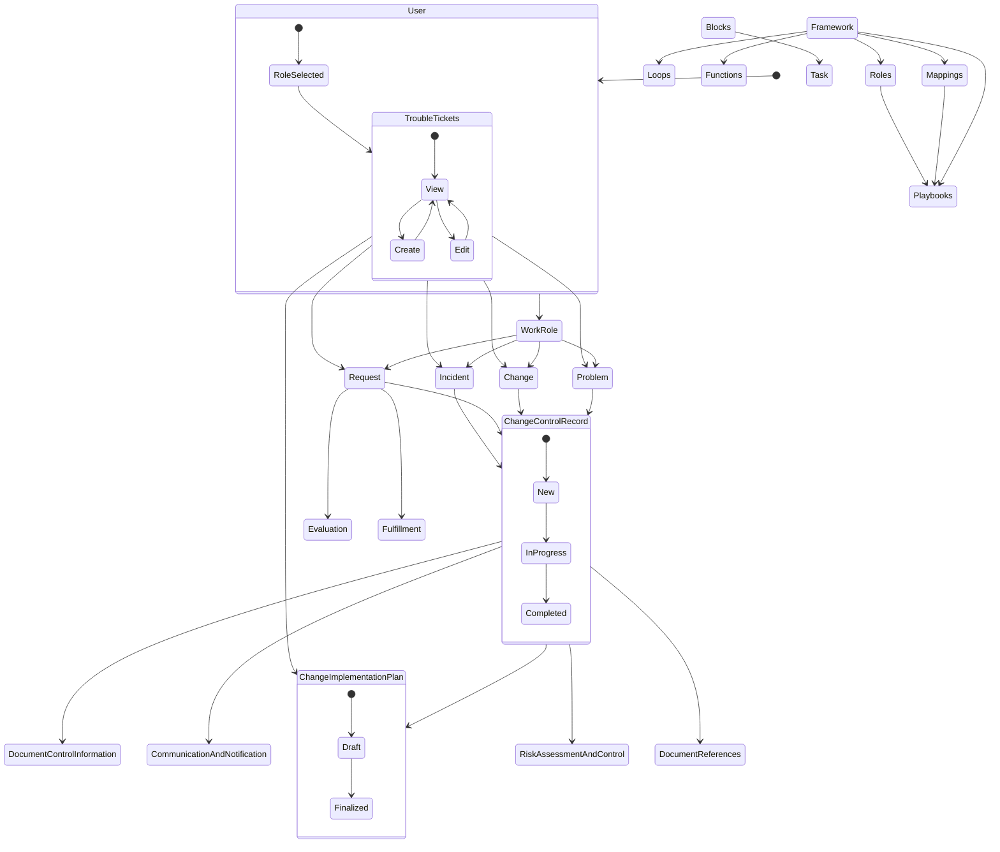
```mermaid
stateDiagram
    [*] --> User
    User --> WorkRole
    WorkRole --> Problem
    WorkRole --> Change
    WorkRole --> Request
    WorkRole --> Incident
    Problem --> ChangeControlRecord
    Change --> ChangeControlRecord
    Request --> ChangeControlRecord
    Incident --> ChangeControlRecord
    ChangeControlRecord --> DocumentControlInformation
    ChangeControlRecord --> ChangeImplementationPlan
    ChangeControlRecord --> CommunicationAndNotification
    ChangeControlRecord --> RiskAssessmentAndControl
    ChangeControlRecord --> DocumentReferences
    TroubleTickets --> Problem
    TroubleTickets --> Change
    TroubleTickets --> Incident
    TroubleTickets --> Request
    TroubleTickets --> ChangeImplementationPlan
    Request --> Evaluation
    Request --> Fulfillment
    Framework --> Loops
    Framework --> Functions
    Framework --> Playbooks
    Framework --> Mappings
    Framework --> Roles
    Mappings --> Playbooks
    Roles --> Playbooks
    Blocks --> Task

    state User {
        [*] --> RoleSelected
        RoleSelected --> TroubleTickets
    }

    state TroubleTickets {
        [*] --> View
        View --> Create
        Create --> View
        View --> Edit
        Edit --> View
    }

    state ChangeControlRecord {
        [*] --> New
        New --> InProgress
        InProgress --> Completed
    }

    state ChangeImplementationPlan {
        [*] --> Draft
        Draft --> Finalized
    }
```

# Roles 
There's much to talk about with [Integrating Roles](./Roles/Integrating%20roles.md), like [Relationship Diagrams in Active Directory](./Relationship%20Diagrams/building%20effective%20relationship%20diagram.md)


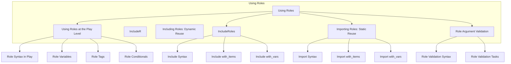
```mermaid
graph TD

subgraph Using Roles
  Roles[Using Roles]
  PlayLevelRoles[Using Roles at the Play Level]
  IncludeR
  oles[Including Roles: Dynamic Reuse]
  ImportRoles[Importing Roles: Static Reuse]
  RoleValidation[Role Argument Validation]

  Roles --> PlayLevelRoles
  Roles --> IncludeRoles
  Roles --> ImportRoles
  Roles --> RoleValidation
end

PlayLevelRoles --> RoleSyntax[Role Syntax in Play]
PlayLevelRoles --> RoleVars[Role Variables]
PlayLevelRoles --> RoleTags[Role Tags]
PlayLevelRoles --> RoleConditionals[Role Conditionals]

IncludeRoles --> IncludeSyntax[Include Syntax]
IncludeRoles --> IncludeWithItems[Include with_items]
IncludeRoles --> IncludeWithVars[Include with_vars]

ImportRoles --> ImportSyntax[Import Syntax]
ImportRoles --> ImportWithItems[Import with_items]
ImportRoles --> ImportWithVars[Import with_vars]

RoleValidation --> RoleValidationSyntax[Role Validation Syntax]
RoleValidation --> RoleValidationTasks[Role Validation Tasks]

```

# Playboooks

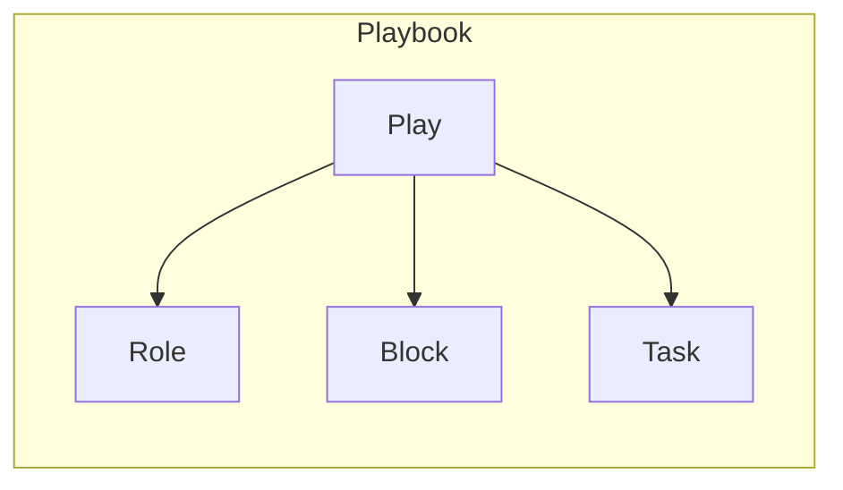
```mermaid
graph LR

subgraph Playbook
  Play[Play]
  Role[Role]
  Block[Block]
  Task[Task]

  Play --> Role
  Play --> Block
  Play --> Task
end

```

# Playbooks and Trouble Tickets 

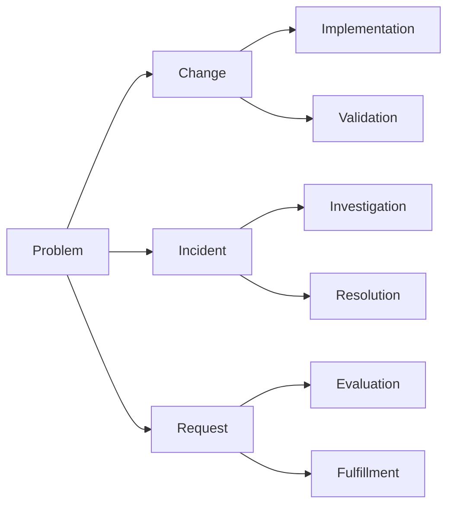
```mermaid
graph LR
    Problem --> Change
    Problem --> Incident
    Problem --> Request
    Change --> Implementation
    Change --> Validation
    Incident --> Investigation
    Incident --> Resolution
    Request --> Evaluation
    Request --> Fulfillment

```


# Ticketing System
[Ticketing System](./Ticketing%20System/ticket%20system.md)

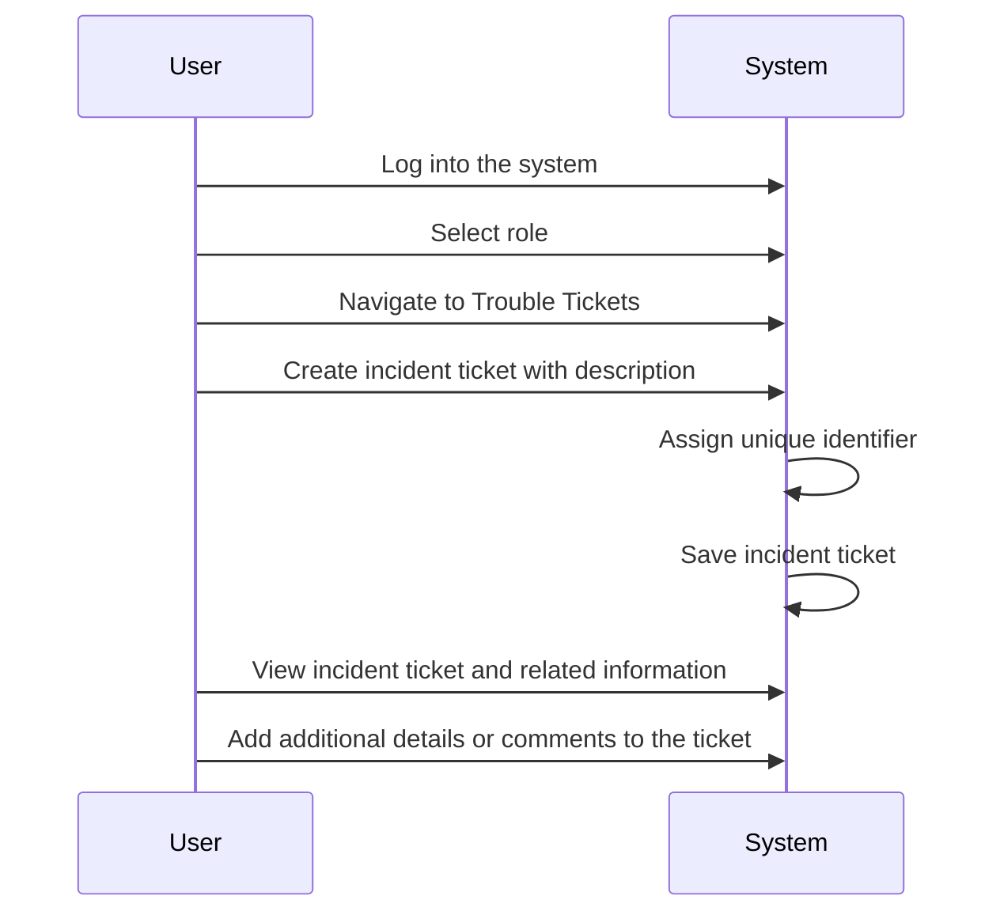
```mermaid
sequenceDiagram
    participant User
    participant System

    User->>System: Log into the system
    User->>System: Select role
    User->>System: Navigate to Trouble Tickets
    User->>System: Create incident ticket with description
    System->>System: Assign unique identifier
    System->>System: Save incident ticket
    User->>System: View incident ticket and related information
    User->>System: Add additional details or comments to the ticket
```

# About the Ticketing System 
### Systems Analysis for Organizational Improvement: 
#### This component focuses on identifying the root causes and triggers of events, which subsequently lead to incidents. Understanding these causes helps in analyzing and improving organizational processes.
### Increasing the Time Between Failures: 
#### This subcomponent aims to enhance system resilience by avoiding anti-patterns, spreading risks, and adopting development practices that contribute to a longer time between failures.
### Trouble Tickets: 
#### This component involves the initiation of various tickets, including problem, incident, and request tickets. Problems can trigger changes, incidents require investigation and resolution, and requests necessitate evaluation and fulfillment.
### Framework: 
#### The framework component utilizes loops, functions, playbooks, mappings, and roles to define and manage ticketing processes effectively.
### Reducing Time to Detect: 
#### This subcomponent focuses on improving Service Level Indicators (SLIs) by aligning systems, utilizing fresh data, and implementing effective alert mechanisms.
### Relationships and Interactions: 
#### Problems are related to alignment, fresh data, and effective alerts. Resilience affects changes, incidents, requests, problems, alignment, fresh data, and effective alerts. Events and incidents are affected by system resilience.

# Graphic Representation of the system with high level components. 

See [Trouble Tickets](./Relationship%20Diagrams/Trouble%20Tickets/)

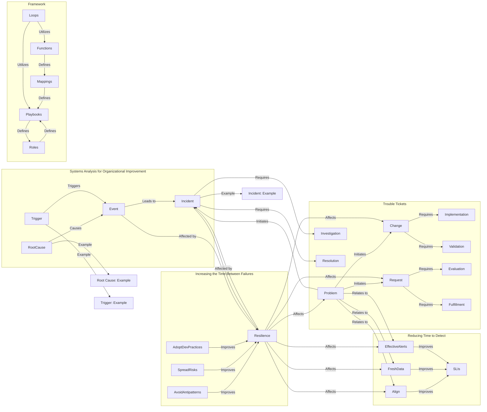
```mermaid
graph LR
    subgraph "Systems Analysis for Organizational Improvement"
        RootCause -->|Causes| Event
        Trigger -->|Triggers| Event
        Event -->|Leads to| Incident
    end

    RootCause -->|Example| RootCauseExample[Root Cause: Example]
    Trigger -->|Example| TriggerExample[Trigger: Example]
    Incident -->|Example| IncidentExample[Incident: Example]

    subgraph "Increasing the Time Between Failures"
        AvoidAntipatterns -->|Improves| Resilience
        SpreadRisks -->|Improves| Resilience
        AdoptDevPractices -->|Improves| Resilience
    end
    
    subgraph Trouble Tickets
        Problem -->|Initiates| Change
        Problem -->|Initiates| Incident
        Problem -->|Initiates| Request
        Change -->|Requires| Implementation
        Change -->|Requires| Validation
        Incident -->|Requires| Investigation
        Incident -->|Requires| Resolution
        Request -->|Requires| Evaluation
        Request -->|Requires| Fulfillment
    end

    subgraph Framework
        Loops -->|Utilizes| Functions
        Loops -->|Utilizes| Playbooks
        Functions -->|Defines| Mappings
        Mappings -->|Defines| Playbooks
        Playbooks -->|Defines| Roles
        Roles -->|Defines| Playbooks
    end
    
    subgraph "Reducing Time to Detect"
        Align -->|Improves| SLIs
        FreshData -->|Improves| SLIs
        EffectiveAlerts -->|Improves| SLIs
    end
    
    Problem -->|Relates to| Align
    Problem -->|Relates to| FreshData
    Problem -->|Relates to| EffectiveAlerts
    
    Resilience -->|Affects| Change
    Resilience -->|Affects| Incident
    Resilience -->|Affects| Request
    Resilience -->|Affects| Problem
    Resilience -->|Affects| Align
    Resilience -->|Affects| FreshData
    Resilience -->|Affects| EffectiveAlerts
    
    Event -->|Affected by| Resilience
    Incident -->|Affected by| Resilience

```
