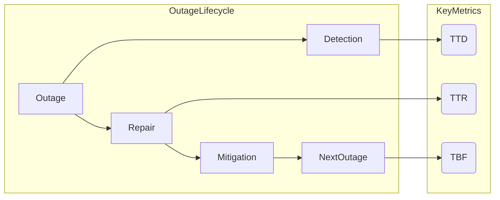
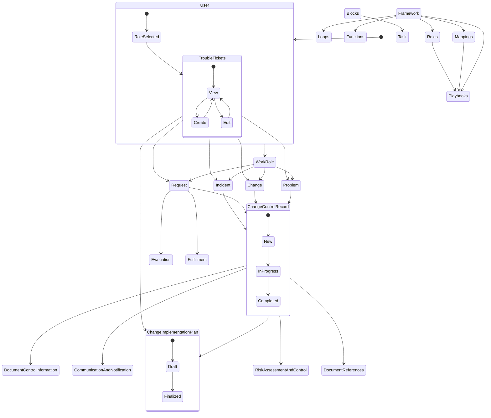
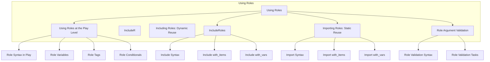
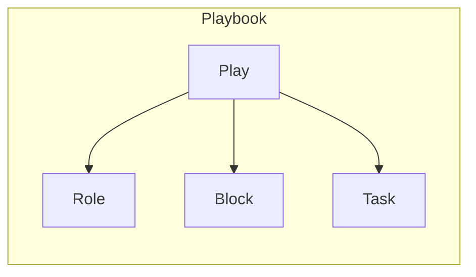
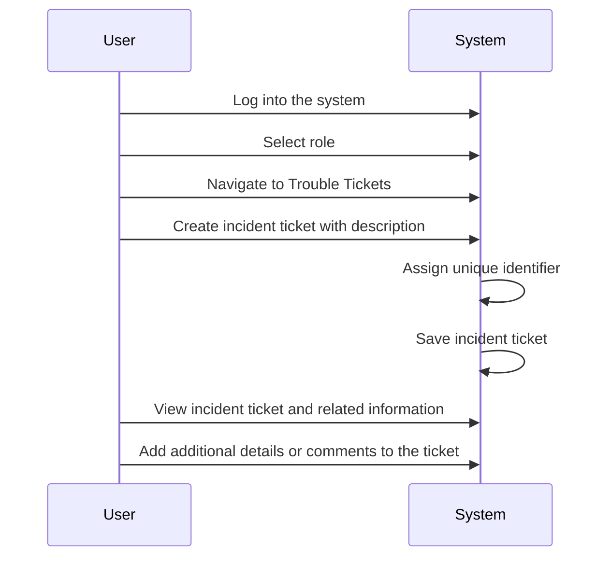

# Homepage 
A simplified homepage for the documentation here 

Before you get started [read](./About%20and%20README/README.md)
and check out the [license](./About%20and%20README/LICENSE)
As we get started, check out the  Business Continuity [link](./Business%20Continuity/business%20continuity.md)

>GRCandMe hereby acknowledges and informs all users, customers, and clients that the products, services, or information provided on our > platform, website, or any other medium are presented "as is" and without any warranties or guarantees of any kind, whether expressed or >implied.
>
> By accessing or using our products, services, or information, users explicitly agree that GRCandMe, its affiliates, employees, agents, or >representatives shall not be held liable for any inaccuracies, errors, omissions, damages, or losses arising from the use or reliance on >the provided content.
>
>We expressly disclaim all warranties, including but not limited to the implied warranties of merchantability, fitness for a particular >purpose, non-infringement, or any other warranty, condition, or representation. We make no warranty or guarantee that our products, >services, or information will meet individual requirements or expectations, or that they will be uninterrupted, secure, error-free, or >free from harmful components.
>
>Furthermore, GRCandMe shall not be responsible for any damages or losses incurred by users, customers, or clients due to any reliance on >the information, advice, or recommendations provided on our platform, website, or any other communication channels. It is the sole >responsibility of users to evaluate the accuracy, completeness, and usefulness of the content.
>
>This no warranties statement applies to all products, services, or information offered by GRCandMe and extends to any third-party content, >links, or references provided within our offerings. Any third-party content or services accessed through our platform are subject to their >respective terms, conditions, and warranties.
>
>Users are encouraged to seek professional advice, verify information, and exercise their own judgment when using our products, services, >or information. By continuing to use our offerings, users accept the terms of this no warranties statement and agree to hold GRCandMe >harmless from any claims, liabilities, or damages resulting from the use of our products, services, or information.
>
>This no warranties statement is binding upon all users, customers, and clients, and supersedes any prior agreements or representations, >whether written or verbal, regarding the warranties or guarantees of our products, services, or information.
>
>GRCandMe reserves the right to modify or update this no warranties statement at any time without prior notice. Users are advised to review >this statement periodically for any changes or updates.

This documentation is vast, I have focused on articulating the details in as verbose of method as possible. 

# Active Directory
If you are looking for resources related to [Active Directory](./Active%20Directory/active%20directory.md)
If you are looking for [Active Directory Structure](./Active%20Directory/active%20directory%20structure.md)
And check out the [Active Directory Security Groups](./Active%20Directory/active%20directory%20security%20groups.md)

# Business Continuity
[Business Continuity](./Business%20Continuity/business%20continuity.md) and [Financial Considerations](./Financial%20Considerations/Financial%20Considerations.md) along with the [Roles](./Financial%20Considerations/Roles%20supporting%20financial%20considerations.md) 
that support your financial considerations in Cyber Security and Change Management. 
[Insider Threat](./Insider%20Threat/Insider%20Threat.md%20) contains a cusory document about the roles that reduce the likelyhood. 
Perhaps you are considering how the [Partners](./Partner%20Ecosystem%20/roles%20partner%20ecosystem) can be support with Cyber Security Roles? 

[Failure Planning](./Relationship%20Diagrams/Roles/Failure%20Planning/failure%20planning%20diagram.md)

## Diagram

# Compliant Folder Structure 
[Folder Structure](./Organizational%20Folder%20Structure%20/organizational%20folder%20structure.md)
Consider configuring SQL for your folder structure located 
[SQL Structure](./Organizational%20Folder%20Structure%20/folderstructure.sql)

# Concept

# Roles 
There's much to talk about with [Integrating Roles](./Roles/Integrating%20roles.md), like [Relationship Diagrams in Active Directory](./Relationship%20Diagrams/building%20effective%20relationship%20diagram.md)

# Playboooks

# Ticketing System
[Ticketing System](./Ticketing%20System/ticket%20system.md)

